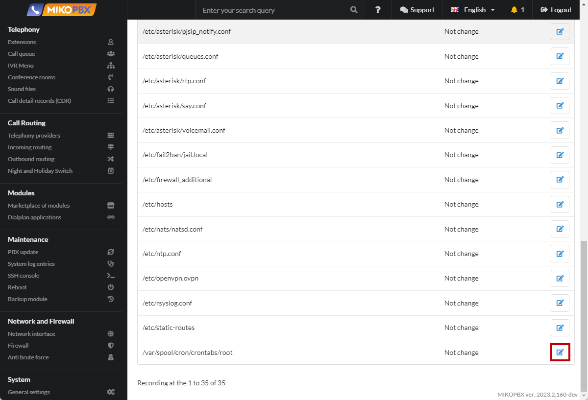
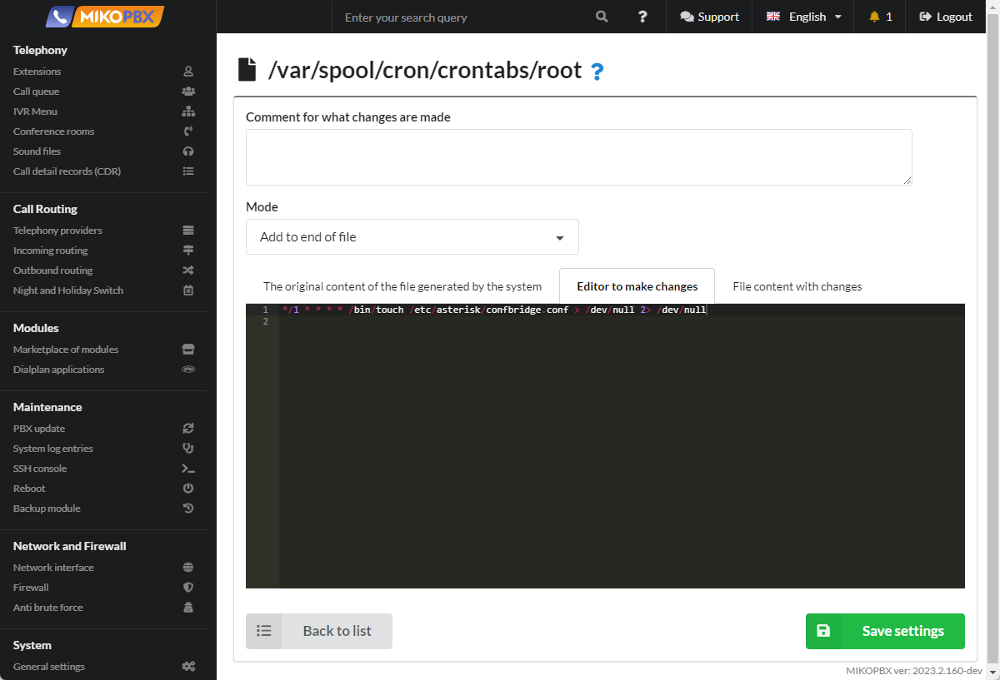
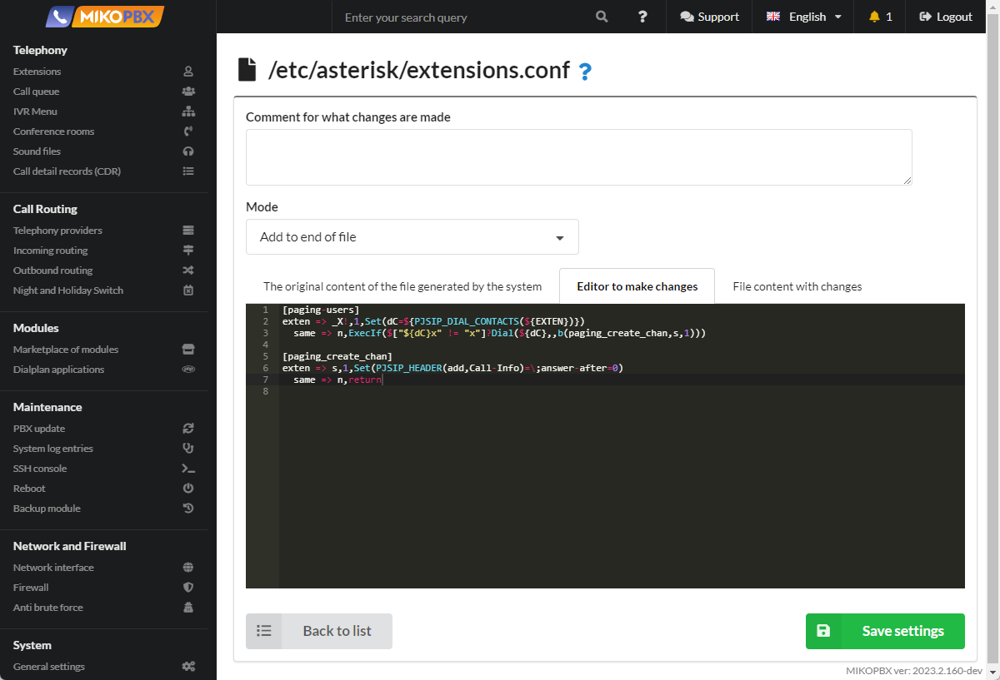

# Setting up the "Paging" function

Paging through phones, i.e. transmitting a voice message through several phones via speakerphone. For example, a manager can quickly call a meeting.


This instruction is suitable for phones:

* **Linksys**
* **Cisco**
* **Telephone** (Softphone)
* **Grandstream**
* **microsip** (Softphone)
* **Yealink**
* **Fanvil**&#x20;
* **Snom**&#x20;


1. Go to the "**System file customization**" section

<figure><figcaption><p>"System file customization" section</p></figcaption></figure>

2. Open the file "**/var/spool/cron/crontabs/root**" for editing

<figure><figcaption><p>"crontabs/root" file</p></figcaption></figure>

3. Add the following code to the end of the file:

```php
*/1 * * * * /bin/touch /etc/asterisk/confbridge.conf > /dev/null 2> /dev/null
```

<figure><figcaption><p>The code for the "crontabs/root" file</p></figcaption></figure>

4. Proceed to editing the "**modules.conf**" file

<figure><figcaption><p>"Modules.conf" file</p></figcaption></figure>

5. Add the following code to the end of the file:

```php
load => bridge_softmix.so
load => app_confbridge.so
load => app_page.so
```

<figure><figcaption><p>Code for modules.conf</p></figcaption></figure>

6. Go to editing the file "**extensions.conf**"

<figure><figcaption><p>extensions.conf file</p></figcaption></figure>

7. Add the following code to the end of the "**extensions.conf**" file

```php
[paging-users] 
exten => _X!,1,Set(dС=${PJSIP_DIAL_CONTACTS(${EXTEN})})
  same => n,ExecIf($["${dС}x" != "x"]?Dial(${dС},,b(paging_create_chan,s,1)))

[paging_create_chan] 
exten => s,1,Set(PJSIP_HEADER(add,Call-Info)=\;answer-after=0) 
  same => n,return
```

<figure><figcaption><p>Code for extensions.conf</p></figcaption></figure>

8. Go to the "**Dialplan Applications**" section, create a new dialplan

<figure><figcaption><p>New dialplan</p></figcaption></figure>

9. Assign an internal number, for example 2200110. Set the code type: "**Asterisk Dialplan**"

<figure><figcaption><p>Dialplan Settings</p></figcaption></figure>

10. Go to the "**Programme Code**" tab, insert the following code:

```php
1,Page(Local/202@paging-users&Local/203@paging-users)
```

<figure><figcaption><p>Code for dialplan</p></figcaption></figure>


In the application code, describe the contacts to whom you should call. Contacts are listed with a **&** separator.

