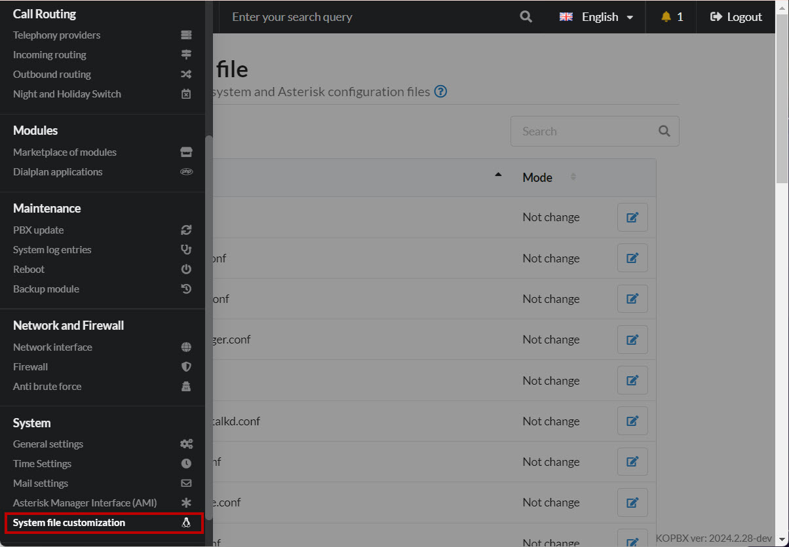
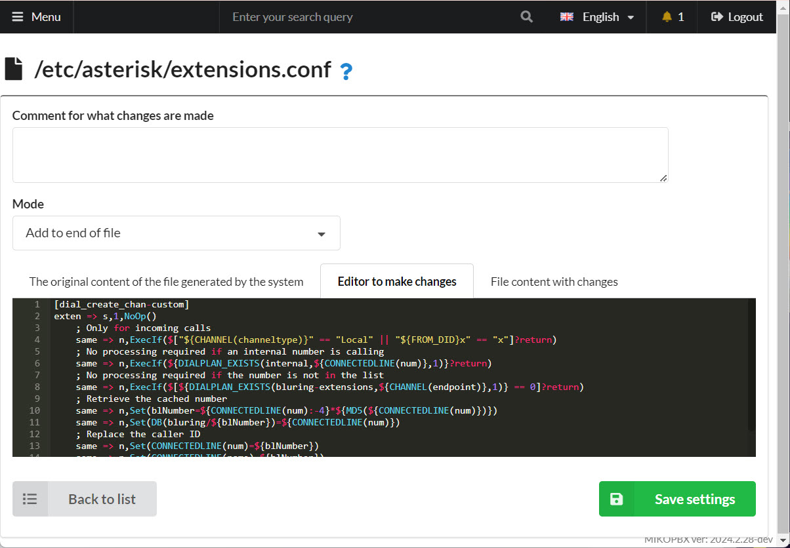

# Hiding the Caller’s Number from Employees

In some cases, employees should not see the actual phone number of a client. Here is a possible approach to solving this problem: employees will be provided with an alternative number that they can use to call back.

1. Go to **System** → **System File Customization**.

<figure><figcaption><p>"System file customization" section</p></figcaption></figure>

2. Open the **modules.conf** configuration file for editing. Set the mode to "**Add to end of file**".

<figure><figcaption><p>"Add to end of file" mode</p></figcaption></figure>

3. Connect the module to calculate the hash sum:

```
load => func_md5.so
```

4. Open the **extensions.conf** configuration file for editing. Set the mode to "**Add to end of file**".

<figure><figcaption><p>"Add to end of file" mode</p></figcaption></figure>

5. Define the context for number substitution:


```php
[dial_create_chan-custom]
exten => s,1,NoOp()
    ; Only for incoming calls
    same => n,ExecIf($["${CHANNEL(channeltype)}" == "Local" || "${FROM_DID}x" == "x"]?return)
    ; No processing required if an internal number is calling
    same => n,ExecIf(${DIALPLAN_EXISTS(internal,${CONNECTEDLINE(num)},1)}?return)
    ; No processing required if the number is not in the list
    same => n,ExecIf($[${DIALPLAN_EXISTS(bluring-extensions,${CHANNEL(endpoint)},1)} == 0]?return)
    ; Retrieve the cached number
    same => n,Set(blNumber=${CONNECTEDLINE(num):-4}*${MD5(${CONNECTEDLINE(num)})})
    same => n,Set(DB(bluring/${blNumber})=${CONNECTEDLINE(num)})
    ; Replace the caller ID
    same => n,Set(CONNECTEDLINE(num)=${blNumber})
    same => n,Set(CONNECTEDLINE(name)=${blNumber})
	same => n,return

```


6. Describe the context with the numbers for which you need to replace the number:

```php
[bluring-extensions]
; Allow number substitution for extension 201
exten => 201,1,NoOp()
; Allow substitution for all four-digit extensions
exten => _XXXX,1,NoOp()
```

7. We will provide the opportunity to call back to a replacement number:

```php
[all_peers](+)
exten => _XXXX*.,1,Set(number=${DB(bluring/${EXTEN})})
    same => n,ExecIf($["${number}x" == "x"]?hangup)
    same => n,Goto(all_peers,${number},1)
```
