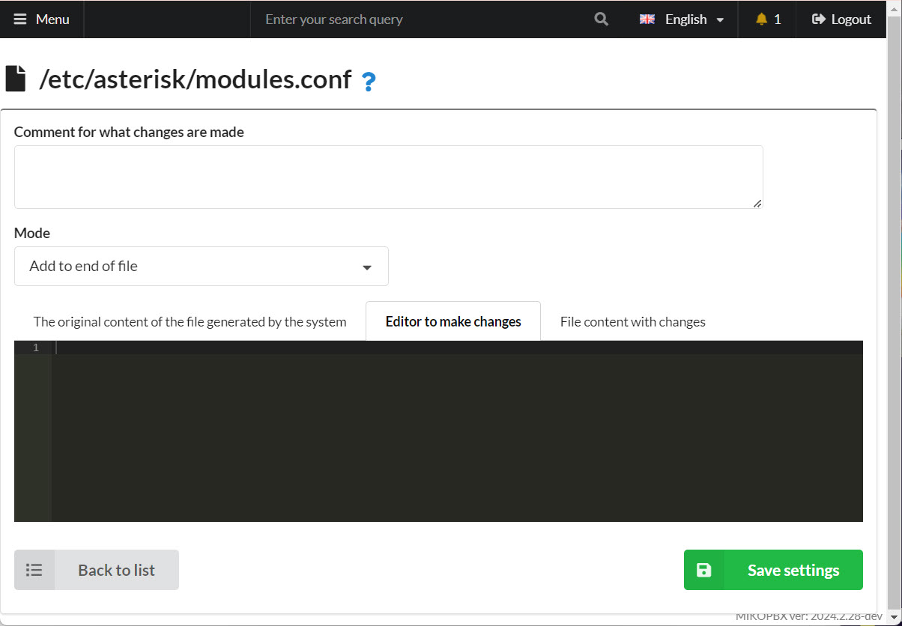
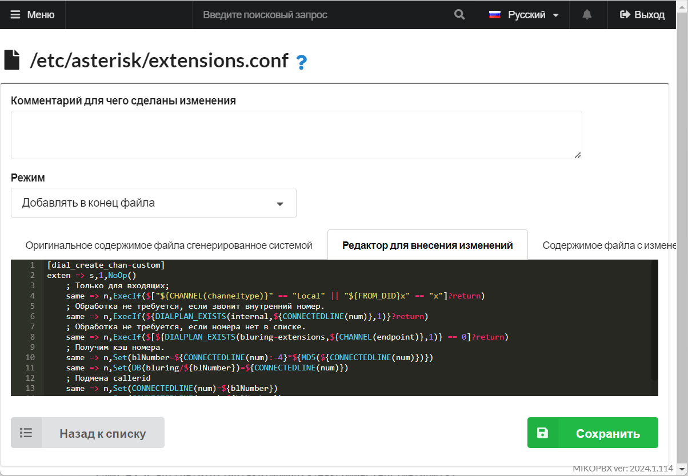

# Скрытие номера от сотрудника

В ряде случаев сотруднику не положено видеть настоящий номер телефона клиента. Рассмотрим возможный подход в решении этой задачи. Сотруднику будет передаваться подменный номер, на который он сможет перезвонить.

1. Перейдите в раздел **Система** → **Кастомизация системных файлов**

<figure><figcaption><p>Раздел "Кастомизация системных файлов"</p></figcaption></figure>

2. Откройте для редактирования конфигурационный файл **modules.conf**. Установите режим «**Добавлять в конец файла**»

<figure><figcaption><p>Режим "Добавлять в конец файла"</p></figcaption></figure>

3. Подключим модуль для вычисления хэш суммы:

```
load => func_md5.so
```

4. Откройте для редактирования конфигурационный файл **extensions.conf**. Установите режим «**Добавлять в конец файла**»

<figure><figcaption></figcaption></figure>

5. Опишем контекст для подмены номера

```php
[dial_create_chan-custom]
exten => s,1,NoOp()
    ; Только для входящих; 
    same => n,ExecIf($["${CHANNEL(channeltype)}" == "Local" || "${FROM_DID}x" == "x"]?return)
    ; Обработка не требуется, если звонит внутренний номер. 
    same => n,ExecIf(${DIALPLAN_EXISTS(internal,${CONNECTEDLINE(num)},1)}?return)
    ; Обработка не требуется, если номера нет в списке. 
    same => n,ExecIf($[${DIALPLAN_EXISTS(bluring-extensions,${CHANNEL(endpoint)},1)} == 0]?return)
    ; Получим кэш номера. 
    same => n,Set(blNumber=${CONNECTEDLINE(num):-4}*${MD5(${CONNECTEDLINE(num)})})
    same => n,Set(DB(bluring/${blNumber})=${CONNECTEDLINE(num)})
    ; Подмена callerid
    same => n,Set(CONNECTEDLINE(num)=${blNumber})
    same => n,Set(CONNECTEDLINE(name)=${blNumber})
	same => n,return
```

6. Опишем контекст с номерами, для которых нужно подменять номер

```php
[bluring-extensions]
; Разрешаем подмену для номера 201
exten => 201,1,NoOp()
; Разрешаем подмену всех четырехзначных номеров
exten => _XXXX,1,NoOp()
```

7. Предусмотрим возможность перезвонить на подменный номер

```php
[all_peers](+)
exten => _XXXX*.,1,Set(number=${DB(bluring/${EXTEN})})
    same => n,ExecIf($["${number}x" == "x"]?hangup)
    same => n,Goto(all_peers,${number},1)
```
