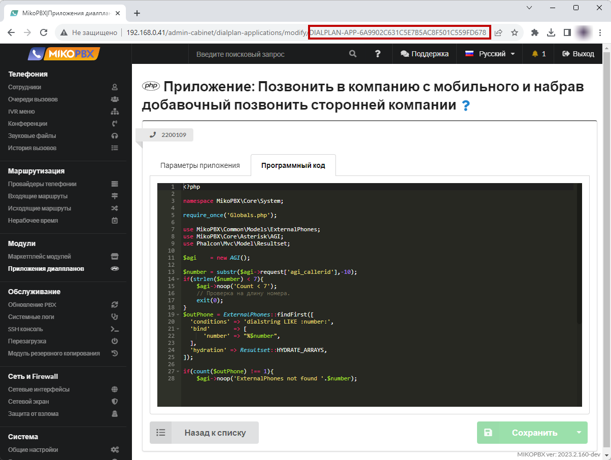
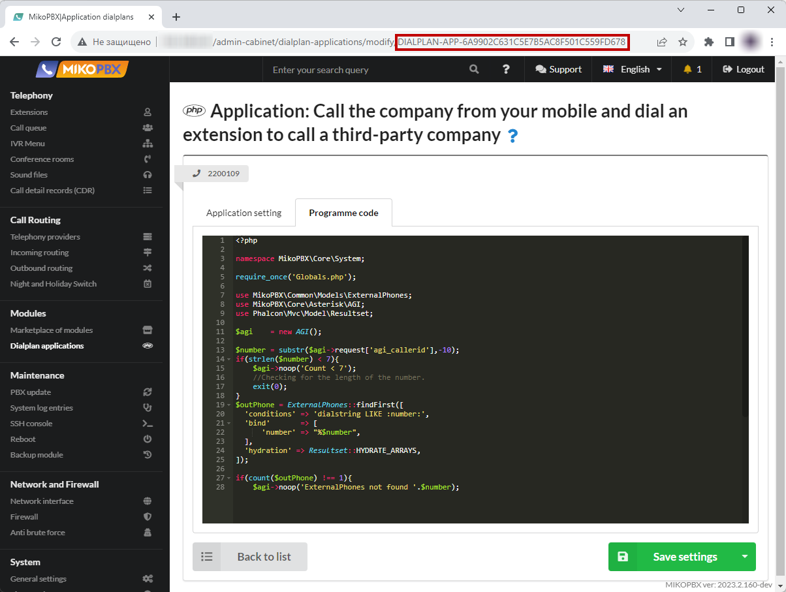
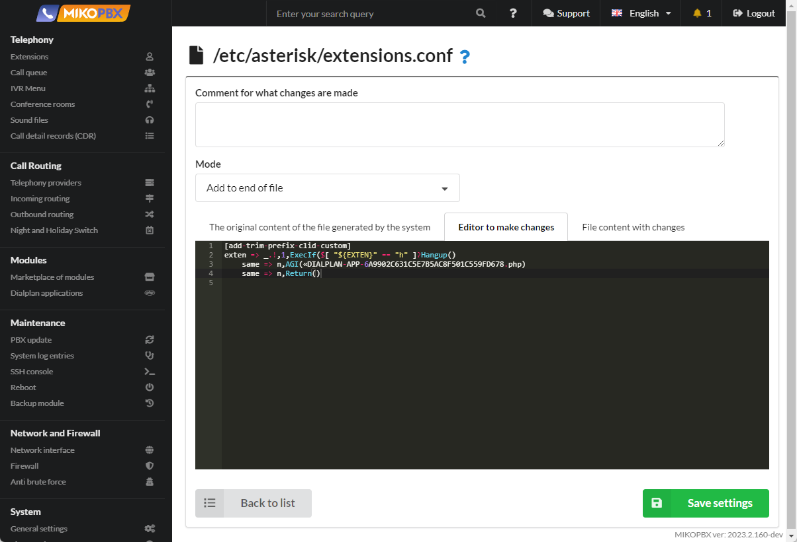

# Call the company from your mobile and dial an extension to call a third-party company

This functionality is convenient for mobile employees. When it is important that the conversation is recorded and recorded on the PBX in the call history. When it is not possible to use a softphone / or "IP-SIM".

1. Add a new dialplan application (see [Dialplan Applications](../../manual/modules/dialplan-applications.md))

<figure><figcaption><p>Dialplan applications section</p></figcaption></figure>

2. Assign an internal number, for example **2200109**

<figure><figcaption><p>Dialplan Number</p></figcaption></figure>

3. Paste the code into the "**Programme Code**" tab:

```php
<?php

namespace MikoPBX\Core\System;

require_once('Globals.php');

use MikoPBX\Common\Models\ExternalPhones;
use MikoPBX\Core\Asterisk\AGI;
use Phalcon\Mvc\Model\Resultset;

$agi    = new AGI();

$number = substr($agi->request['agi_callerid'],-10);
if(strlen($number) < 7){
    $agi->noop('Count < 7');
    //Checking for the length of the number.
    exit(0);
}
$outPhone = ExternalPhones::findFirst([
  'conditions' => 'dialstring LIKE :number:',
  'bind'       => [
      'number' => "%$number",
  ],
  'hydration' => Resultset::HYDRATE_ARRAYS,
]);

if(count($outPhone) !== 1){
    $agi->noop('ExternalPhones not found '.$number);
    // Checking whether the phone number belongs to an employee of the company.
    exit(0);
}

$agi->set_variable('AGIEXITONHANGUP', 'yes');
$agi->set_variable('AGISIGHUP', 'yes');
$agi->set_variable('__ENDCALLONANSWER', 'yes');
$agi->exec('Ringing', '');
$agi->Answer();

$result      = $agi->getData('vm-enter-num-to-call', 3000, 11);
$selectednum = $result['result']??'';
if(!empty($selectednum)){
    // Everything is OK. Ending the call.
    $agi->set_variable('__pt1c_UNIQUEID', '');
    $agi->exec(
        'Dial',
        "Local/{$selectednum}@all_peers/n,300," . 'TtekKHhU(dial_answer)b(dial_create_chan,s,1)'
    );
}else{
    $agi->noop('selectednum is empty');
}
```

<figure><figcaption><p>Code for dialplan</p></figcaption></figure>

4. In the browser's address bar, copy the application ID. It will look like "**DIALPLAN-APP-6A9902C631C5E7B5AC8F501C559FD678**"

<figure><figcaption><p>Dialplan ID</p></figcaption></figure>

5. Go to the "**System file customization**" section

<figure><figcaption><p>System file customixation section</p></figcaption></figure>

6. Open the file "**extensions.conf**" for editing

<figure><figcaption><p>"extensions.conf" file</p></figcaption></figure>

7. Paste the following code at the end of the file:

```php
[add-trim-prefix-clid-custom]
exten => _.!,1,ExecIf($[ "${EXTEN}" == "h" ]?Hangup()
    same => n,AGI(«DIALPLAN-APP-6A9902C631C5E7B5AC8F501C559FD678.php)
    same => n,Return()
```

<figure><figcaption><p>code for extensions.conf</p></figcaption></figure>


here "**DIALPLAN-APP-6A9902C631C5E7B5AC8F501C559FD678**" is the application ID.


#### Important points&#x20;

1. The application will be executed for **all** incoming calls
2. It will be possible to enter an extension only if the caller's phone number is filled in the employee card, that is, the number must belong to the employee. This is done for security.
3. The script is **not a complete product**, but is open for customization
