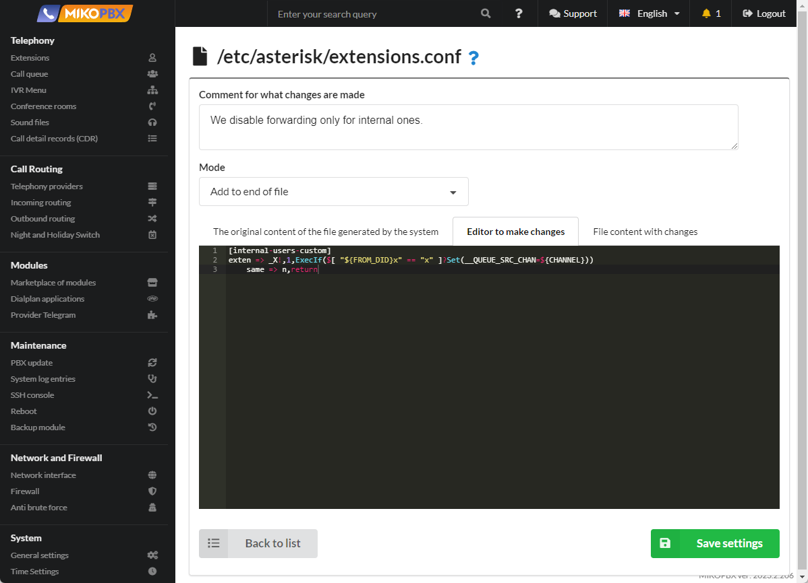

# Disable forwarding to mobile for internal calls

In the [extension ](../../manual/telephony/extensions.md)settings you can configure routing. If an employee is not available, the call can be directed to his mobile phone number. This function is not necessary for all cases. For example, clients often ask to turn it off for internal calls.

1. Go to the “**System**” section -> “**System file customization**”

<figure><figcaption><p>"System file customization" section</p></figcaption></figure>

2. Select the file “**/etc/asterisk/extensions.conf**” to edit.

<figure><figcaption><p>"Extensions.conf" file</p></figcaption></figure>

3. Select the “**Add to end of file**” mode.

<figure><figcaption><p>“Add to end of file” mode</p></figcaption></figure>

4. Add the code to the second field:


```php
[internal-users-custom]
exten => _X!,1,ExecIf($[ "${FROM_DID}x" == "x" ]?Set(__QUEUE_SRC_CHAN=${CHANNEL}))
	same => n,return
```


<figure><figcaption><p>Code for "extensions.conf" file</p></figcaption></figure>

