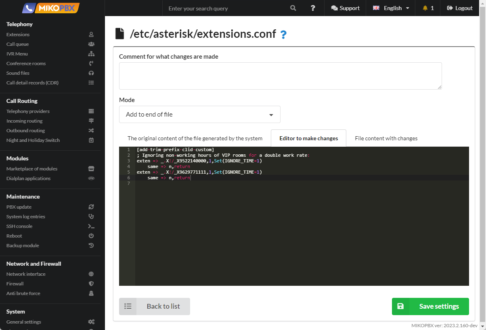

# Disabling "off-hours" for VIP numbers

1. Connect providers registered on the same host as described in the <mark style="color:red;">instructions</mark>.
2. Go to **System** → **System file customization**

<figure><figcaption><p>System file customization section</p></figcaption></figure>

3. Open the **extensions.conf** configuration file for editing.

<figure><figcaption><p>"extensions.conf" file</p></figcaption></figure>

4. Set the "**Add to end of file**" mode. In the black window, add the following code snippet:

```php
[add-trim-prefix-clid-custom]
; Ignoring non-working hours for VIP numbers for a double work rate:
exten => _.X!/_X9522140000,1,Set(IGNORE_TIME=1)
    same => n,return
exten => _.X!/_X9629771111,1,Set(IGNORE_TIME=1)
    same => n,return
```

<figure><figcaption><p>Code for extensions.conf</p></figcaption></figure>


Instead of the numbers X9522140000 and X9629771111, specify the customer phone numbers as they appear in the call history.

