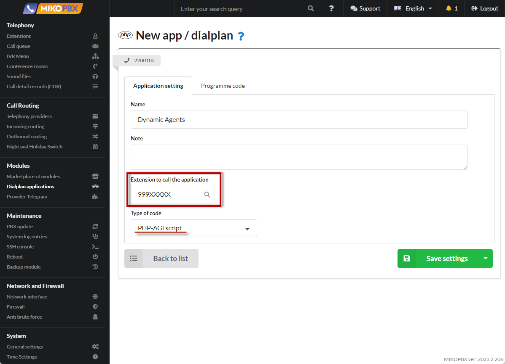
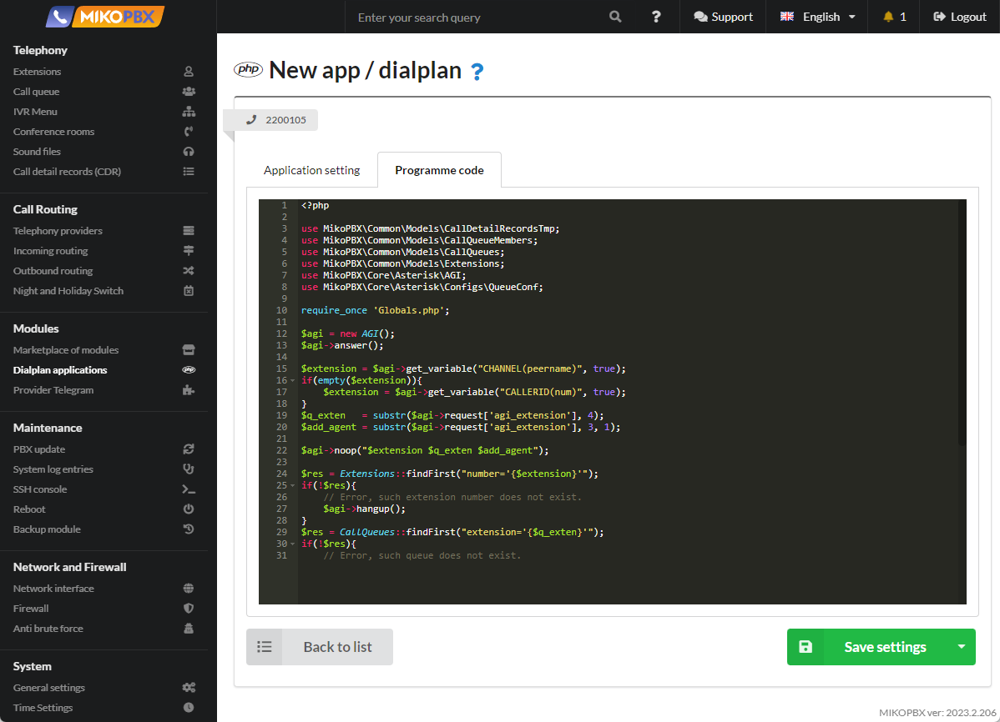

# Dynamic Queue Agents

From time to time there is a need to add and remove employees from the queue. Until now, this was only possible to do through the web interface of the telephone exchange.

&#x20;In this article I will tell you how to implement the ability to connect and disconnect from a queue by dialing a service extension number.

1. Create a new queue with a four-digit extension number. For example, **2001**. (see documentation “[Call Queue](../../manual/telephony/call-queues.md)”)

<figure><figcaption><p>"Call queue" section</p></figcaption></figure>

2. Describe the new “[Dialplan Application](../../manual/modules/dialplan-applications.md)”

<figure><figcaption><p>"Application dialplans" section</p></figcaption></figure>

3. Assign a “**Extension to call the application**” - **999XXXXX**, you can redefine the first three digits with your own combination

Code type - “**PHP AGI script**”

<figure><figcaption><p>Configuration for dialplan</p></figcaption></figure>

4. In the "**Programme code**" tab, paste the following content:

```php
<?php

use MikoPBX\Common\Models\CallDetailRecordsTmp;
use MikoPBX\Common\Models\CallQueueMembers;
use MikoPBX\Common\Models\CallQueues;
use MikoPBX\Common\Models\Extensions;
use MikoPBX\Core\Asterisk\AGI;
use MikoPBX\Core\Asterisk\Configs\QueueConf;

require_once 'Globals.php';

$agi = new AGI();
$agi->answer();

$extension = $agi->get_variable("CHANNEL(peername)", true);
if(empty($extension)){
    $extension = $agi->get_variable("CALLERID(num)", true);
}
$q_exten   = substr($agi->request['agi_extension'], 4);
$add_agent = substr($agi->request['agi_extension'], 3, 1);

$agi->noop("$extension $q_exten $add_agent");

$res = Extensions::findFirst("number='{$extension}'");
if(!$res){
    // Error, such extension number does not exist.
    $agi->hangup();
}
$res = CallQueues::findFirst("extension='{$q_exten}'");
if(!$res){
    // Error, such queue does not exist.
    $agi->hangup();
}
$a_count = CallQueueMembers::maximum([ "queue='{$res->uniqid}'", 'column' => 'priority'] ) + 1;
$member  = CallQueueMembers::findFirst("queue='{$res->uniqid}' AND extension='{$extension}'");

if($add_agent === '1' && !$member){
    $member = new CallQueueMembers();
    $member->extension  = $extension;
    $member->queue      = $res->uniqid;
    $member->priority   = $a_count;
    $member->save();
    QueueConf::queueReload();
}

if($add_agent == false && $member){
    $member->delete();
    QueueConf::queueReload();
}

$linkedid = $agi->get_variable("CDR(linkedid)", true);
$res = CallDetailRecordsTmp::find("linkedid='{$linkedid}'");
foreach ($res as $data){
    $data->delete();
}
sleep(2);
$agi->hangup();
```

Press "**Save settings**"!

<figure><figcaption><p>Programme code for Dynamic Agents </p></figcaption></figure>

Now "Dynamic queue agents" application is ready to use :tada:.


Dial **99912001** to join queue 2001 .

Dial **99902001** to disconnect from queue 2001.

