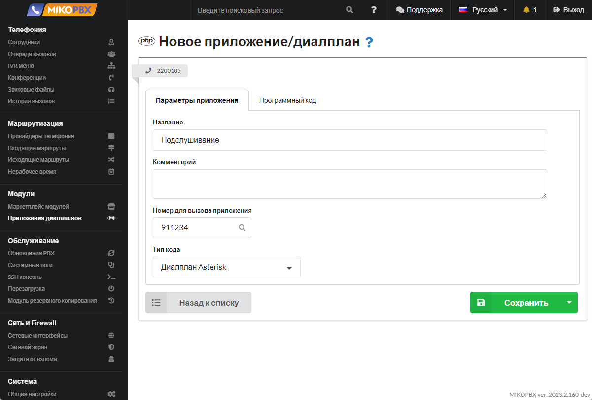
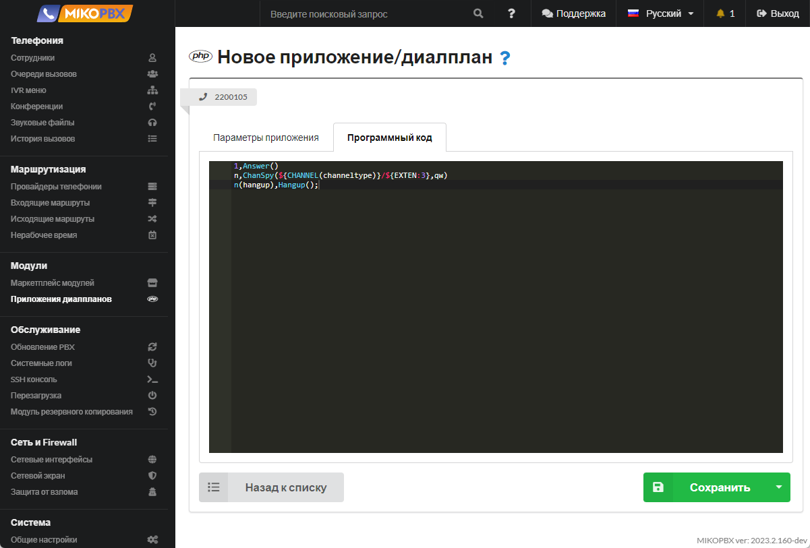

# Как реализовать функцию суфлера

## Создание диалплана <a href="#podslushat_razgovor" id="podslushat_razgovor"></a>

1. Перейдите в раздел «**Модули**» - «**Приложения диалпланов**». Создайте новый диалплан.

<figure><figcaption><p>Новое приложение диалплана</p></figcaption></figure>

2. Укажите название «Подслушивание». Укажите «номер для вызова приложения», тут будем использовать шаблон «911XXX» - XXX означает все **трехзначные** числовые номера. В поле «**тип кода**» укажите «**Диалплан Asterisk**»

<figure><figcaption><p>Шаблон параметров для диалплана</p></figcaption></figure>

## Шаблоны

Дальнейший функционал вы можете выбрать из трех вариантов:

### 1. Подслушать разговор

Появляется возможность подслушать чужой разговор, так что ни оператор, ни клиент ничего не заподозрят

Во вкладке ''**Программный код**'' вставьте следующий код:

```php
1,Answer()
n,ChanSpy(${CHANNEL(channeltype)}/${EXTEN:3},qw)
n(hangup),Hangup();
```

<figure><figcaption><p>Первый вариант реализации</p></figcaption></figure>


**ChanSpy(SIP/${EXTEN:3},qw)** - обратите внимание, в качестве EXTEN будет передан номер приложения. Если вы набираете 911101, то будет набран внутренний номер 101. Отсекаются первые три цифры.

Если вы измените длину шаблона, то следует скорректировать эту строку.

При использовании PJSIP команда будет иметь вид **ChanSpy(PJSIP/${EXTEN:3},qw)**


### 2. Вмешаться в разговор <a href="#vmeshatsja_v_razgovor" id="vmeshatsja_v_razgovor"></a>

Во вкладке ''**Программный код**'' вставьте следующий код:

```php
1,Answer()
n,ChanSpy(${CHANNEL(channeltype)}/${EXTEN:3},qBx)
n(hangup),Hangup();
```

<figure><figcaption><p>Второй вариант реализации</p></figcaption></figure>


Отличия только в параметрах для **ChanSpy**


### 3. ''Шепнуть'' коллеге <a href="#shepnut_kollege" id="shepnut_kollege"></a>

Во вкладке ''**Программный код**'' вставьте следующий код:

```php
1,Answer()
n,ChanSpy(${CHANNEL(channeltype)}/${EXTEN:3},wvq(4)x)
n(hangup),Hangup();
```

<figure><figcaption><p>Третий вариант реализации</p></figcaption></figure>


Отличия только в параметрах для **ChanSpy**

