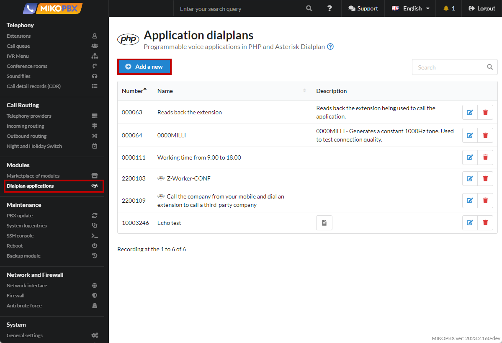
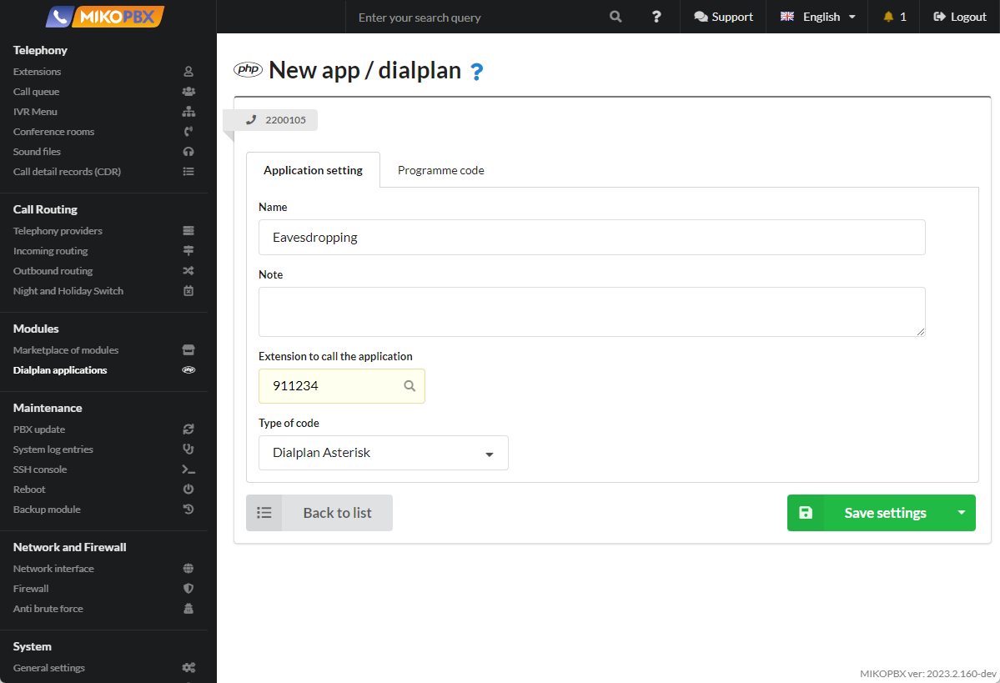

# How to implement the prompter function

## Creating a dialplan

1. Go to the "**Modules**" - "**Dialplan Applications**". Create a new dialplan.

<figure><figcaption><p>New Dialplan app</p></figcaption></figure>

2. Enter the name "Eavesdropping". Specify the "number to call the application", here we will use the template "911XXX" - XXX means all **three-digit** numeric numbers. In the "**Type of code**" field, specify "**Dialplan Asterisk**"

<figure><figcaption><p>Template of parameters for dialplan</p></figcaption></figure>

## Templates

Further functionality you can choose from three options:

### 1. Eavesdrop on a conversation

It becomes possible to eavesdrop on someone else's conversation, so that neither the operator nor the client will suspect anything

In the tab "**Programme code**" insert the following code:

```php
1,Answer()
n,ChanSpy(${CHANNEL(channeltype)}/${EXTEN:3},qw)
n(hangup),Hangup();
```

<figure><figcaption><p>The first implementation option</p></figcaption></figure>


**ChanSpy(SIP/${EXTEN:3},qw)** - note that the application number will be passed as EXTEN. If you dial 911101, the internal number 101 will be dialed. The first three digits are cut off.&#x20;

If you change the length of the template, then you should adjust this line.&#x20;

When using PJSIP, the command will look like **ChanSpy(PJSIP/${EXTEN:3},qw)**


### 2. To intervene in the conversation

In the tab "**Programme code**" insert the following code:

```php
1,Answer()
n,ChanSpy(${CHANNEL(channeltype)}/${EXTEN:3},qBx)
n(hangup),Hangup();
```

<figure><figcaption><p>The second implementation option</p></figcaption></figure>


The differences are only in the parameters for **ChanSpy**


### 3. "Whisper'' to a colleague

In the tab "**Programme code**" insert the following code:

```php
1,Answer()
n,ChanSpy(${CHANNEL(channeltype)}/${EXTEN:3},wvq(4)x)
n(hangup),Hangup();
```

<figure><figcaption><p>The third implementation option</p></figcaption></figure>


The differences are only in the parameters for **ChanSpy**

