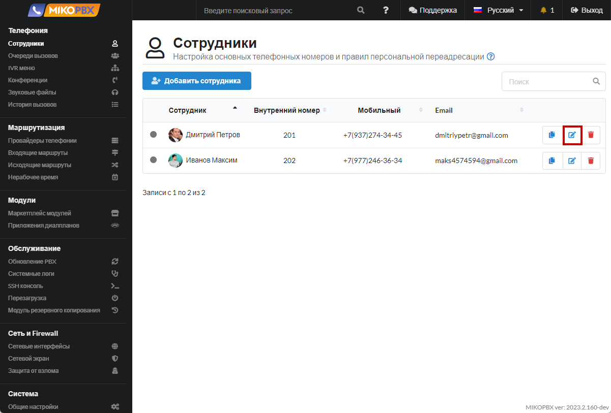

# Ограничить количество авторизаций на одном SIP аккаунте

1. Перейдите к редактированию учетной записи сотрудника.

<figure><figcaption><p>Редактирование учетной записи сотрудника</p></figcaption></figure>

2. &#x20;В поле «**Дополнительные параметры**», добавьте:

```php
[aor]
max_contacts = 1
```

<figure><figcaption><p>Дополнительные параметры в учетной записи сотрудника</p></figcaption></figure>


Будет работать последняя регистрация. Софтфон / телефон, который зарегистрировался последним и будет принимать вызовы. Исходящие сможет совершать каждое конечное устройство.

