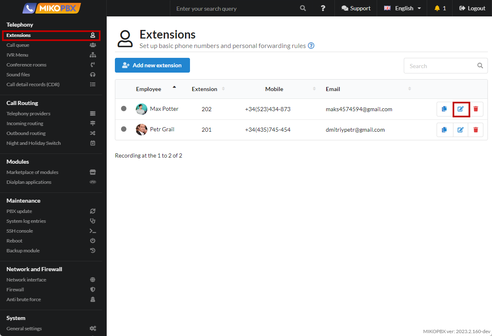
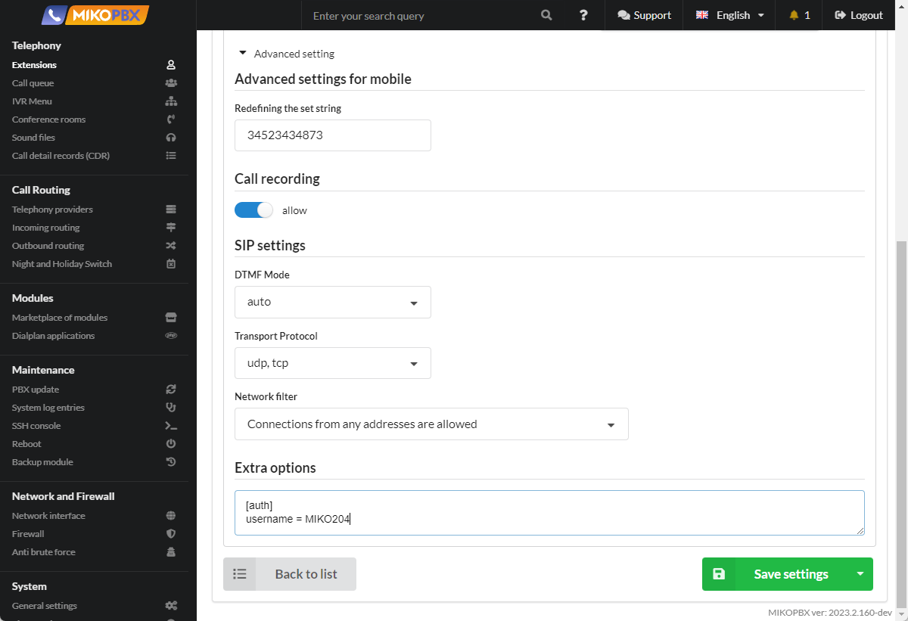

# Limit the number of authorizations per SIP account

1. Go to edit the employee account.

<figure><figcaption><p>Editing an employee's account</p></figcaption></figure>

2. In the "**Extra oprions**" field, add:

```
[aor]
max_contacts = 1
```

<figure><figcaption><p>Additional parameters in the employee account</p></figcaption></figure>


The last registration will work. The softphone/phone that registered last and will receive calls. Outgoing calls can be made by each end device.

