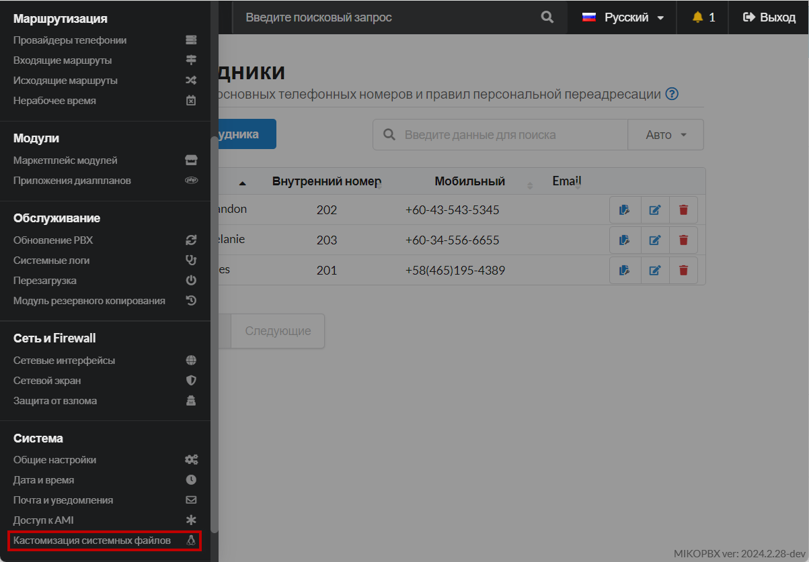
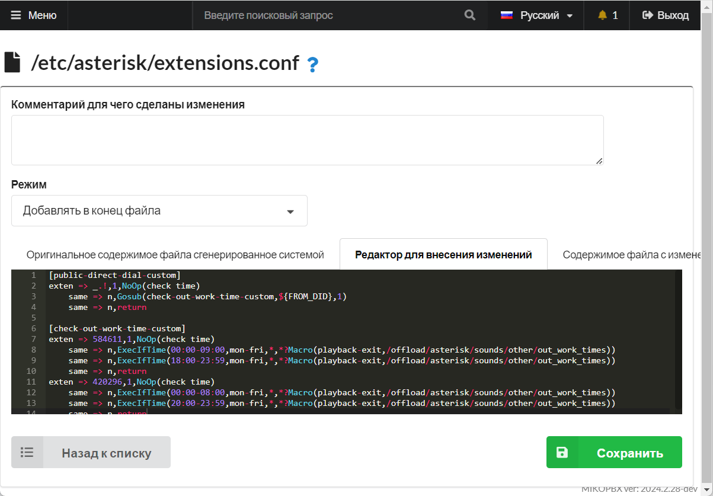

# Настройка индивидуального нерабочего времени для нескольких провайдеров, на одном хосте

## Постановка задачи <a href="#postanovka_zadachi" id="postanovka_zadachi"></a>

Имеем две учетные записи от провайдера Zadarma, настроенных в MikoPBX по [инструкции](registering-multiple-accounts-from-one-provider.md).

<figure><figcaption><p>Две учетные записи</p></figcaption></figure>

Необходимо для каждого номера Zadarma настроить свое нерабочее время. Например, для номера +7(495)-229-30-42 рабочее время с 9.00 до 18.00 по МСК; для номера +7 (499) 638-25-84 рабочее время с 8.00 до 20.00 по МСК.

## Решение <a href="#reshenie" id="reshenie"></a>

1. Перейдите в раздел **Система** → **Кастомизация системных файлов**.

<figure><figcaption><p>Раздел "Кастомизация системных файлов"</p></figcaption></figure>

2. &#x20;Откройте для редактирования конфигурационный файл **extensions.conf**. Установите режим «**Добавлять в конец файла**». В черное окно добавьте следующий фрагмент кода:

```php
[public-direct-dial-custom]
exten => _.!,1,NoOp(check time)
    same => n,Gosub(check-out-work-time-custom,${FROM_DID},1)
    same => n,return
	
[check-out-work-time-custom]
exten => 584611,1,NoOp(check time)
    same => n,ExecIfTime(00:00-09:00,mon-fri,*,*?Macro(playback-exit,/offload/asterisk/sounds/other/out_work_times))
    same => n,ExecIfTime(18:00-23:59,mon-fri,*,*?Macro(playback-exit,/offload/asterisk/sounds/other/out_work_times))
    same => n,return
exten => 420296,1,NoOp(check time)
    same => n,ExecIfTime(00:00-08:00,mon-fri,*,*?Macro(playback-exit,/offload/asterisk/sounds/other/out_work_times))
    same => n,ExecIfTime(20:00-23:59,mon-fri,*,*?Macro(playback-exit,/offload/asterisk/sounds/other/out_work_times))
    same => n,return
```

<figure><figcaption><p>Код в конец файла extensions.conf</p></figcaption></figure>

В выше приведенном фрагменте кода Вам необходимо указать логины от Ваших учетных записей провайдеров. В нашем примере использовались следующие данные:

* **584611** - логин от учетной записи провайдера для номера телефона +7(495)-229-30-42.

Рабочее время с 9.00 до 18.00. Следовательно необходимо задать два интервала для нерабочего времени: 00:00-09:00 и 18:00-23:59.

* **420296** - логин от учетной записи провайдера для номера телефона +7 (499) 638-25-84.

Рабочее время с 8.00 до 20.00. Следовательно необходимо задать два интервала для нерабочего времени: 00:00-08:00 и 20:00-23:59.

Ниже красным цветом выделены фрагменты, которые Вам необходимо изменить:

<figure><figcaption><p>Фрагменты для изменения </p></figcaption></figure>

Более подробно разберём команду **ExecIfTime**. Эта команда выполняет указанное приложение Asterisk, если текущее время соответствует заданной спецификации времени. В нашем случае команда выполняет проигрывание звукового файла, расположенного в директории **/offload/asterisk/sounds/other/out\_work\_times** в MikoPBX.\
Синтаксис команды:

```
ExecIfTime(times,weekdays,mdays,months?appname[(appargs)])
```

* **times** - Диапазоны времени в 24-часовом формате
* **weekdays** - Дни недели (mon, tue, wed, thu, fri, sat, sun)
* **mdays** - Дни месяца (1-31)
* **months** - Месяцы (jan, feb, mar, apr и т. д.)
* **appname\[(appargs)]** - команда Asterisk с указанием параметров вызова

В нашем примере указаны диапазон времени, диапазон дней недели. Вместо указания дней месяцев и месяцев введены \*. Этот символ означает «для всех остальных случаев».

```
ExecIfTime(00:00-08:00,mon-fri,*,*?Macro(playback-exit,/offload/asterisk/sounds/other/out_work_times))
```
