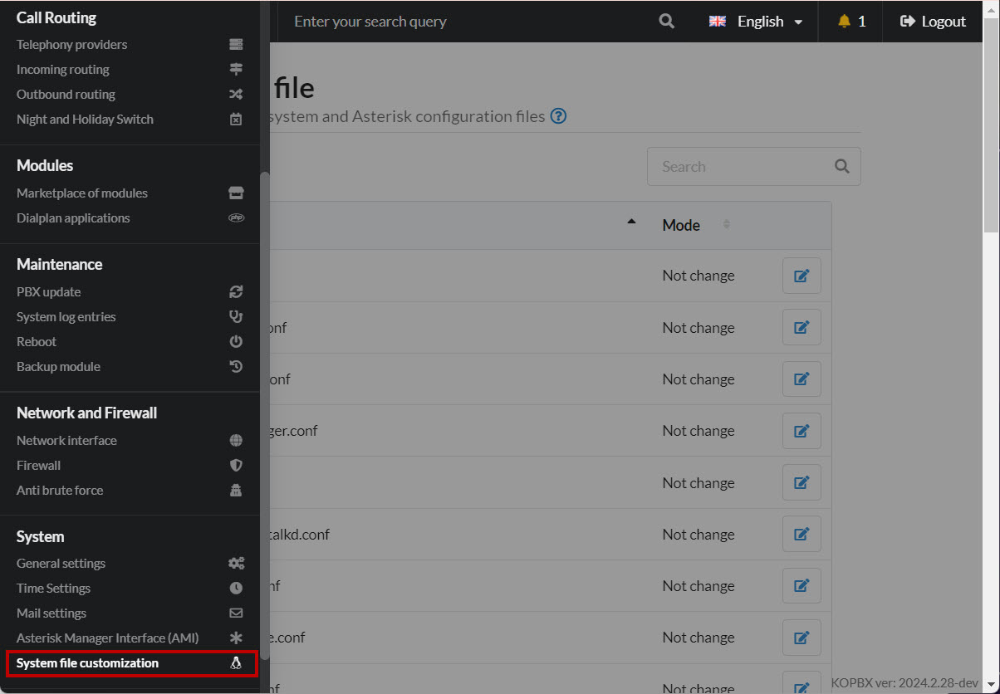
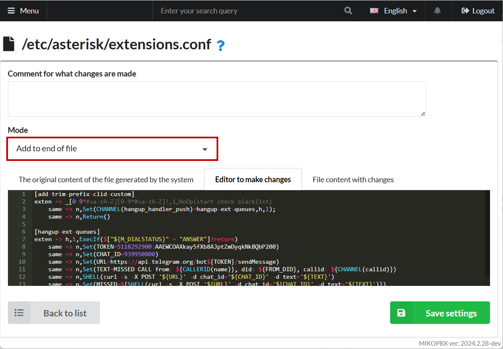
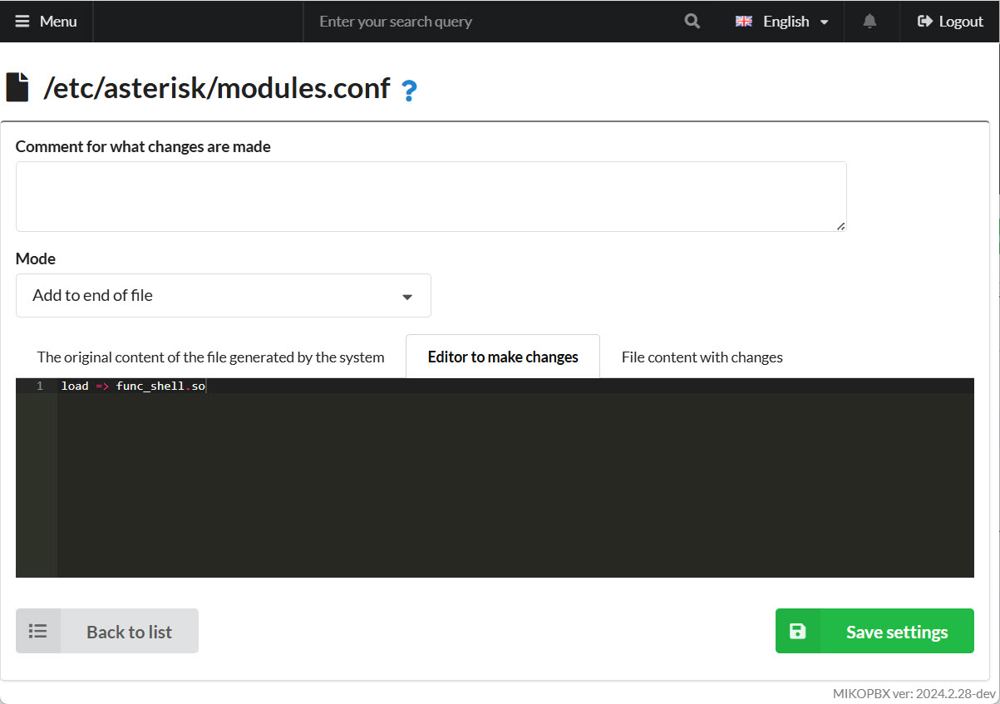
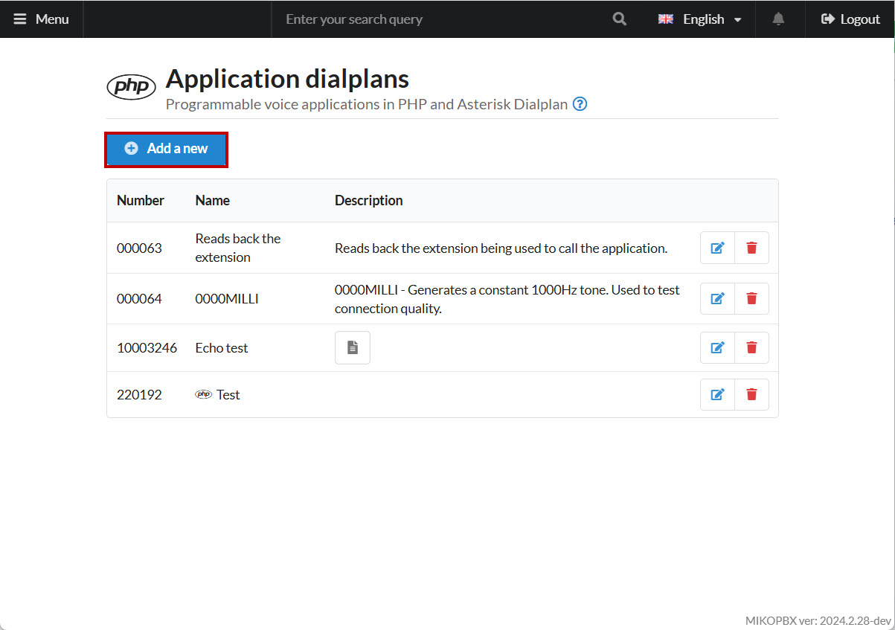
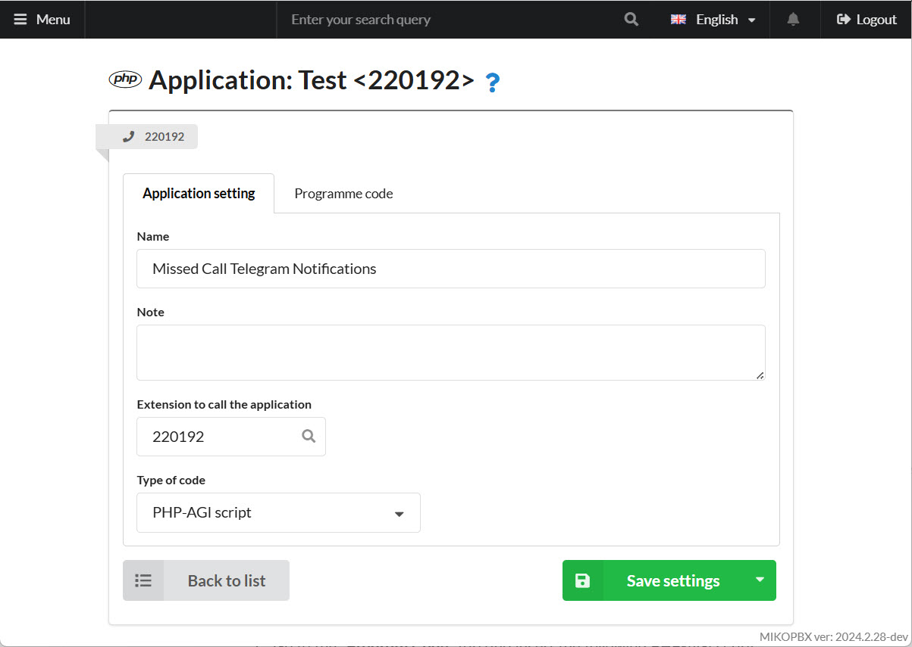
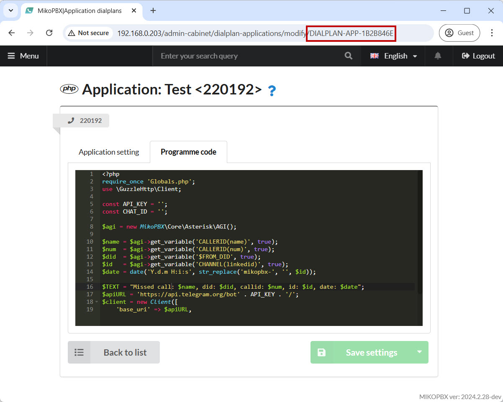
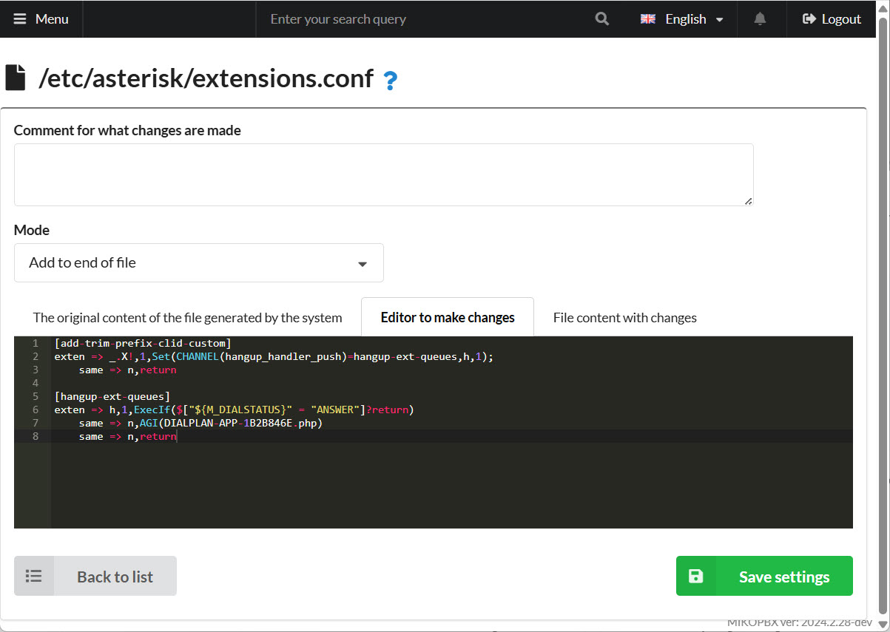

# Missed Call Telegram Notifications

## Dialplan-Based Example


[Helpful article](https://gist.github.com/dideler/85de4d64f66c1966788c1b2304b9caf1) on working with a Telegram bot using **curl**.


1. Go to the **"System File Customization"** section:

<figure><figcaption><p>System file customization section</p></figcaption></figure>

2. Open the **"extensions.conf"** file for editing. Set the mode to **"Append to the end of the file"** and insert the following context:

```php
[add-trim-prefix-clid-custom]
exten => _[0-9*#+a-zA-Z][0-9*#+a-zA-Z]!,1,NoOp(start check blacklist)
	same => n,Set(CHANNEL(hangup_handler_push)=hangup-ext-queues,h,1);
	same => n,Return()

[hangup-ext-queues]
exten => h,1,ExecIf($["${M_DIALSTATUS}" = "ANSWER"]?return)
    same => n,Set(TOKEN=5118292900:AAEWCOAXkay5fXb8AJptZmDyqkNk8QbP200)
    same => n,Set(CHAT_ID=939950800)
    same => n,Set(URL=https://api.telegram.org/bot${TOKEN}/sendMessage)
    same => n,Set(TEXT=MISSED CALL from: ${CALLERID(name)}, did: ${FROM_DID}, callid: ${CHANNEL(callid)})
    same => n,SHELL(curl -s -X POST '${URL}' -d chat_id='${CHAT_ID}' -d text='${TEXT}')
    same => n,Set(MISSED=${SHELL(curl -s -X POST '${URL}' -d chat_id='${CHAT_ID}' -d text='${TEXT}')})
    same => n,return
```

In this context, replace:

* **TOKEN** with your Telegram bot’s token.
* **CHAT\_ID** with the chat ID where messages should be sent.

Save your changes.

<figure><figcaption><p>Editing file "extensions.conf"</p></figcaption></figure>

3. Go to **"modules.conf"** for editing. Set the mode to **"Append to the end of the file"** and insert the following line:

```
load => func_shell.so
```

Save your changes.

<figure><figcaption><p>Editing file "modules.conf"</p></figcaption></figure>


With **curl**, you can send requests to any website. For example, you could send notifications to **Slack**:


```php
same => n,Set(MISSED=${SHELL(curl -X POST --data-urlencode "payload={\"channel\": \"#cannel_name\", \"username\": \"bot_name\", \"text\": \"Missed call from ${CALLERID(name)} using external line: ${FROM_DID} в ${STRFTIME(${EPOCH},,%H:%M:%S %d-%m-%Y)}\", \"icon_emoji\": \":sos:\"}" https://hooks.slack.com/services/T76G7L0/B01R/VMPQUeAN)})
```



## PHP-AGI Example

1. Go to **"Dialplan Applications"** and create a new application by clicking **"Add a new"**:

<figure><figcaption><p>Creating new dialplan app</p></figcaption></figure>

2. Provide the following parameters for the dialplan:

* **Name** – any name
* **Number to Call the Application** – any number
* **Code Type** – "_PHP-AGI script_"

<figure><figcaption><p>Dialplan parameters</p></figcaption></figure>

3. Go to the **"Program Code"** tab and insert the following PHP-AGI script:


```php
<?php
require_once 'Globals.php';
use \GuzzleHttp\Client;

const API_KEY = '';
const CHAT_ID = '';

$agi = new MikoPBX\Core\Asterisk\AGI();

$name = $agi->get_variable('CALLERID(name)', true);
$num  = $agi->get_variable('CALLERID(num)', true);
$did  = $agi->get_variable('$FROM_DID', true);
$id   = $agi->get_variable('CHANNEL(linkedid)', true);
$date = date('Y.d.m H:i:s', str_replace('mikopbx-', '', $id));

$TEXT = "Missed call: $name, did: $did, callid: $num, id: $id, date: $date";
$apiURL = 'https://api.telegram.org/bot' . API_KEY . '/';
$client = new Client([
    'base_uri' => $apiURL,
    'timeout' => 1,
    'http_errors' => false,
]);
try {
    $client->post( 'sendMessage', ['query' => ['chat_id' => CHAT_ID, 'text' => $TEXT]] );
}catch (Throwable $e){
}
```


In this context, replace:

* **API\_KEY** with your Telegram bot token.
* **CHAT\_ID** with the chat ID where you want to send the message.

You can modify the notification text in the **$TEXT** variable.

4. After saving the script, copy its identifier from the browser’s address bar, which looks like **"DIALPLAN-APP-1B2B846E"**:

<figure><figcaption><p>Dialplan application identifier</p></figcaption></figure>

5. Go to **"System file customization"**:

<figure><figcaption><p>"System file customization" section</p></figcaption></figure>

6. Open **"extensions.conf"** for editing. Set the mode to **"Append to the end of the file"** and insert the following context:

```php
[add-trim-prefix-clid-custom]
exten => _.X!,1,Set(CHANNEL(hangup_handler_push)=hangup-ext-queues,h,1);
	same => n,return

[hangup-ext-queues]
exten => h,1,ExecIf($["${M_DIALSTATUS}" = "ANSWER"]?return)
    same => n,AGI(DIALPLAN-APP-1B2B846E.php)
    same => n,return
```


Replace **"DIALPLAN-APP-1B2B846E"** with your dialplan application ID.&#x20;


Save your changes.

<figure><figcaption><p>Editing file "extensions.conf"</p></figcaption></figure>
