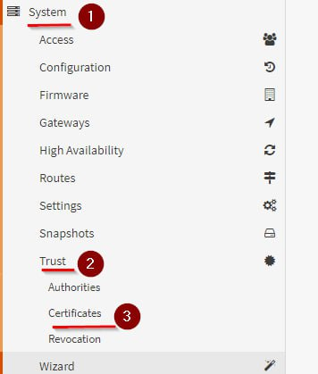
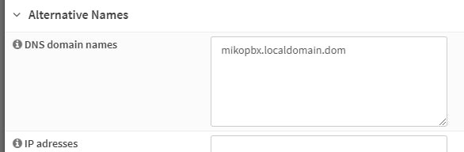
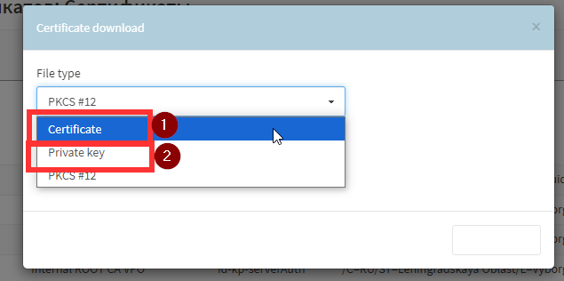
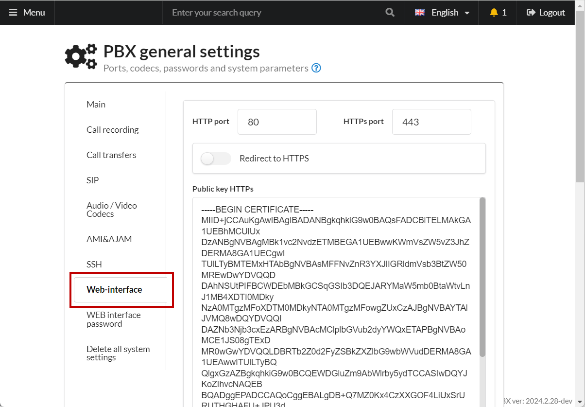

# SSL Certificate for MikoPBX Web Interface from OPNSense

**OPNsense** is a FreeBSD-based operating system designed for creating firewalls and routers. It provides powerful network management tools, including VPN, traffic filtering, monitoring, and load balancing.

OPNSense includes a certification authority (CA) and can issue SSL certificates for the MikoPBX web interface.

First, ensure that the OPNSense certification authority is configured and that the root certificate is installed on the user's workstation.

### Creating a Certificate in OPNSense

1. **Generate a certificate:** Navigate to your OPNSense server and open the certificate manager:

<figure><figcaption>
Certificate Manager
</figcaption></figure>

2. **Issue an internal certificate:** Assign a clear **name**, choose **server** as the **certificate type**, specify your internal certification authority as the **issuer**, and set the certificate validity period in days.

<figure><figcaption>
Certificate Parameters
</figcaption></figure>

3. **Specify DNS:** Enter the DNS configured for MikoPBX.

<figure><figcaption>
DNS Domain Names
</figcaption></figure>

Save the certificate in OPNSense.

4. **Save the public and private keys:** Locate your PBX certificate in the list and click "Download."

<figure><figcaption>
Download Button
</figcaption></figure>

5. **Download the public key (1) and private key (2).**

<figure><figcaption>
Downloading Public and Private Keys
</figcaption></figure>

### Installing the Certificate in MikoPBX

1. Navigate to **General Settings -> WEB-Interface**.

<figure><figcaption>
WEB-interface section
</figcaption></figure>

2. Open the previously downloaded files using a text editor. Paste the contents into the Web interface fields.

* **Public Key**: Enter the content starting with "BEGIN CERTIFICATE."
* **Private Key**: Enter the content starting with "BEGIN PRIVATE KEY."

3. **Save** the settings.
4. Open the MikoPBX web interface in your browser's incognito mode using an HTTPS connection. Your connection is now secure.
