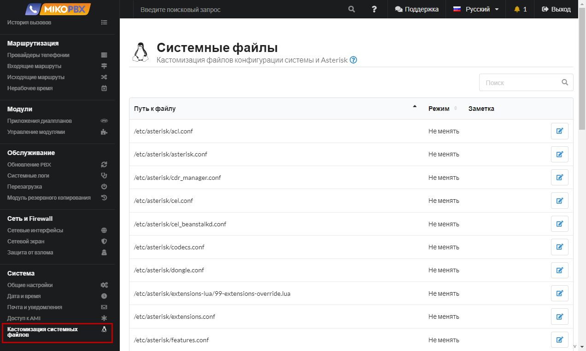
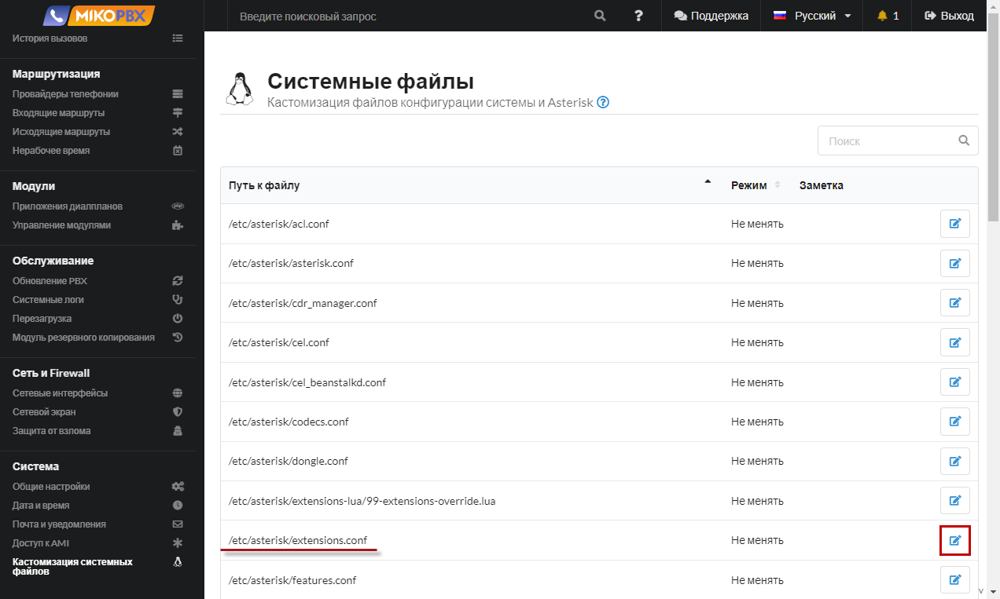
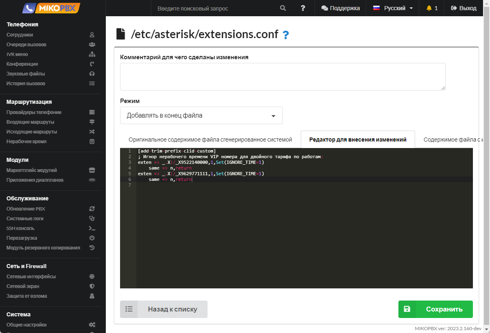

# Отключение "нерабочего времени" для VIP номеров

1. Подключите провайдеров, зарегистрированных на одном хосте, как описано в [<mark style="color:red;">инструкции</mark>](https://wiki.mikopbx.ru/providers:many\_hosts)
2. Перейдите в раздел **Система** → **Кастомизация системных файлов**.

<figure><figcaption><p>Раздел кастомизации системных файлов</p></figcaption></figure>

3. Откройте для редактирования конфигурационный файл **extensions.conf**.

<figure><figcaption><p>Конфигурационный файл "extensions.conf"</p></figcaption></figure>

4. Установите режим «**Добавлять в конец файла**». В черное окно добавьте следующий фрагмент кода:

```php
[add-trim-prefix-clid-custom]
; Игнор нерабочего времени VIP номера для двойного тарифа по работам:
exten => _.X!/_X9522140000,1,Set(IGNORE_TIME=1)
    same => n,return
exten => _.X!/_X9629771111,1,Set(IGNORE_TIME=1)
    same => n,return
```

<figure><figcaption><p>Код для extensions.conf</p></figcaption></figure>


Вместо номеров X9522140000 и X9629771111 укажите номера телефонов клиентов, в том виде, как они отображаются в истории звонков.

