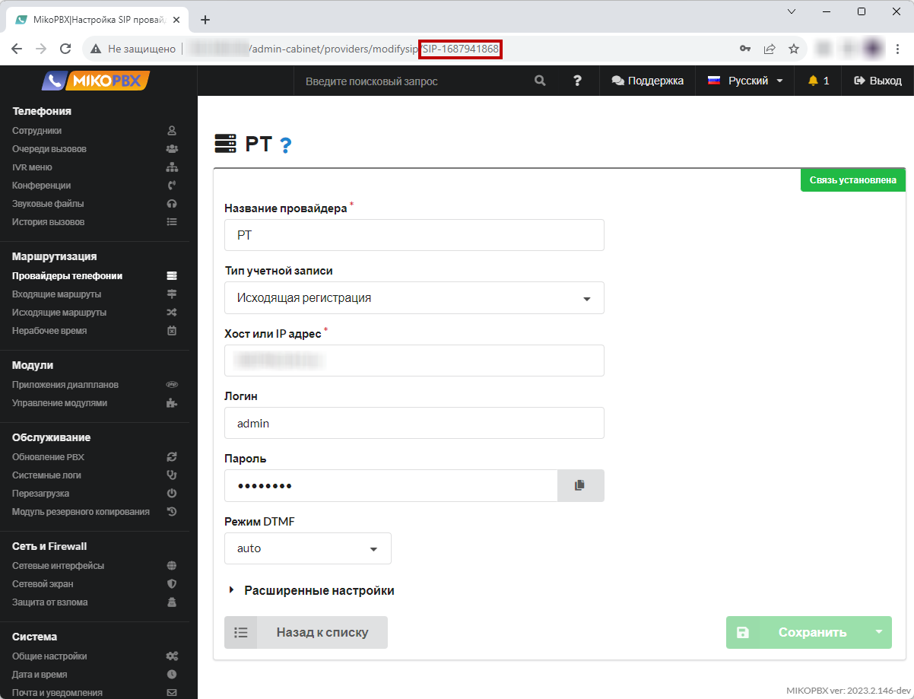
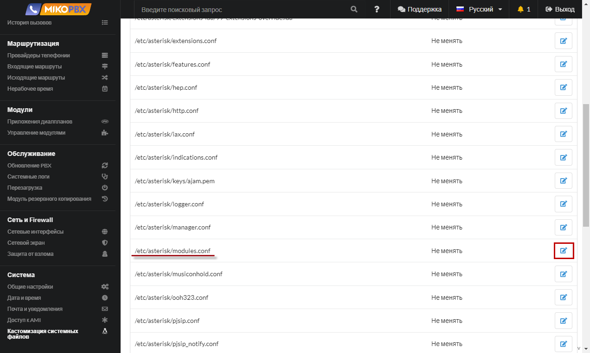
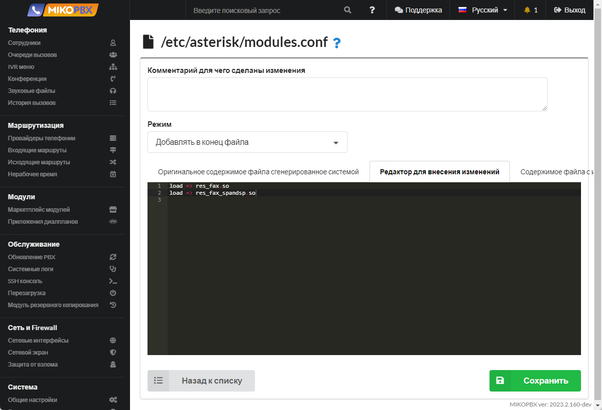

# Отправка входящего факса на email

1. Добавьте новое приложение dialplan (см. [**Приложения диалпланов**](../../manual/modules/dialplan-applications.md))

<figure><figcaption><p>Новое приложение диалпланов</p></figcaption></figure>

2. Назначьте внутренний номер, к примеру **2200110**

<figure><figcaption><p>Внутренний номер приложения </p></figcaption></figure>

3. Вставьте следующий код во вкладку "Программный код"

```php
<?php
require_once 'Globals.php';

use \MikoPBX\Core\Asterisk\AGI;
use MikoPBX\Core\System\Notifications;
use MikoPBX\Core\System\{MikoPBXConfig};

$agi     = new AGI();
$faxFile = "/tmp/" .$agi->get_variable("CDR(linkedid)", true).'.tiff';
$caller  = $agi->get_variable("CALLERID(num)", true);
$agi->exec("ReceiveFax", "{$faxFile},d"); 
$result  = $agi->get_variable("FAXOPT(status)", true);

if($result === 'SUCCESS' && file_exists($faxFile)){
    $notify = new Notifications();
    $notify->sendMail('test@gmail.com', 'Fax msg from '.$caller, 'Incoming fax <br><br>', $faxFile);
    unlink($faxFile);
}
sleep(1);
```


В коде приложения укажите свой email вместо адреса «test@gmail.com».


4. Перейдите в раздел "**Кастомизация системных файлов**"

<figure><figcaption><p>Раздел "Кастомизация системных файлов"</p></figcaption></figure>

5. Откройте для редактирования файл "**extensions.conf**"&#x20;

<figure><figcaption><p>Конфигурационный файл "extensions.conf"</p></figcaption></figure>

6.  Добавьте следующий код в конец файла:

    ```php
    [SIP-1687941868-incoming](+)
    exten => fax,1,Goto(internal,2200100,1)
    ```

    «2200100» замените на номер **своего** приложения

<figure><figcaption><p>Код для extensions.conf</p></figcaption></figure>

В коде, «**SIP-1687941868**» замените на ID своего провайдера. Подсмотреть его значение можно в карточке провайдера, в адресной строке браузера

<figure><figcaption><p>ID провайдера </p></figcaption></figure>

7. Откройте для редактирования файл "**modules.conf**"&#x20;

<figure><figcaption><p>Конфигурационный файл "Modules.conf"</p></figcaption></figure>

8. Вставьте в конец файла код:

```php
load => res_fax.so
load => res_fax_spandsp.so
```

<figure><figcaption><p>Код для modules.conf</p></figcaption></figure>

9. В карточке провайдера, в **расширенных настройках**, в **дополнительных параметрах** укажите

```php
[endpoint]
fax_detect=yes
fax_detect_timeout=30
```
