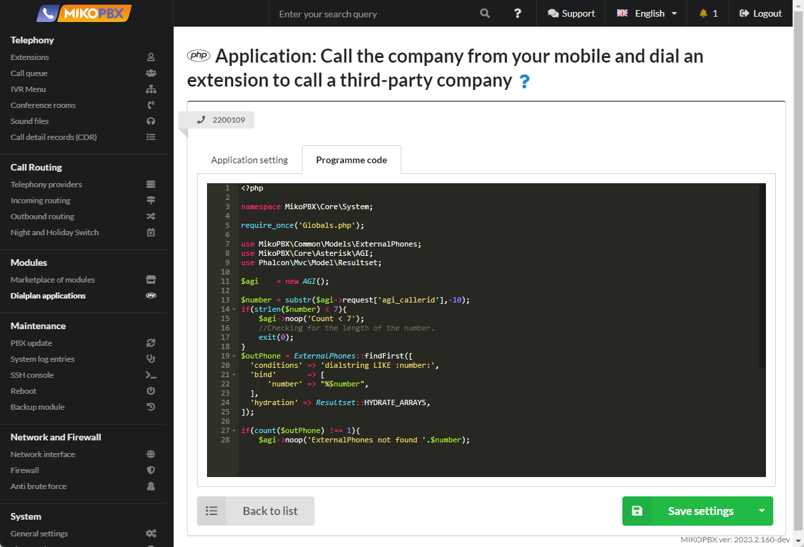

# Настройка функции "Paging"

Пейджинг через телефоны, т.е. передача голосового сообщения через насколько телефонов через громкую связь. К примеру руководитель может быстро созвать совещание.


Данная инструкция подойдет для телефонов:

* **Linksys**
* **Cisco**
* **Telephone** (софтфон)
* **Grandstream**
* **microsip** (софтфон)
* **Yealink**
* **Fanvil**&#x20;
* **Snom**&#x20;


1. Перейдите в раздел "**Кастомизация системных файлов**"

<figure><figcaption><p>Раздел "Кастомизация системных файлов"</p></figcaption></figure>

2. Откройте для редактирования файл "**/var/spool/cron/crontabs/root"**

<figure><figcaption><p>Файл "crontabs/root"</p></figcaption></figure>

3. Добавьте в конец файла следующий код:

```php
*/1 * * * * /bin/touch /etc/asterisk/confbridge.conf > /dev/null 2> /dev/null
```

<figure><figcaption><p>Код для файла "crontabs.root"</p></figcaption></figure>

4. Перейдите к редактированию файла "**modules.conf**"

<figure><figcaption><p>Файл "Modules.conf" </p></figcaption></figure>

5. Добавьте следующий код в конец файла:

```php
load => bridge_softmix.so
load => app_confbridge.so
load => app_page.so
```

<figure><figcaption><p>Код для "modules.conf"</p></figcaption></figure>

6. Перейдите к редактированию файла "**extensions.conf**"

<figure><figcaption><p>Файл "extensions.conf"</p></figcaption></figure>

7. Добавьте следующий код в конец файла "extensions.conf"

```php
[paging-users] 
exten => _X!,1,Set(dС=${PJSIP_DIAL_CONTACTS(${EXTEN})})
  same => n,ExecIf($["${dС}x" != "x"]?Dial(${dС},,b(paging_create_chan,s,1)))

[paging_create_chan] 
exten => s,1,Set(PJSIP_HEADER(add,Call-Info)=\;answer-after=0) 
  same => n,return
```

<figure><figcaption><p>Код для extensions.conf</p></figcaption></figure>

8. Перейдите в раздел "**Приложения диалпланов**", создайте новый диалплан

<figure><figcaption><p>Новый диалплан</p></figcaption></figure>

9. Назначьте внутренний номер, к примеру 2200110. Установите тип кода: ''**Диалплан Asterisk**''

<figure><figcaption><p>Настройки диалплана</p></figcaption></figure>

10. Перейдите во вкладку "**Программный код**", вставьте следующий код:

```php
1,Page(Local/202@paging-users&Local/203@paging-users)
```

<figure><figcaption><p>Код для диалплана</p></figcaption></figure>


В коде приложения опишите контакты, кому следует звонить. Контакты перечисляются с разделителем **&**.

