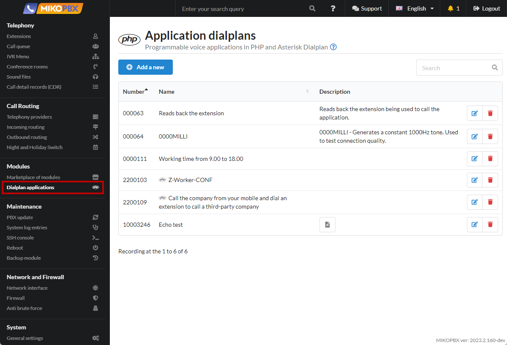
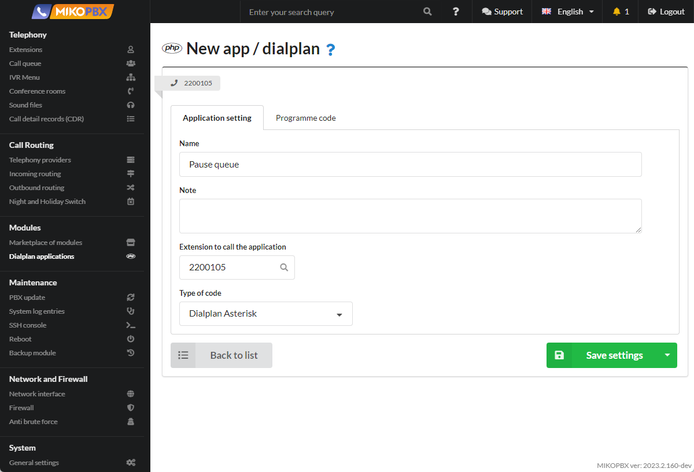
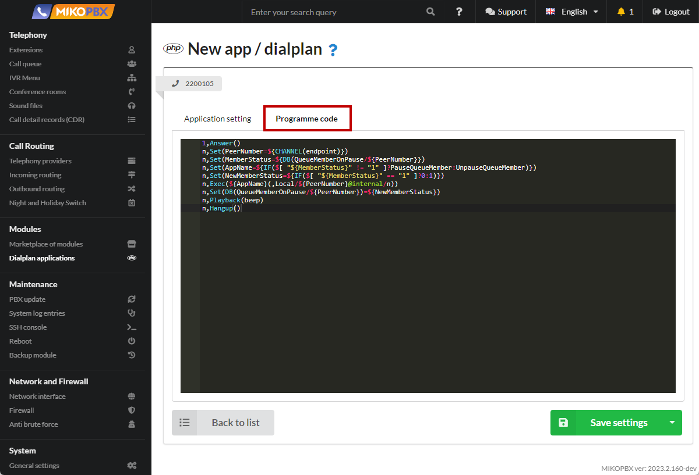

# Pause for Queue agent

For the case when an employee has moved away and cannot answer a call, it is convenient to put the agent on pause. For example, an employee dials a special extension number **\*46** and leaves for lunch.

New calls to the employee will stop coming.

When the employee returns, he dials **\*46** again and disables the pause. In modern phones, everything can be reduced to pressing a single button.

1. Go to "**Modules**" -> "**Dialplan Applications**"

<figure><figcaption><p>Section "Dialplan applications"</p></figcaption></figure>

2. Create a new dialplan.

<figure><figcaption><p>Creating a new dialplan</p></figcaption></figure>

3. Specify the name, as well as the dialplan number (in our case - **2200105**). Specify "**Dialplan Asterisk**" as the code type

<figure><figcaption><p>New Dialplan Settings</p></figcaption></figure>

4. Go to the "**Programme Code**" tab. Paste the following code into the black area:

```php
1,Answer()
n,Set(PeerNumber=${CHANNEL(endpoint)})
n,Set(MemberStatus=${DB(QueueMemberOnPause/${PeerNumber})})
n,Set(AppName=${IF($[ "${MemberStatus}" != "1" ]?PauseQueueMember:UnpauseQueueMember)})
n,Set(NewMemberStatus=${IF($[ "${MemberStatus}" == "1" ]?0:1)})
n,Exec(${AppName}(,Local/${PeerNumber}@internal/n))
n,Set(DB(QueueMemberOnPause/${PeerNumber})=${NewMemberStatus})
n,Playback(beep)
n,Hangup()
```

<figure><figcaption><p>Code for dialplan</p></figcaption></figure>

5. Go to the "**System file customization**" section

<figure><figcaption><p>"System file customization' section</p></figcaption></figure>

6. Open the file "**/etc/asterisk/extensions.conf**" for editing

<figure><figcaption><p>"extensions.conf" file</p></figcaption></figure>

7. Paste the following code at the end of the file:

<pre class="language-php"><code class="lang-php">[all_peers](+)
exten => *46,1,Goto(applications,<a data-footnote-ref href="#user-content-fn-1">2200105</a>,1)
</code></pre>

<figure><figcaption><p>Code for extensions.conf</p></figcaption></figure>

[^1]: Dialplan number
