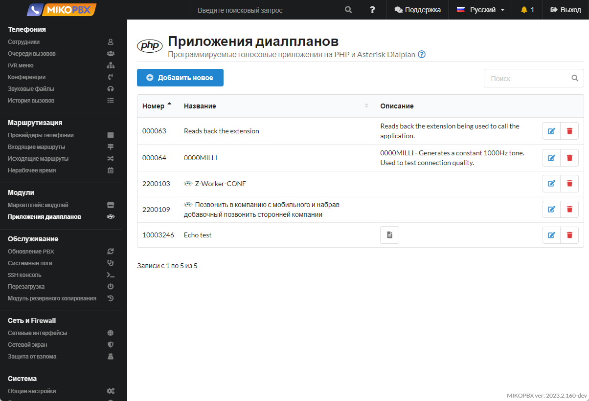
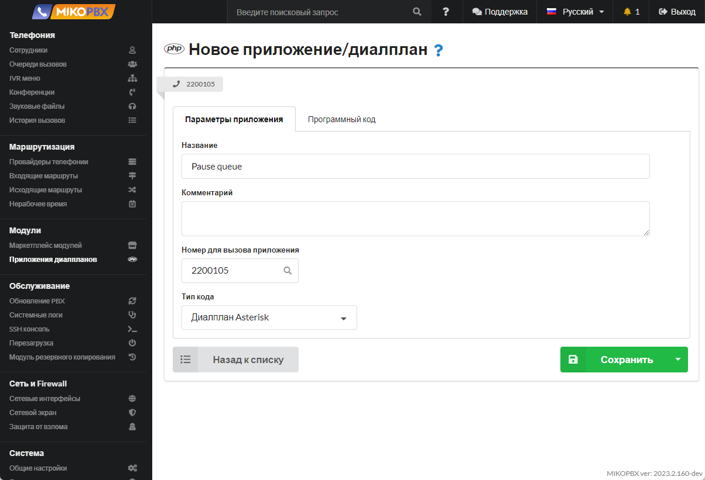
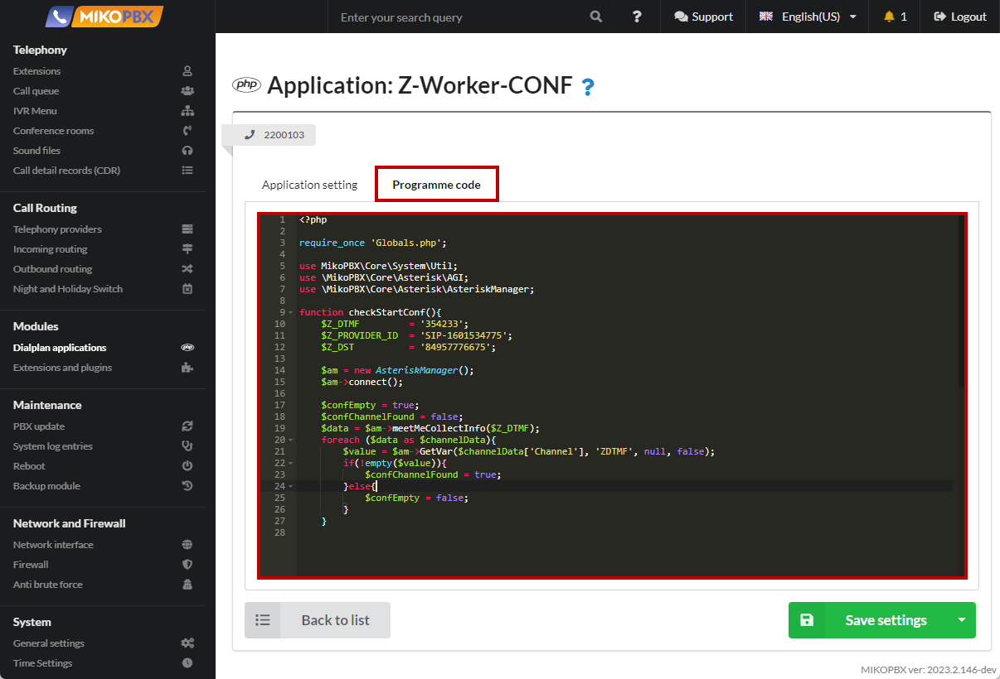

# Пауза для агента очереди

Для случая, когда сотрудник отошел и не может ответить на вызов бывает удобно поставить агента на паузу. К примеру сотрудник набирает специальный добавочный номер **\*46** и уходит по на обед.

Новые вызовы сотруднику перестанут поступать.

Когда сотрудник возвращается, снова набирает номер **\*46** и отключает паузу. В современных телефонах все можно свести к нажатию одной кнопки.

1. Перейдите в раздел "**Модули**" -> "**Приложения диалпланов**"

<figure><figcaption><p>Раздел "Приложения диалпланов"</p></figcaption></figure>

2. Создайте новый диалплан.

<figure><figcaption><p>Создание нового диалплана</p></figcaption></figure>

3. Укажите название, а так же номер диалпана (в нашем случае - **2200105**). В качестве типа кода укажите "**Диалплан Asterisk**"

<figure><figcaption><p>Настройки нового диалплана</p></figcaption></figure>

4. Перейдите во вкладку "Программный код". Вставьте следующий код в черную область:

```php
1,Answer()
n,Set(PeerNumber=${CHANNEL(endpoint)})
n,Set(MemberStatus=${DB(QueueMemberOnPause/${PeerNumber}})
n,Set(AppName=${IF($[ "${MemberStatus}" != "1" ]?PauseQueueMember:UnpauseQueueMember)})
n,Set(NewMemberStatus=${IF($[ "${MemberStatus}" == "1" ]?0:1)})
n,Exec(${AppName}(,Local/${PeerNumber}@internal/n))
n,Set(DB(QueueMemberOnPause/${PeerNumber})=${NewMemberStatus})
n,Playback(beep)
n,Hangup()
```

<figure><figcaption><p>Код для диалплана </p></figcaption></figure>

5. Перейдите в раздел «[Кастомизация системных файлов](../../manual/system/custom-files.md)»

<figure><figcaption><p>Раздел "Кастомизация системных файлов"</p></figcaption></figure>

6. Откройте для редактирования файл «**/etc/asterisk/extensions.conf**»

<figure><figcaption><p>Конфигурационный файл "extensions.conf"</p></figcaption></figure>

7. Вставьте в конец файла следующий код:

<pre class="language-php"><code class="lang-php">[all_peers](+)
exten => *46,1,Goto(applications,<a data-footnote-ref href="#user-content-fn-1">2200105,1</a>)
</code></pre>

<figure><figcaption><p>Код для extensions.conf</p></figcaption></figure>


[^1]: Номер диалплана

