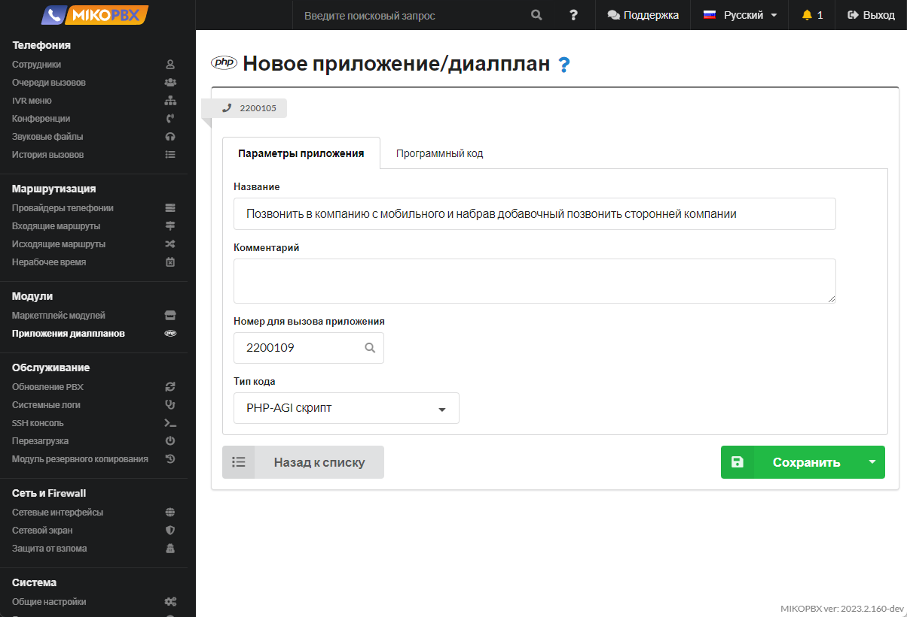
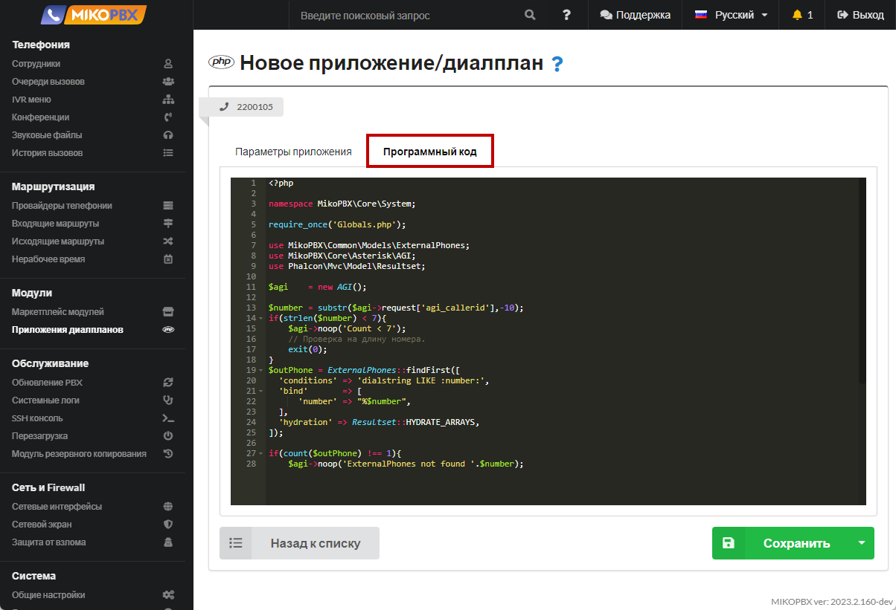

# Позвонить в компанию с мобильного и набрав добавочный позвонить сторонней компании

Такой функционал удобен для мобильных сотрудников. Когда важно, чтобы разговор был записан и зафиксирован на АТС в истории звонков. Когда нет возможности использовать софтфон / или «IP-SIM».

1. Добавьте новое приложение dialplan (см. [**Приложения диалпланов**](../../manual/modules/dialplan-applications.md))

<figure><figcaption><p>Новое приложение диалпланов</p></figcaption></figure>

2. Назначьте внутренний номер, к примеру **2200109**

<figure><figcaption><p>Номер диалплана </p></figcaption></figure>

3. Вставьте код во вкладку "**Программный код**":

```php
<?php

namespace MikoPBX\Core\System;

require_once('Globals.php');

use MikoPBX\Common\Models\ExternalPhones;
use MikoPBX\Core\Asterisk\AGI;
use Phalcon\Mvc\Model\Resultset;

$agi    = new AGI();

$number = substr($agi->request['agi_callerid'],-10);
if(strlen($number) < 7){
    $agi->noop('Count < 7');
    // Проверка на длину номера.
    exit(0);
}
$outPhone = ExternalPhones::findFirst([
  'conditions' => 'dialstring LIKE :number:',
  'bind'       => [
      'number' => "%$number",
  ],
  'hydration' => Resultset::HYDRATE_ARRAYS,
]);

if(count($outPhone) !== 1){
    $agi->noop('ExternalPhones not found '.$number);
    // Проверка на принадлежность номера телефона сотруднику компании.
    exit(0);
}

$agi->set_variable('AGIEXITONHANGUP', 'yes');
$agi->set_variable('AGISIGHUP', 'yes');
$agi->set_variable('__ENDCALLONANSWER', 'yes');
$agi->exec('Ringing', '');
$agi->Answer();

$result      = $agi->getData('vm-enter-num-to-call', 3000, 11);
$selectednum = $result['result']??'';
if(!empty($selectednum)){
    // Все ок. Завершаем вызов.
    $agi->set_variable('__pt1c_UNIQUEID', '');
    $agi->exec(
        'Dial',
        "Local/{$selectednum}@all_peers/n,300," . 'TtekKHhU(dial_answer)b(dial_create_chan,s,1)'
    );
}else{
    $agi->noop('selectednum is empty');
}
```

<figure><figcaption><p>Код для создаваемого диалплана</p></figcaption></figure>

4. В адресной строке браузера скопируйте ID приложения. Он будет иметь вид «**DIALPLAN-APP-6A9902C631C5E7B5AC8F501C559FD678**»

<figure><figcaption><p>ID диалплана</p></figcaption></figure>

5. Перейдите в раздел "**Кастомизация системных файлов**"

<figure><figcaption><p>Раздел "Кастомизация системных файлов"</p></figcaption></figure>

6. Откройте для редактирования файл "**extensions.conf**"&#x20;

<figure><figcaption><p>Конфигурационный файл "<strong>extensions.conf</strong>"</p></figcaption></figure>

7. Вставьте в конец файла следующий код:

```php
[add-trim-prefix-clid-custom]
exten => _.!,1,ExecIf($[ "${EXTEN}" == "h" ]?Hangup()
    same => n,AGI(«DIALPLAN-APP-6A9902C631C5E7B5AC8F501C559FD678.php)
    same => n,Return()
```

<figure><figcaption><p>Код для extensions.conf</p></figcaption></figure>


тут «DIALPLAN-APP-6A9902C631C5E7B5AC8F501C559FD678» - это ID приложения.


### Важные моменты <a href="#vazhnye_momenty" id="vazhnye_momenty"></a>

1. Приложение будет выполнено для **всех** входящих вызовов
2. Ввести добавочный будет возможно лишь в том случае, если номер телефона звонящего заполнен в карточке сотрудника, то есть номер должен принадлежать сотруднику. Это сделано для безопасности
3. **Скрипт не является завершенным продуктом**, но открыт для кастомизации
