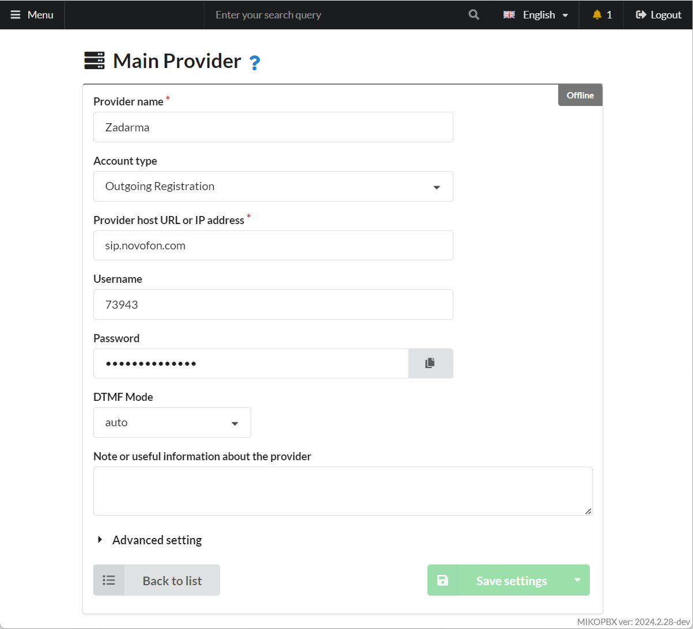
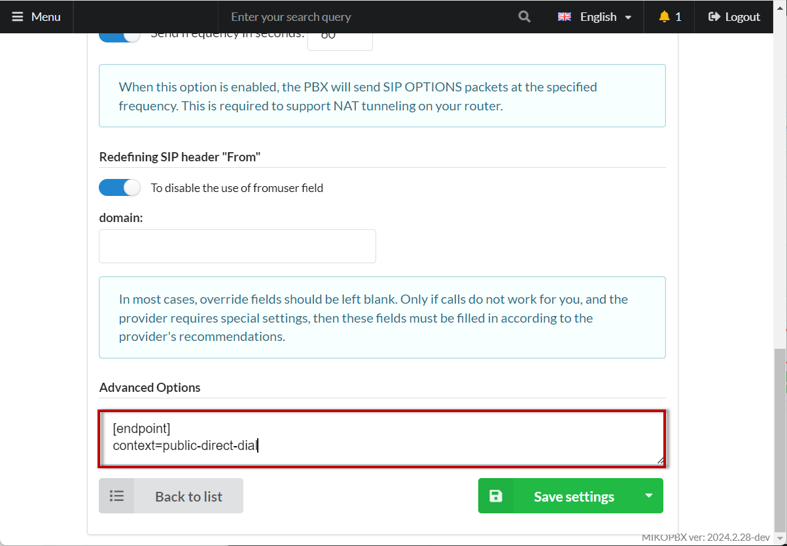
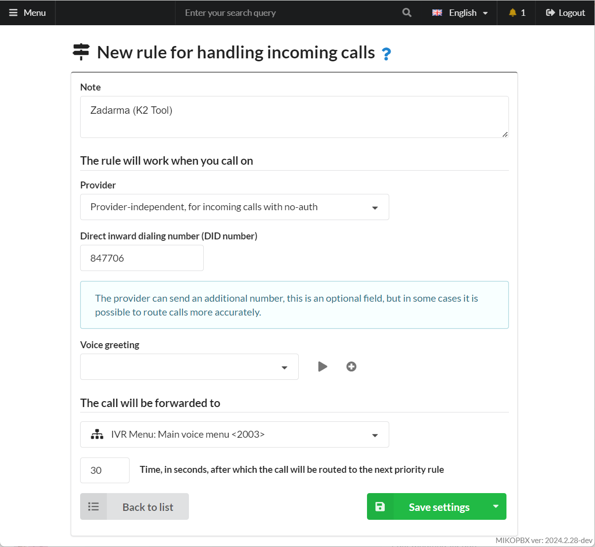

# Registering multiple accounts from one provider


Instructions for connecting a provider account can be found [here](../../manual/routing/providers.md).


Many telecom operators cannot offer multiple SIP numbers in a single trunk (as one provider account) and provide separate registration details for each number. For example, when using the provider Zadarma, to connect the phone number +60(3)-2293-042, you should use the login 847706 and password XXXXXX, while to connect the phone number +60(3)-6382-584, you should use the login 847900 and password YYYYYY. The host for both accounts will be the same: <mark style="color:blue;">sip.zadarma.com.</mark>

_Task:_ For each number, specific incoming routing needs to be configured. For example, calls to +60(3)-2293-042 should be routed to the sales department (call queue), while calls to +60(3)-6382-584 should be routed to an IVR menu.

_Potential Issue:_ The issue is that **all incoming calls** will go through the **first** Zadarma provider account defined in MikoPBX. Calls from the second provider will never be routed through MikoPBX.

## Solution

1. In the **Routing** → **Telephony Providers** section, create two provider accounts from the same service provider. In our example, this is Zadarma. Enter the correct login, password, and host.

<figure><figcaption><p>Provider parameters</p></figcaption></figure>

2. In the advanced options, specify:

```
[endpoint]
context=public-direct-dial
```

<figure><figcaption></figcaption></figure>

3. In the **Routing** → **Incoming routing** section, set up an incoming call rule for each provider. In the **Direct inward dialing number** field, enter the login from the provider account. In the **Provider** field, select **Provider-independent...**

<figure><figcaption><p>New rule for handling incoming calls</p></figcaption></figure>


Instructions for setting up incoming call routing are available here.


