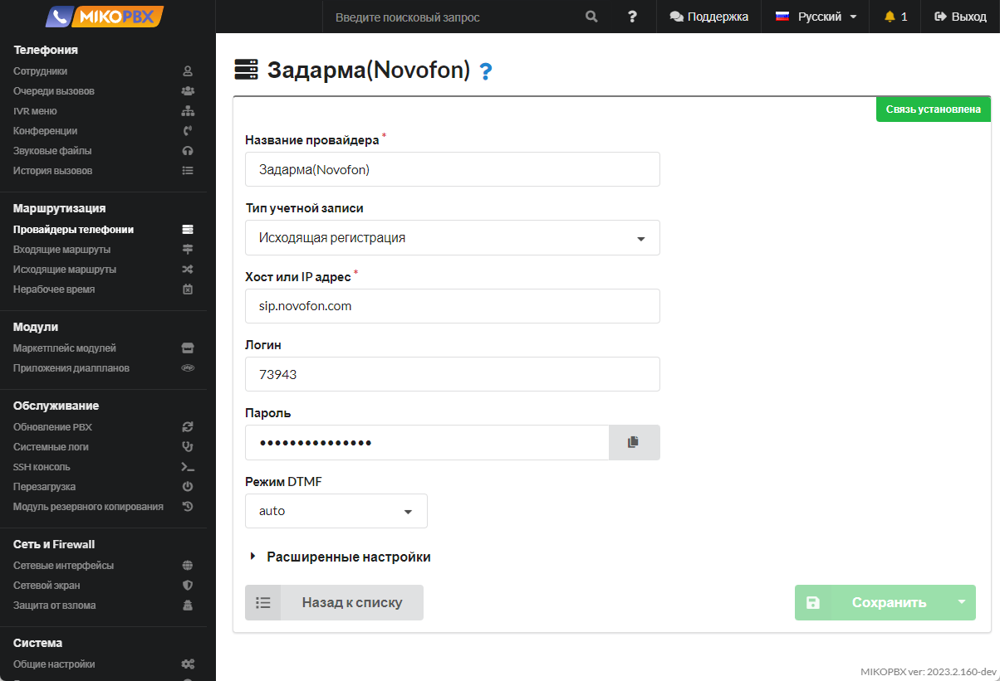

# Регистрация нескольких учетных записей от одного провайдера


Инструкция по подключению учетной записи провайдера доступна по [ссылке](../../manual/routing/providers.md).


Многие операторы связи не могут предложить несколько SIP-номеров в одном транке (в качестве одной учетной записи провайдера) и выдают для каждого номера свои регистрационные данные. Например, используя провайдера Zadarma, для подключения номера телефона +7(495)-229-30-42 следует использовать логин 847706, пароль XXXXXX, а при подключении номера телефона +7 (499) 638-25-84 следует использовать логин 847900, пароль YYYYYY. При этом хост будет для двух учетных записей одинаковым: <mark style="color:blue;">sip.zadarma.com.</mark>\
\
_Задача:_ необходимо для каждого номера задать определенную входящую маршрутизацию, например при звонке на номер +7(495)-229-30-42 вызов должен направляться на отдел продаж (очередь вызовов), а при звонке на номер +7 (499) 638-25-84 вызов должен направляться на IVR-меню.\
\
_Потенциальная проблема:_ проблема заключается в том, что **все входящие звонки** пойдут через **первого** провайдера Zadarma, который определен в учетных записях MikoPBX. Вызовы через второго провайдера MikoPBX никогда не пройдут.

### Решение &#x20;

1. В разделе **Маршрутизация** → **Провайдеры телефонии** создайте две учетные записи провайдера от одного поставщика услуг связи. В нашем примере это Zadarma. Укажите верный логин, пароль и хост.

<figure><figcaption><p>Настройки провайдера </p></figcaption></figure>

2. В дополнительных параметрах укажите:

```php
[endpoint]
context=public-direct-dial
```

<figure><figcaption><p>Дополнительные настройки провайдера</p></figcaption></figure>

3. В разделе **Маршрутизация** → **Входящие маршруты** задайте правило входящих звонков для каждого провайдера. В поле **Дополнительный номер** вставьте логин от учетной записи провайдера. В поле **Провайдер** выберите **Любой**.

<figure><figcaption><p>Новое правило обработки входящих вызовов</p></figcaption></figure>


Инструкции по настройке входящей маршрутизации доступны по [ссылке](../vkhodyashaya-marshrutizaciya/).

