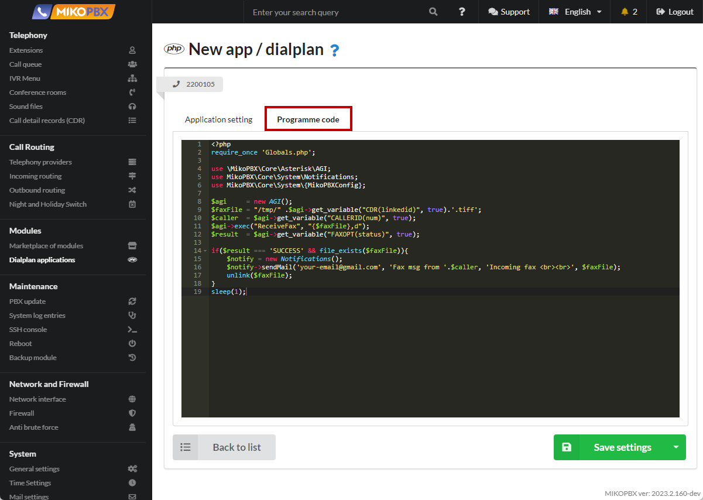
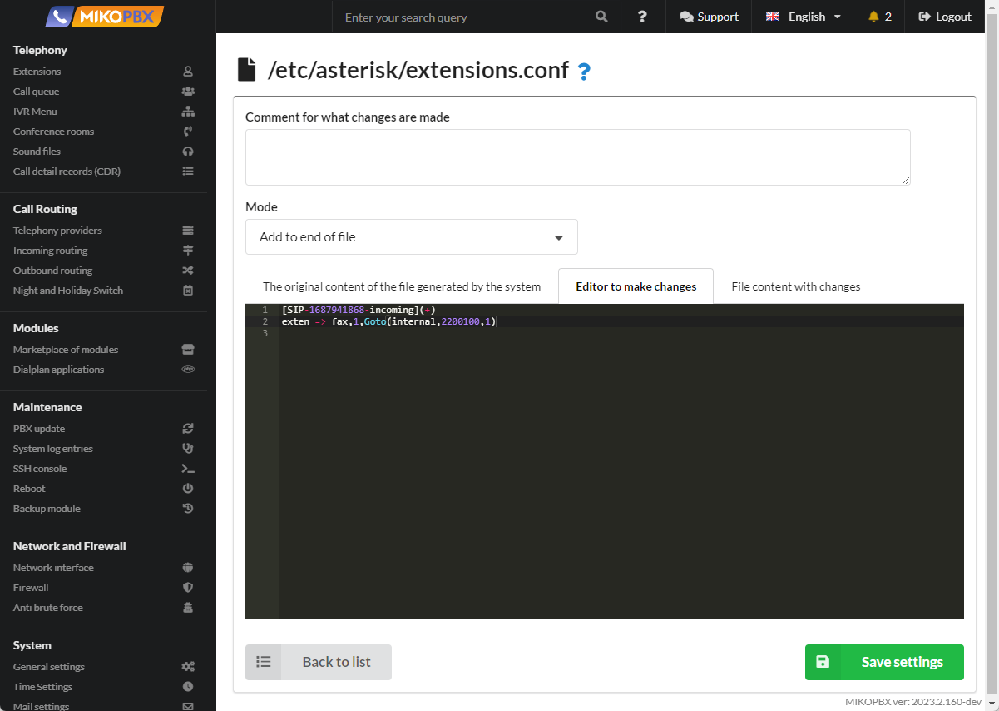
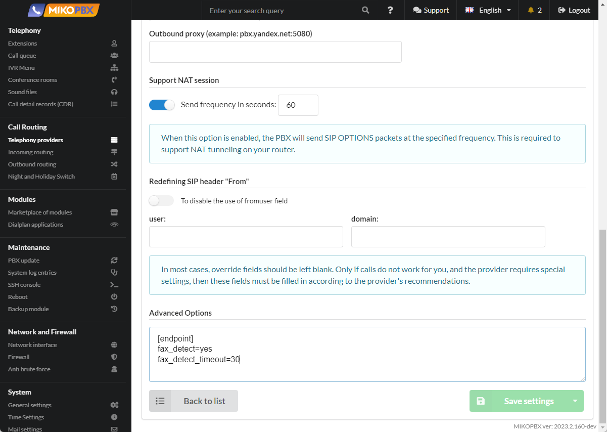

# Sending an incoming fax to email

1. Add a new dialplan application (see [**Dialplan Applications**](../../manual/modules/dialplan-applications.md)).

<figure><figcaption><p>Creating a new dialplan application</p></figcaption></figure>

2. Assign an internal number, for example, **2200110**.

<figure><figcaption><p>Parameters for dialplan </p></figcaption></figure>

3. Insert the following code into the "**Programme Code**" tab:

```php
<?php
require_once 'Globals.php';

use \MikoPBX\Core\Asterisk\AGI;
use MikoPBX\Core\System\Notifications;
use MikoPBX\Core\System\{MikoPBXConfig};

$agi     = new AGI();
$faxFile = "/tmp/" .$agi->get_variable("CDR(linkedid)", true).'.tiff';
$caller  = $agi->get_variable("CALLERID(num)", true);
$agi->exec("ReceiveFax", "{$faxFile},d"); 
$result  = $agi->get_variable("FAXOPT(status)", true);

if($result === 'SUCCESS' && file_exists($faxFile)){
    $notify = new Notifications();
    $notify->sendMail('your-email@gmail.com', 'Fax msg from '.$caller, 'Incoming fax <br><br>', $faxFile);
    unlink($faxFile);
}
sleep(1);
```


In the code, replace 'your-email@gmail.com' with your own email address.


<figure><figcaption><p>Code for dialplan</p></figcaption></figure>

4. Go to the "**System file customization**" section.

<figure><figcaption><p>System file customization section.</p></figcaption></figure>

5. Open the "**extensions.conf**" file for editing.

<figure><figcaption><p>extensions.conf file</p></figcaption></figure>

6. Add the folowwing code to the end of file:

```php
[SIP-1687941868-incoming](+)
exten => fax,1,Goto(internal,2200100,1)
```

<figure><figcaption></figcaption></figure>

Replace "2200100" with the number of **your** application.

In the code, replace "**SIP-1687941868**" with your provider's ID. You can find it in the provider's card in the browser's address bar.

<figure><figcaption><p>Provider ID</p></figcaption></figure>

7. Open the "**modules.conf**" file for editing.

<figure><figcaption><p>Modules.conf file</p></figcaption></figure>

8. Add the following code to the end of the file:

```php
load => res_fax.so
load => res_fax_spandsp.so
```

<figure><figcaption><p>Code for Modules.conf</p></figcaption></figure>

9. In the provider's card, in the **advanced settings**, in **additional parameters**, specify:

```php
[endpoint]
fax_detect=yes
fax_detect_timeout=30
```

<figure><figcaption><p>Additional parameters in Provider section</p></figcaption></figure>
