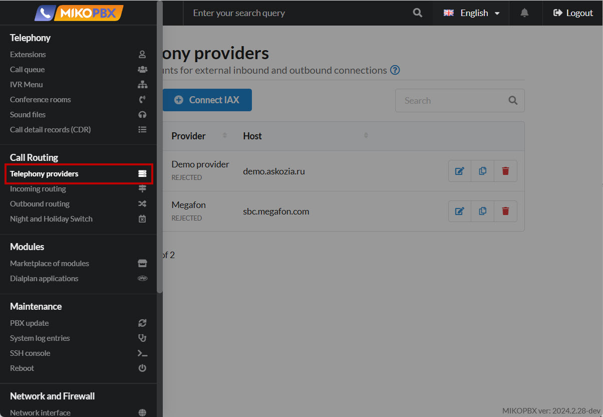
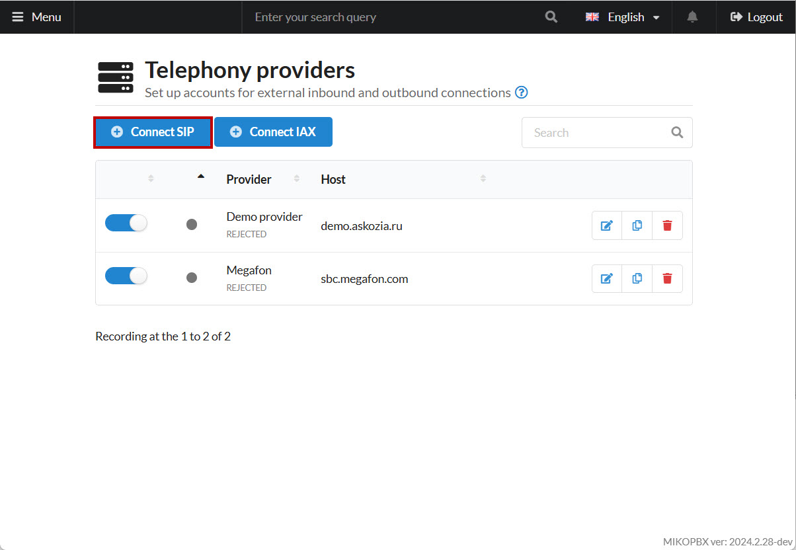
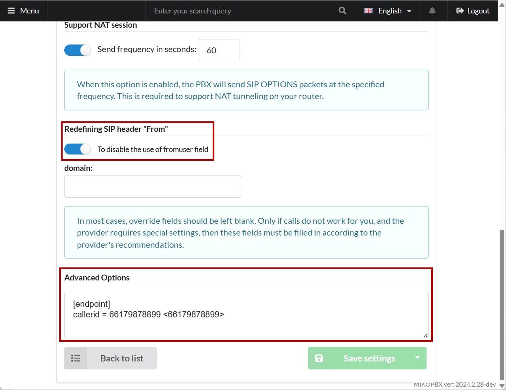
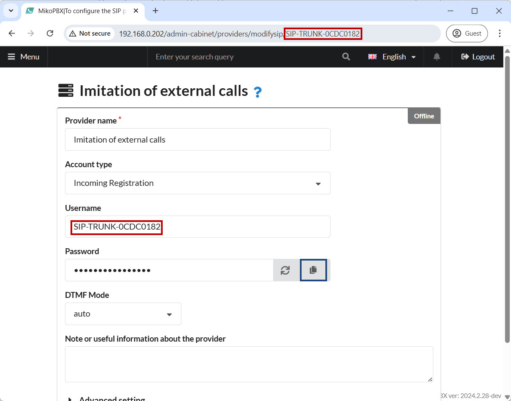
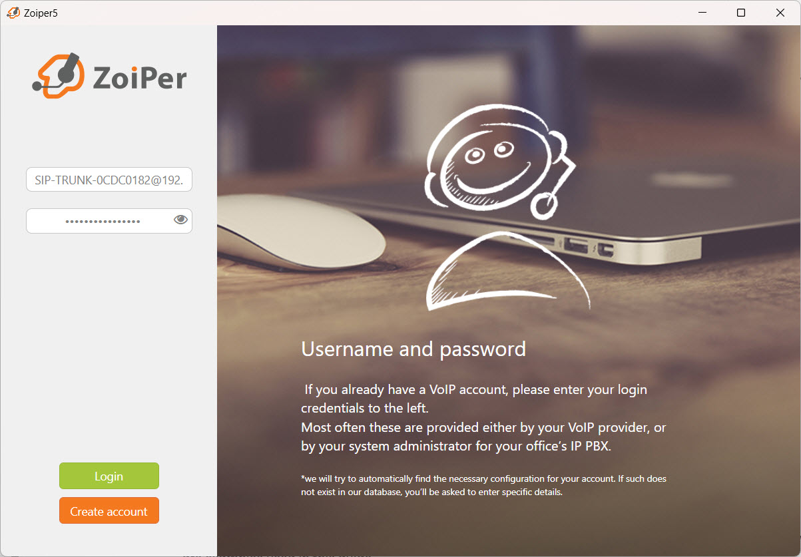
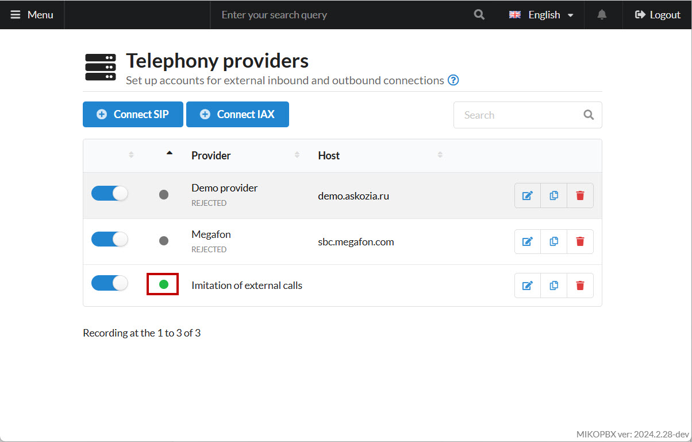
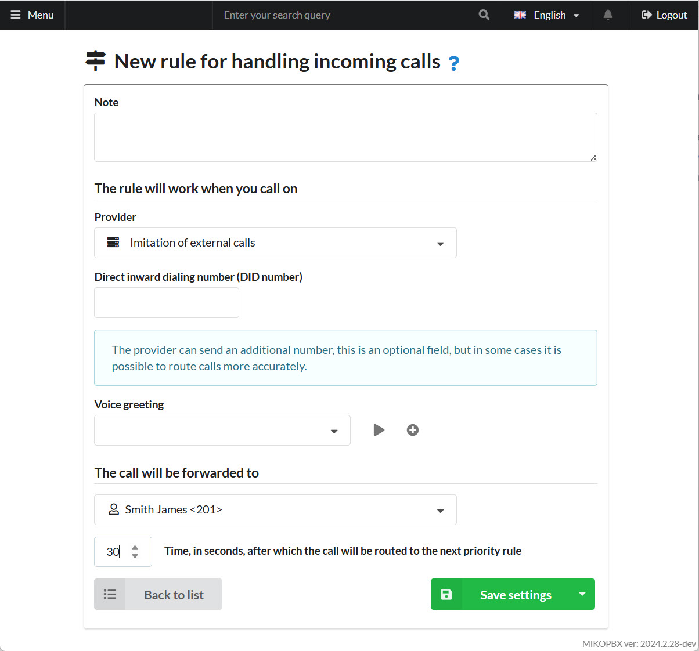

# Simulation of external calls

A useful tool for configuring MikoPBX is to simulate incoming and outgoing external calls without connecting a real provider, thus saving costs.

## Creating a New SIP Provider on the PBX

1. Go to **"Call Routing"** → **"Telephony Providers"**:

<figure><figcaption><p>"Telephony providers" section</p></figcaption></figure>

2. Add a new **SIP Provider**:

<figure><figcaption><p>Adding a new SIP provider</p></figcaption></figure>

3. Specify the following parameters for the new provider:

* **Name** – arbitrary
* **Account Type** – "Incoming Registration"
* **DTMF Mode** – "auto"

<figure><figcaption><p>Imitation Provider parameters</p></figcaption></figure>

4. In the provider creation menu, go to **"Advanced Settings"**:

Disable the **"fromuser"** field.

In **"Additional Options,"** add:

```php
[endpoint]
callerid = 66179878899 <66179878899>
```


You can replace **"66179878899"** with any desired number.


<figure><figcaption><p>Additional Parameters</p></figcaption></figure>

Save your settings and note:

* The provider ID, e.g., **"SIP-TRUNK-704CB9B8"**, which you can find in the address bar or in the provider details.
* The password.

<figure><figcaption><p>ID and Password of Provider</p></figcaption></figure>

## Connecting a Softphone for Call Simulation

To make calls with a simulated number, you need to connect the provider to a softphone. In this example, we’ll use Zoiper.

1. Enter the following credentials:
   * **Login** – `"ProviderID@MikoPBXIPAddress"`
   * **Password** – The password from the provider’s settings.


Replace:

* **ProviderID** with the ID of your provider.
* **MikoPBXIPAddress** with the IP address of your PBX.


<figure><figcaption><p>Zoiper credetionals</p></figcaption></figure>

2. Complete the authorization process by clicking through “**Next**.” You can verify the successful connection by checking the provider’s status indicator:

<figure><figcaption><p>Connection Indicator</p></figcaption></figure>

## Routing Configuration

For the simulation provider to work properly, you must define both incoming and outgoing routes. Below are examples used in this guide.

### Incoming Routing

<figure><figcaption><p>Incoming Calls routing</p></figcaption></figure>

### Outbound Routing

<figure><figcaption><p>Outgoing Template</p></figcaption></figure>

Alternatively, you can manually describe a route for simulating external calls (add this at the end of the **"extensions.conf"** file in **"System file customization"**):

```php
[SIP-TRUNK-0CDC0182-22-outgoing]
exten => _X!,1,NoOp(Outgoing call to ${EXTEN})
same => n,Set(CALLERID(num)=66179878899)
same => n,Dial(PJSIP/${EXTEN}@SIP-TRUNK-0CDC0182)
same => n,Return()
```

In this example, the route applies to calls through the **"SIP-TRUNK-0CDC0182"** provider, and the displayed caller number is **"66179878899"**.


&#x20;In the context above, change **"**&#x53;IP-TRUNK-0CDC018&#x32;**"** to your actual provider ID and 66179878899 to your number.

