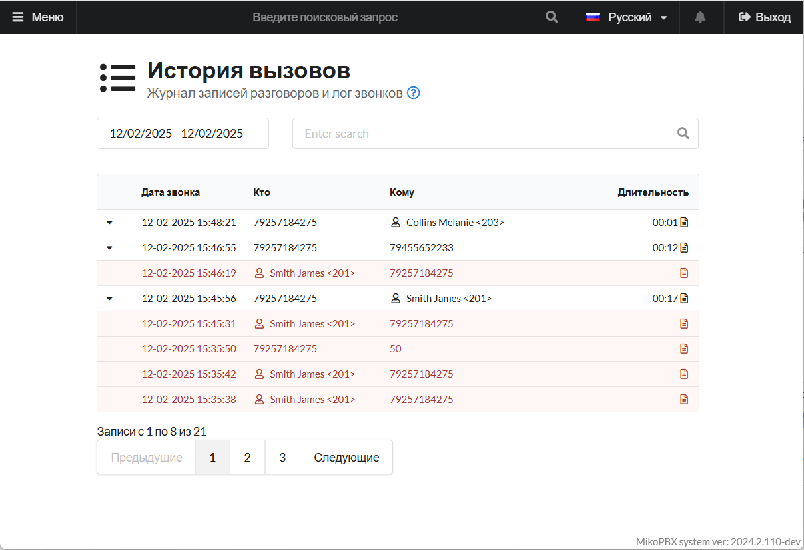
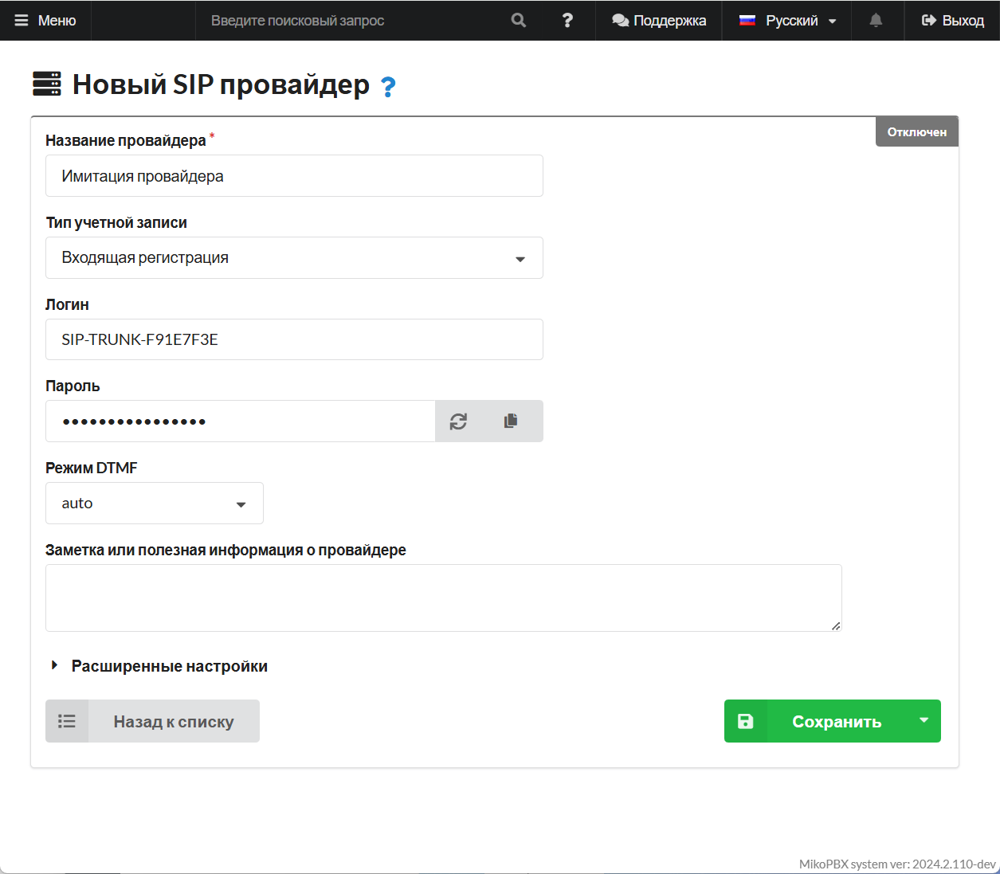
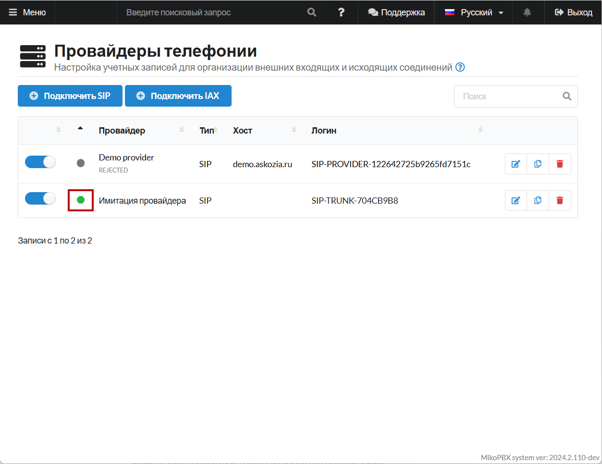
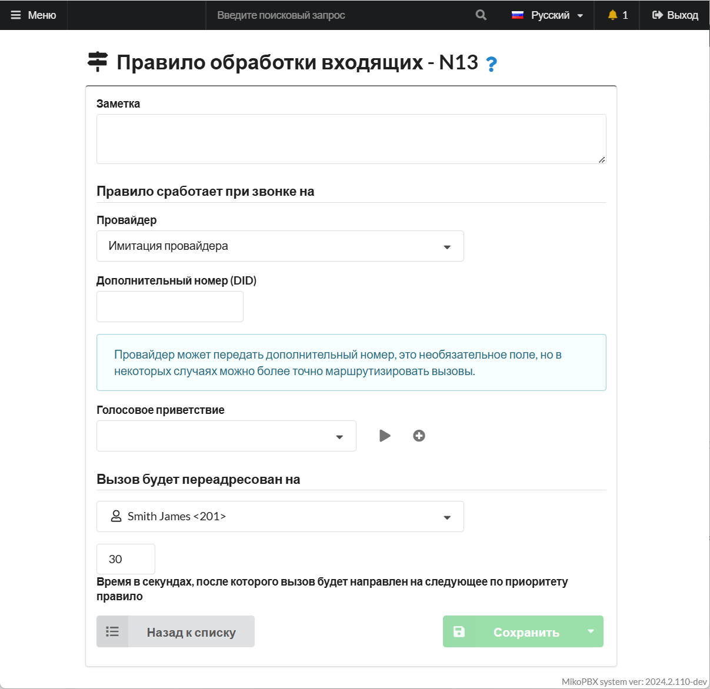
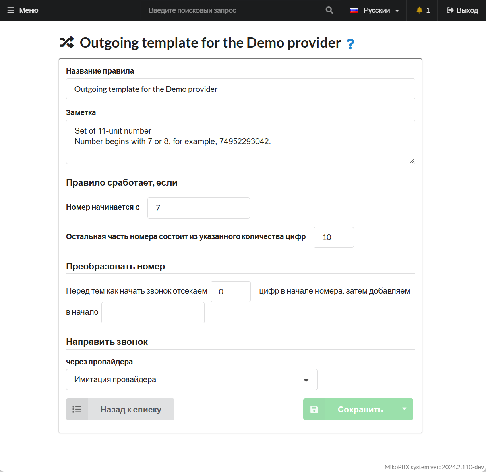

# Имитация внешних звонков

Полезным инструментом для настройки АТС MikoPBX будет имитация входящих и исходящих внешних звонков, чтобы не подключать реального провайдера, тем самым сэкономив.

<figure><figcaption><p>Имитация звонков</p></figcaption></figure>

## Создание нового SIP-провайдера на АТС

1. Перейдите в раздел "**Маршрутизация**" -> "**Провайдеры телефонии**":

<figure><figcaption><p>Раздел "Провайдеры телефонии"</p></figcaption></figure>

2. Подключите нового SIP-провайдера:

<figure><figcaption><p>Подключение нового SIP-провайдера</p></figcaption></figure>

3. Укажите следующие параметры для нового провайдера:

* **Название** - произвольное
* **Тип учетной записи** - "Входящая регистрация"&#x20;
* **Режим DTMF** - "auto"

<figure><figcaption><p>Базовые параметры создаваемого провайдера </p></figcaption></figure>

4. В меню создания провайдера, перейдите в "**Расширенные настройки**":

Отключите использования поля "**fromuser**".

В поле "**Дополнительные параметры**" вставьте следующие правки:

```php
[endpoint]
callerid = 79257184275 <79257184275>
```


Вы можете заменить номер "**79257184275**" на необходимый Вам


<figure><figcaption><p>Поле "Дополнительные параметры"</p></figcaption></figure>

Сохраните настройки и скопируйте:

* Индентификатор провайдера вида "**SIP-TRUNK-704CB9B8**". Найти его можно в параметрах или в адресной строке провайдера.
* Пароль

<figure><figcaption><p>Идентификатор провайдера</p></figcaption></figure>

## Подключение софтфона для имитации звонка

Для того, чтобы совершать звонки с иммитироваными номерами, необходимо подключить провайдера к софтфону. В качестве примера, мы будем использовать софтфон Zoiper.

1. Укажите следующие данные для авторизации:

* Login - "ProviderID@IPadressOfMikoPBX"
* Password - "Пароль из карточки настроек провайдера"


Замените:

* ProviderID на идентификатор Вашего провайдера.
* IPadressOfMikoPBX на IP-адрес вашей станции.


<figure><figcaption><p>Данные для авторизации в Zoiper</p></figcaption></figure>

2. Завершите процесс авторизации, следуя "Далее". По индикатору подключения провайдера, Вы можете удостовериться в корректности его подключения:

<figure><figcaption><p>Индикатор провайдера</p></figcaption></figure>

## Настройка маршрутизации&#x20;

Для корректности работы имитации провайдера, необходимо описать входящую и исходящую маршрутизацию. Ниже будут описаны примеры для данной статьи.

### Входящая маршрутизация

<figure><figcaption><p>Параметры входящей маршрутизации</p></figcaption></figure>

### Исходящая маршрутизация

<figure><figcaption><p>Параметры исходящей маршрутизации</p></figcaption></figure>

Так же, существует вариант с ручным описанием маршрута для имитации внешнего звонка (Добавлять в конец конфигурационного файла "**extensions.conf**" в разделе "**Кастомизация системных файлов**"):

```php
[SIP-TRUNK-704CB9B8-22-outgoing]
exten => _X!,1,NoOp(Outgoing call to ${EXTEN})
same => n,Set(CALLERID(num)=79257184275)
same => n,Dial(PJSIP/${EXTEN}@SIP-TRUNK-704CB9B8)
same => n,Return()
```

В данном примере описаны правила для исходящих с провайдера "**SIP-TRUNK-704CB9B8**", номер, который будет отображен при вызове - "**79257184275**"


В контексте выше, необходимо изменить "**SIP-TRUNK-704CB9B8**" на Ваш идентификатор провайдера.

