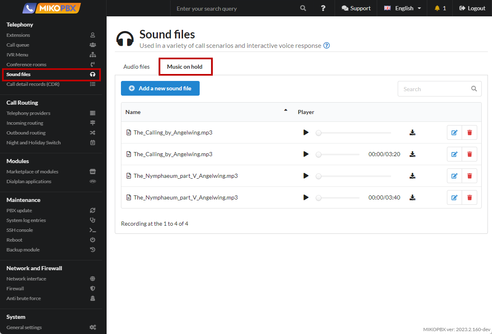
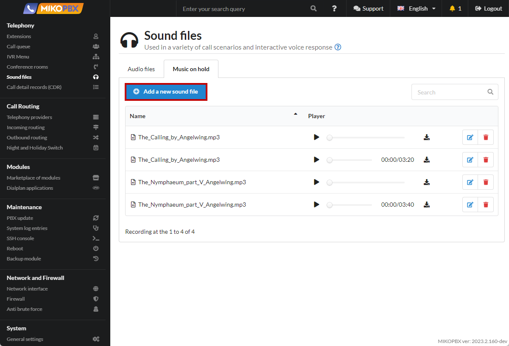
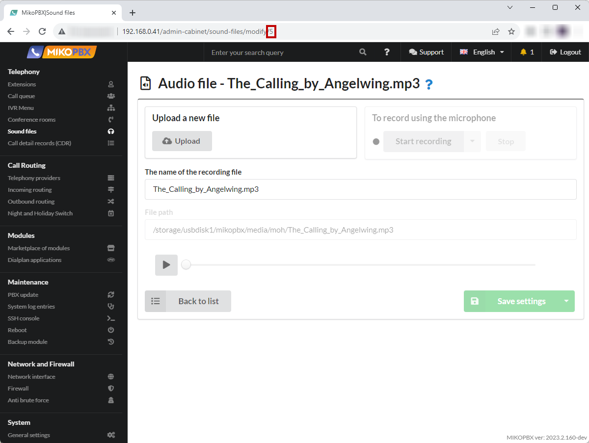

# Unique background music for the queue

The function can be useful if there is a need to play an advertising audio file instead of background music. You can assign your own file to each queue.

1. Go to the section "**Telephony**" -> "**Sound files**" -> "**Music on hold**"

<figure><figcaption><p>Music on hold section</p></figcaption></figure>

2. Add media files:

<figure><figcaption><p>New audio file</p></figcaption></figure>

3. After saving the media file, copy its ID from the browser address bar. For example , in a link like "<mark style="color:blue;">http://192.168.0.41/admin-cabinet/sound-files/modify/5</mark>" the identifier is the number **5**.

<figure><figcaption><p>ID of the media file</p></figcaption></figure>

4. Go to the "**System**" -> "**System file customization**"

<figure><figcaption><p>"System file customization" section</p></figcaption></figure>

5. Open the file "**/etc/asterisk/extensions.conf**" for editing

<figure><figcaption><p>"extensions.conf" file</p></figcaption></figure>

6. Paste the following code at the end of the file:

```php
[queue-pre-dial-custom]
exten => 2001,1,Set(CHANNEL(musicclass)=moh-5)
exten => 2002,1,Set(CHANNEL(musicclass)=moh-6)
exten => _X!,2,return
```

<figure><figcaption><p>Code for extensions.conf </p></figcaption></figure>


According to this example, for the queue with the number "**2001**", a file with the ID **5** will be played in the background, for the queue "**2002**", a file with the ID **6**

