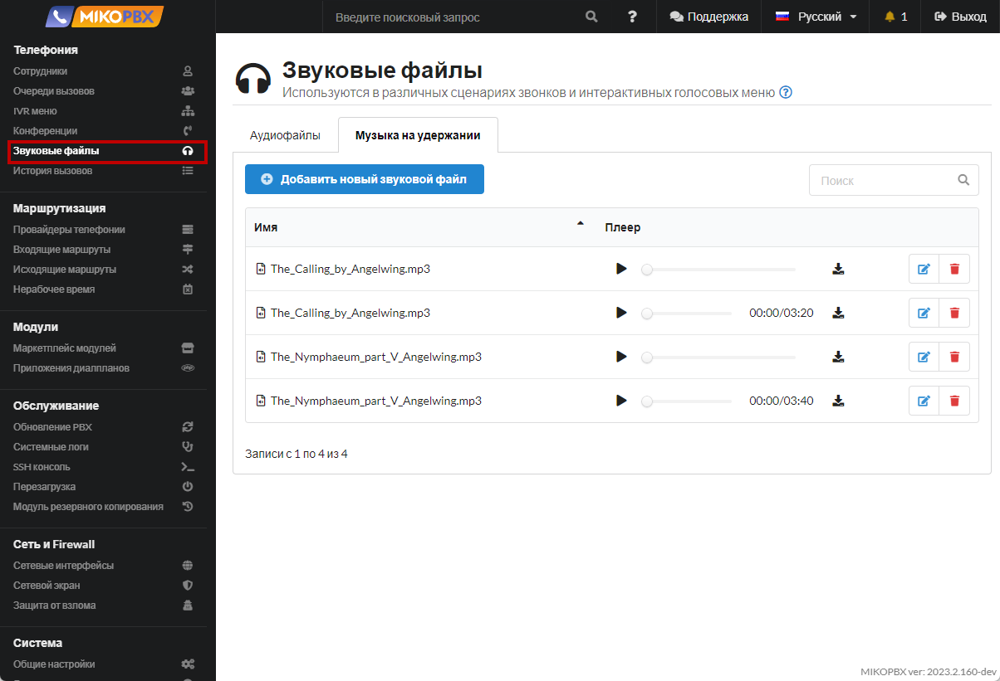
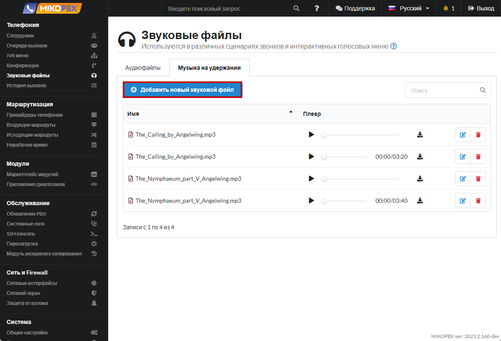
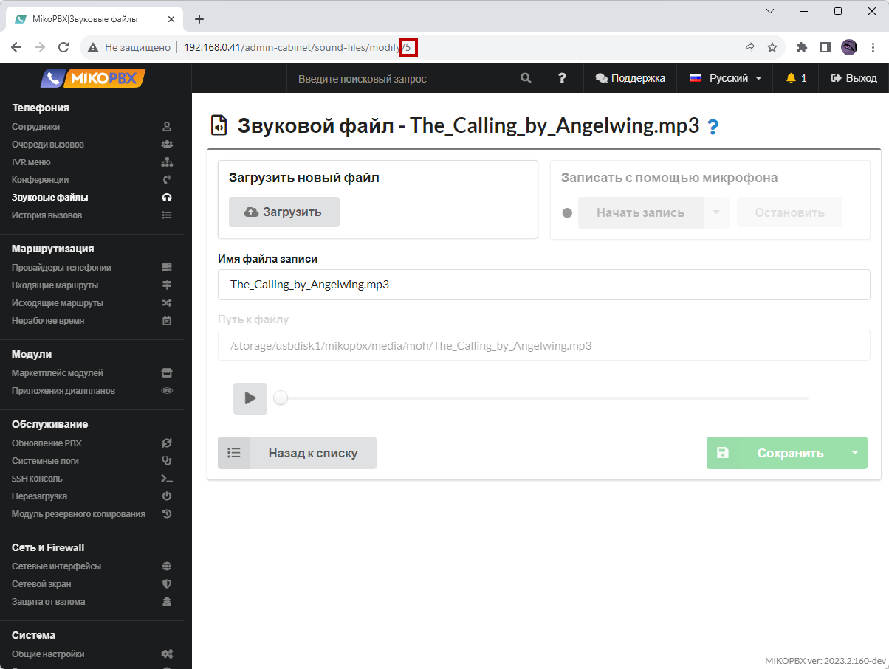
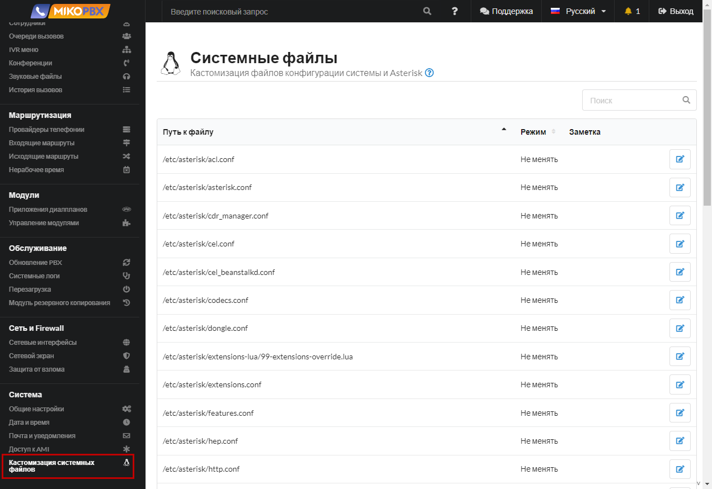

# Уникальная фоновая музыка для очереди

Функция может быть полезна, если вместо фоновой музыки есть необходимость воспроизводить рекламный аудиофайл. Для каждой очереди можно назначить свой файл.

1. Перейдите в раздел «**Телефония**» - «**Звуковые файлы**» - «**Музыка на удержании**»

<figure><figcaption><p>Раздел "Звуковые файлы"</p></figcaption></figure>

2. Добавьте медиафайлы:

<figure><figcaption><p>Новый звуковой файл</p></figcaption></figure>

3. После сохранения медиа файла скопируйте его идентификатор из адресной строки браузера. К примеру в ссылке вида «[http://192.168.0.41/admin-cabinet/sound-files/modify/5](http://192.168.0.41/admin-cabinet/sound-files/modify/5)» идентификатором является число **5**.

<figure><figcaption><p>Идентификатор медиа файла</p></figcaption></figure>

4. Перейдите в раздел «**Система**» - «**Кастомизация системных файлов**»

<figure><figcaption><p>Раздел "Кастомизация системных файлов"</p></figcaption></figure>

5. Откройте для редактирования файл «**/etc/asterisk/extensions.conf**»

<figure><figcaption><p>Конфигурационный файл "extensions.conf"</p></figcaption></figure>

6. Вставьте в конец файла следующий код:

```php
[queue-pre-dial-custom]
exten => 2001,1,Set(CHANNEL(musicclass)=moh-5)
exten => 2002,1,Set(CHANNEL(musicclass)=moh-6)
exten => _X!,2,return
```

<figure><figcaption><p>Код для extensions.conf</p></figcaption></figure>


Согласно этому примеру для очереди с номером «**2001**» будет воспроизводится в фоне файл с идентификатором **5**, для очереди «**2002**» файл с идентификатором **6**

