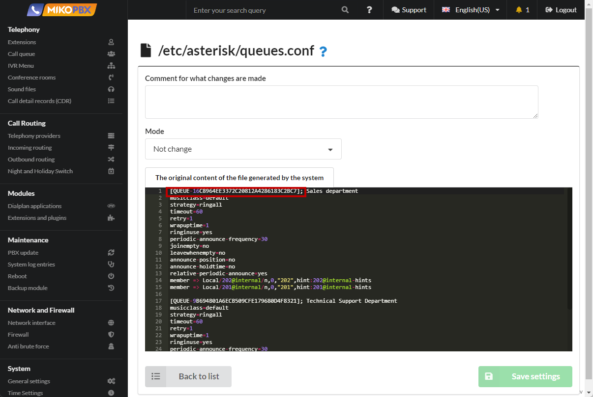
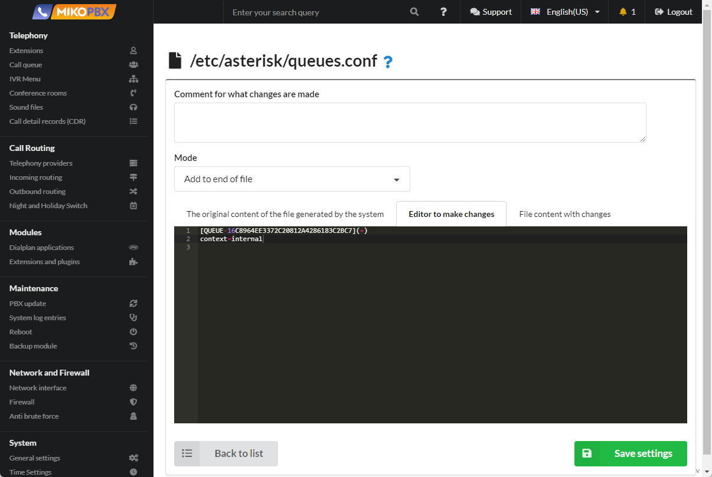

# Allow additional dialing of the internal number in the queue

Such a need may arise in many cases, For example, when a client is tired of waiting on the line, you can offer him to leave a voice message, connect with an internal number known to the client.

1. Go to **System** → **System file custmization**.

<figure><figcaption><p>System file customization section</p></figcaption></figure>

2. Open the file "**queues.conf**" for editing

<figure><figcaption><p>queues.conf</p></figcaption></figure>

3. In the black window, find the queue section that you need to configure

<figure><figcaption><p>Queue section</p></figcaption></figure>

4. Select the "Add to End of File" mode. Add a similar section with the prefix (+) :

```
[QUEUE-16C8964EE3372C20812A4286183C2BC7](+)
context=internal
```

<figure><figcaption><p>Code for queues </p></figcaption></figure>


In this example, we have described the internal context, the dialing of all internal numbers is allowed. You can specify the context of the IVR menu, in the format ivr\<InternalNumberIVR>

