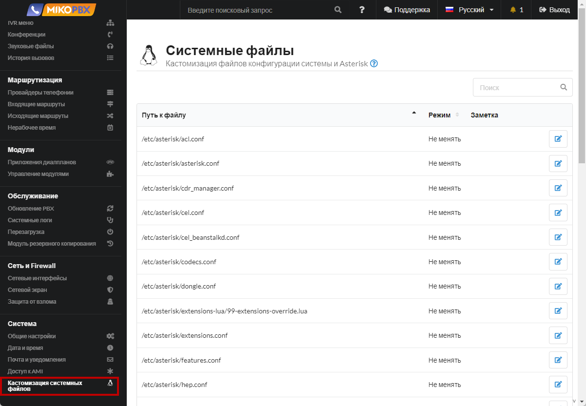
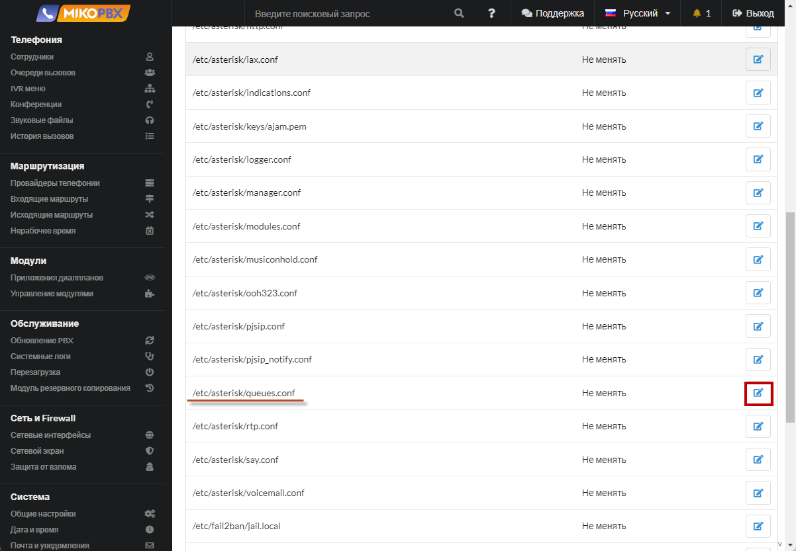
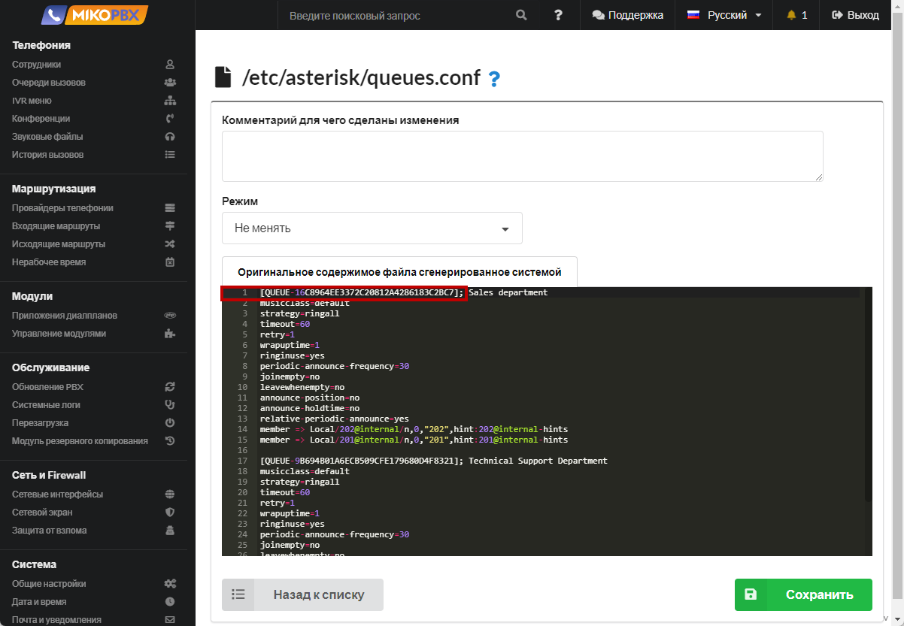

# Разрешить донабор внутреннего номера в очереди

Такая необходимость может возникнуть во многих случаях, К примеру когда клиент устал ждать на линии, можно предложить ему оставить голосовое сообщение, соединить с известным клиенту внутренним номером.

1. Перейдите во вкладку "**Кастомизация системных файлов**"

<figure><figcaption><p>Раздел "Кастомизация системных файлов</p></figcaption></figure>

2. Откройте для редактирования файл "**queues.conf**"

<figure><figcaption><p>Файл "queues.conf"</p></figcaption></figure>

3. В черном окне найдите секцию очереди, которую необходимо настроить

<figure><figcaption><p>Секции очереди</p></figcaption></figure>

4. Выберите режим "**Добавлять в конец файла**".  Добавьте аналогичную секцию с приставкой (+) :

```php
[QUEUE-16C8964EE3372C20812A4286183C2BC7](+)
context=internal
```

<figure><figcaption><p>Код для "queues.conf"</p></figcaption></figure>


В данном примере мы описали контекст **internal**, разрешен набор всех внутренних номеров. Можно указать контекст IVR меню, в формате ivr<ВнутреннийНомерIVR>

