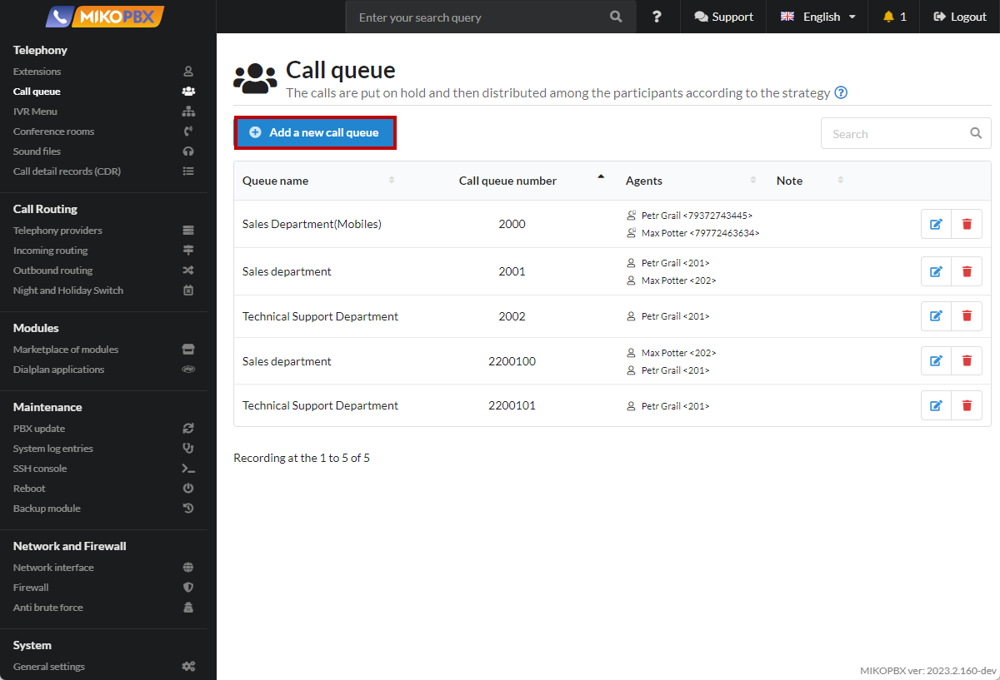
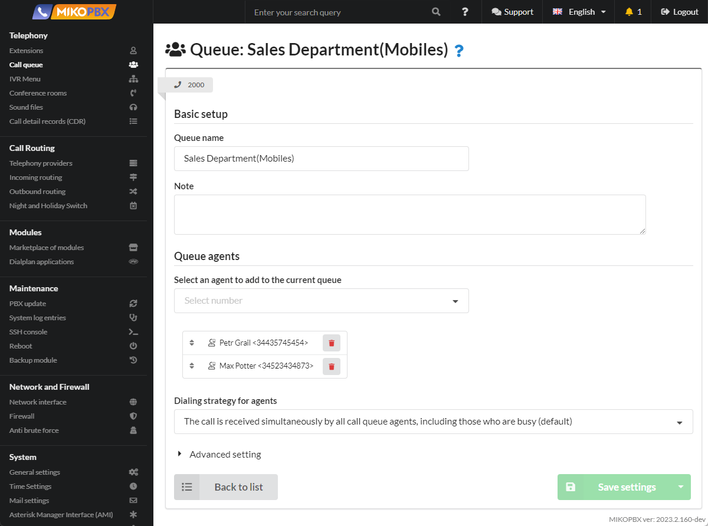
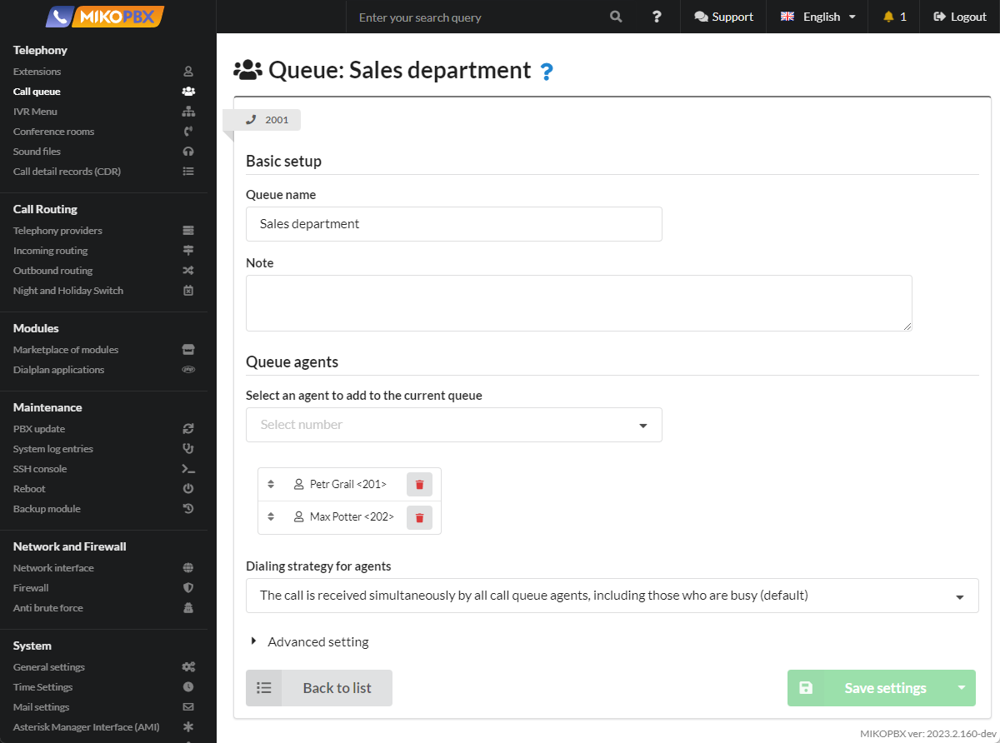
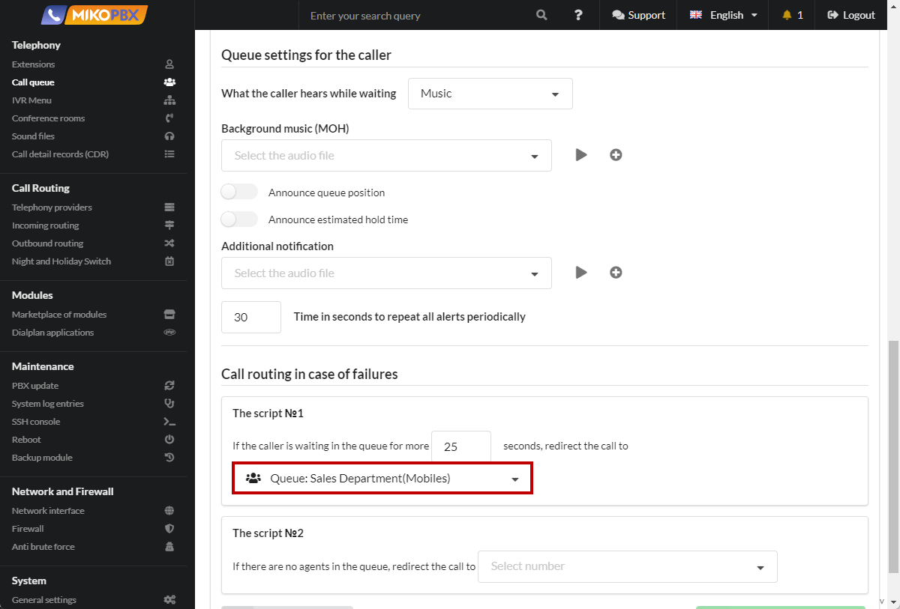
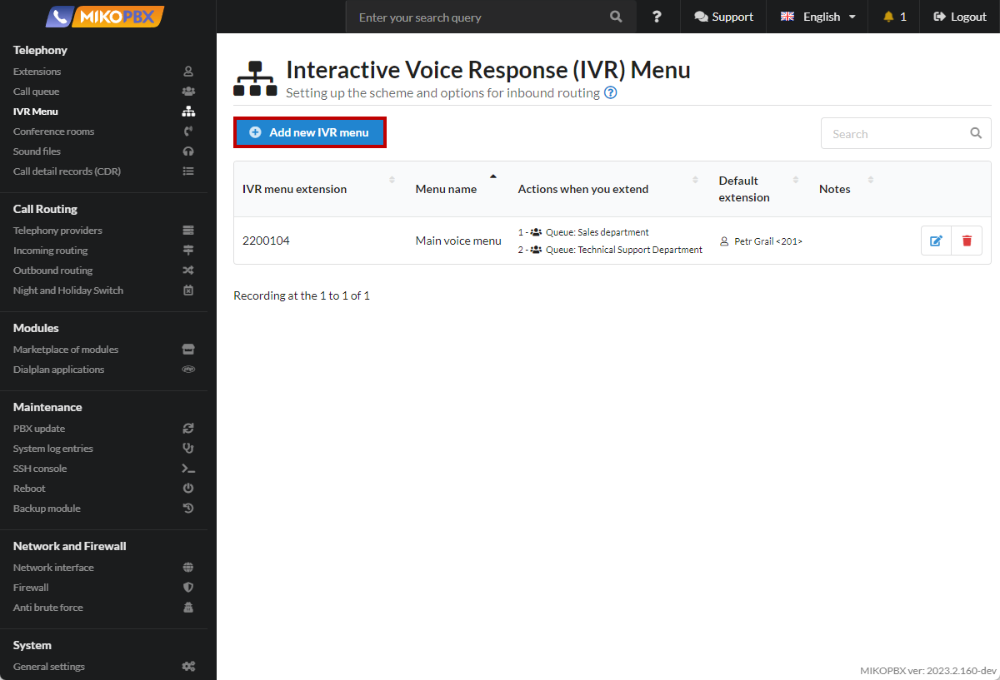

# An example of the implementation of a typical route of incoming calls

## Formulation of the problem

The client calls the company, a welcome message (voice greeting) sounds.&#x20;

During the playback of the voice greeting, the client can dial any internal number, for example, the extension number of an employee or the extension number of a department.&#x20;

After playing the voice greeting, the client can enter numbers from the phone:

* **1** - in this case, the call will be sent to the sales department. The **sales department** is a call queue consisting of two queue agents (two employees). When calling the sales department, the call must be received on the phones of employees at the same time. If none of the employees answered the customer's call within 25 seconds, the call should be sent to the employees' mobile numbers.&#x20;
* **2** - the call will be sent to the technical support department. The **Technical Support** Department is a call queue consisting of three queue agents (three employees). The call must be received by any available employee (queue agent). If the client waits more than 30 seconds for his call to be answered, the call must be transferred to the secretary. If the client has not entered anything / incorrectly dialed the number, then a repeated voice notification occurs and the client can enter the number again. As soon as all attempts to enter the correct number for the client are completed, the call is forwarded to the secretary.

## Solution

### Call queues


Instructions on call queues are available at the [link](../../manual/telephony/call-queues.md).


For our example, you need to create three call queues:&#x20;

1. Sales Department (mobile numbers of employees)&#x20;
2. Sales Department (internal employee numbers)&#x20;
3. Technical Support Department


You must first create internal accounts for employees according to the [instructions ](../../manual/telephony/extensions.md)indicating their mobile numbers.


1. Go to the **Telephony** → **Call queue**. Click on the "**Add a new call queue**" button.

<figure><figcaption>
Creating a new queue
</figcaption></figure>

2. Creating a call queue for the sales department (for employees' **mobile** numbers).

<figure><figcaption>
Queue for the sales department(mobile)
</figcaption></figure>

3. Creating a call queue for the sales department (for **internal** employee numbers).

<figure><figcaption>
Queue for the sales department
</figcaption></figure>

4. We indicate that if none of the employees answered the customer's call within 25 seconds, the call should be sent to the employees' mobile numbers.

<figure><figcaption>
Scenario in case of failure
</figcaption></figure>

5. Creating a call queue for the technical support department.

<figure><figcaption>
Queue for Technical Support department
</figcaption></figure>

### IVR Menu


Instructions for the IVR menu are available at the [link](../../manual/telephony/ivr-menu.md).


1. Go to **Telephony** → **IVR menu**. Click on the "**Add new IVR menu**" button.

<figure><figcaption>
Creating a new IVR menu
</figcaption></figure>

2. Specify the IVR settings according to our description.

<figure><figcaption>
IVR Menu
</figcaption></figure>

### Incoming route


Instructions for incoming routes are available at the [link](../../manual/routing/incoming-routing.md).


1. At the last step, we create an incoming call route for our provider. In the **Call Routing** → **Incoming routing** add a new rule.

<figure><figcaption>
Section "Incoming routes"
</figcaption></figure>

2. Fill in the data according to the template:

<figure><figcaption>
New incoming call handling rule
</figcaption></figure>
