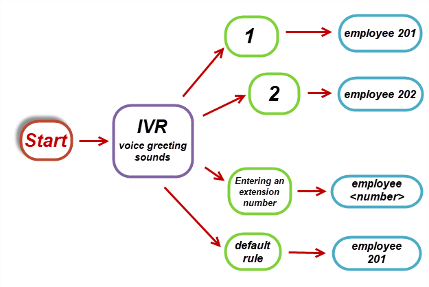
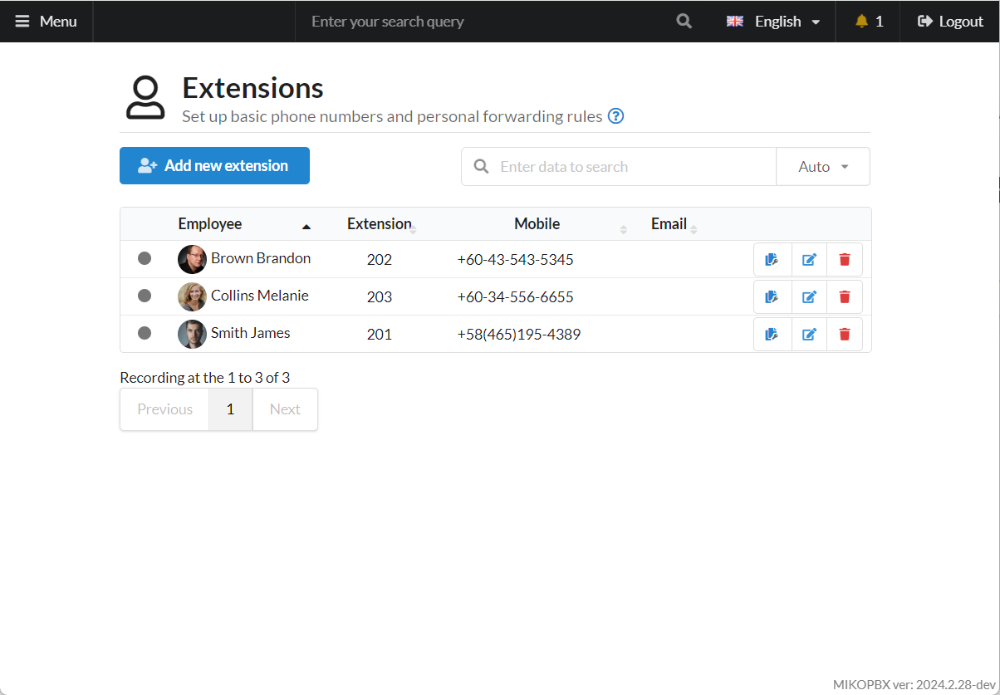

# Basic IVR example

## Task Description 

A customer calls the company, and a welcome message (greeting) is played.

While the greeting is playing, the customer can dial any internal extension number, for example, an employee's extension number.

Additionally, the customer can press:

* **1** - the call will be routed to the employee with extension number 201.
* **2** - the call will be routed to the employee with extension number 202.

If the customer doesn't press anything or enters an incorrect number, the call will be redirected to the **default number** - the employee with extension number 201.

The task can be visually represented as follows:

<figure><figcaption>
Scheme of the task
</figcaption></figure>

## Solution 

1. Create **employee accounts** by following the [instructions](../../manual/telephony/extensions.md). Connect softphones or hardware phones to these accounts.

<figure><figcaption>
Extensions section
</figcaption></figure>

2. Add the **greeting sound file** by following the [instructions](../../manual/telephony/sound-files.md). This file will be played when the customer calls the company's phone number.

<figure><figcaption>
Sound Files Menu
</figcaption></figure>

3. Create a new **IVR menu** by following the [instructions](../../manual/telephony/ivr-menu.md).

<figure><figcaption>
IVR menu
</figcaption></figure>

When a call is made to the IVR menu (**IVR menu number**), the sound file "Greeting" will start playing.

**While the greeting is playing**, the customer can:

* Dial any internal extension, for example, an employee's extension. This is enabled by the **Allow dialing of any extension** option.
* Press 1 to route the call to the employee with extension number 203.
* Press 2 to route the call to the employee with extension number 201.

If the customer **does not enter anything** during the greeting, after the greeting plays, the system waits **7 seconds** for a digit input. "Total time for number entry" = "Greeting duration" + 7 seconds.

If the "Total time for number entry" expires, the call is redirected to the "Default number," which is the employee with extension number 101.

To **repeat** the greeting and allow the customer to enter a number again, set the **"Number of retries before redirecting to the default number"** to 2 or more. The greeting will be repeated, followed by another 7-second wait, allowing the customer to retry the IVR. Once the retries exceed the set value, the call is redirected to the "Default number."

If the customer **enters an incorrect number** or does not enter anything, the greeting will repeat (if the **Number of retries** is set to **more than 2**), or the call will be redirected to the "Default number" (if the **Number of retries** is set to **1**).

4. Add a **providers account** through which calls will be made, following the [instructions](../../manual/routing/providers.md). Examples of provider connections can be found [here](../providers/).

<figure><figcaption>
VoIP Providers
</figcaption></figure>

5. Set up **incoming calls** to be routed to the IVR menu via the configured provider.

<figure><figcaption></figcaption></figure>


Instructions for configuring incoming call routing are available [here](../../manual/routing/incoming-routing.md).

