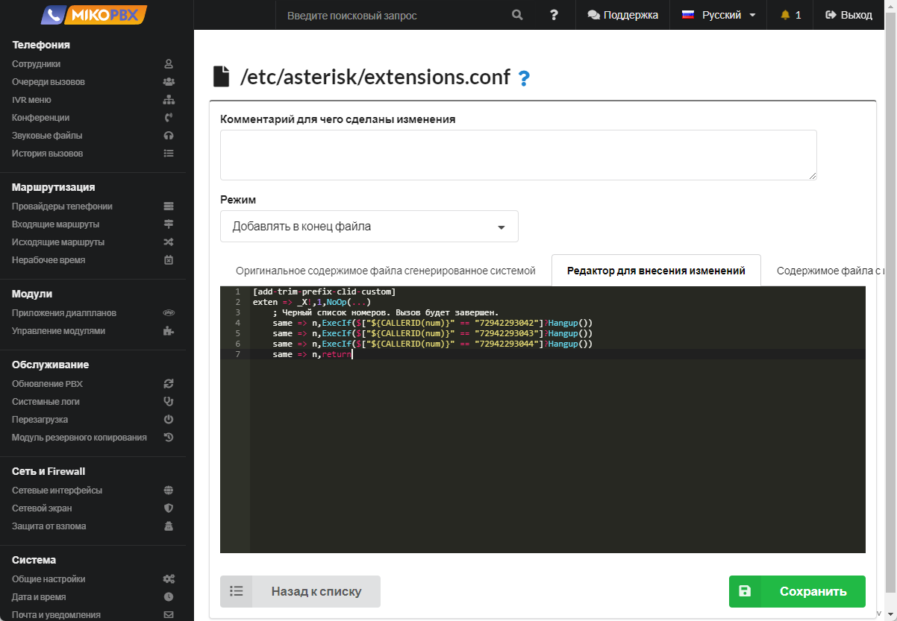

# Choosing a provider when redirecting to a mobile

**Task**: Several providers A,B, C, D are installed on the PBX… The call arrives at MikoPBX through provider A. When dialing an employee's mobile number, the call must also go through provider A. **The provider must support more than one simultaneous call.**

1. Go to **System** → **System file customization**

<figure><figcaption><p>System file customization section</p></figcaption></figure>

2. Open the **extensions.conf** configuration file for editing.

<figure><figcaption><p>Extensions.conf file</p></figcaption></figure>

3. Set the "**Add to end of file**" mode. In the black window, add the following code snippet:

```php
[all-outgoing-custom]
exten => _[0-9*#+a-zA-Z][0-9*#+a-zA-Z]!,1,NoOp(-)
    same => n,NoOp("${PROVIDER_ID}" --- "${ONLY_THIS_PROVIDER}")
    same => n,Set(NEED_RETURN=${UNDEFINED})
    same => n,ExecIf($["${ONLY_THIS_PROVIDER}x" == "x"]?return)
    same => n,ExecIf($["${PROVIDER_ID}" != "${ONLY_THIS_PROVIDER}"]?Set(NEED_RETURN=1))
    same => n,ExecIf($["${PROVIDER_ID}" != "${ONLY_THIS_PROVIDER}"]?Set(ROUTFOUND=${UNDEFINED}))
    same => n,Return()
    
[add-trim-prefix-clid-custom]
exten => _[0-9*#+a-zA-Z][0-9*#+a-zA-Z]!,1,NoOp(start check blacklist)
    same => n,ExecIf($["${CHANNEL(channeltype)}" == "PJSIP" ]?Set(__ONLY_THIS_PROVIDER=${CHANNEL(endpoint)}))
    same => n,Return()
```

<figure><figcaption></figcaption></figure>

4. For each provider, it is necessary to describe the [outbound routes](../../manual/routing/outbound-routes.md)
5. Fill in the mobile numbers for employees ([see the documentation](../../manual/telephony/extensions.md))
6. Limit the use of outgoing routes for users, use the "[User Groups](../../modules/miko/module-users-groups.md)" module
7. Now, if an incoming call is sent to an employee's mobile phone, for example through the [IVR menu](../../manual/telephony/ivr-menu.md), then the call will be sent through the same provider through which it came


ATTENTION: The instructions are only relevant for **MikoPBX 2022.2.96+**

