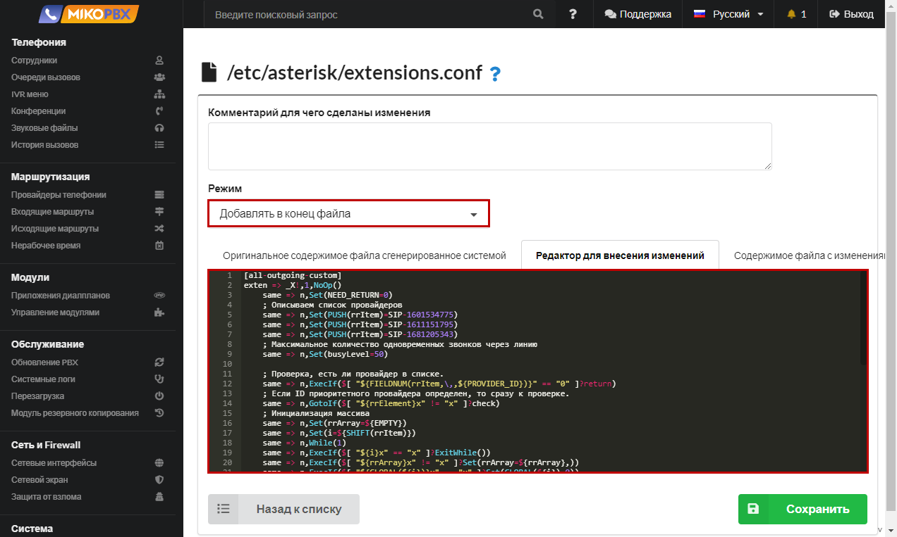

# Normalization of incoming phone number

When connecting multiple providers to MikoPBX, you may encounter situations where customer phone numbers come in different formats:

* In 7-digit format - **2293042**
* With a "+" sign, for example, **+79257184444**
* With "8", for example, **89257184444**

There is a need to standardize all these formats.

1. Go to the **Routing** → **Telephony Providers** section. Open the provider's account for editing. Copy the **Provider ID** from the address bar, through which subscribers call your company. Please note that in our example, we are using **a single** provider. If you have multiple providers configured, you need to perform the following steps **for each provider**.

In our example, the Provider ID looks like: **SIP-1687941868**

<figure><figcaption><p>Provider ID</p></figcaption></figure>

2. Go to the **System** → **System file customization** section.

<figure><figcaption><p>System file customization section</p></figcaption></figure>

2. Open the configuration file **extensions.conf** for editing.

<figure><figcaption><p>extensions.conf file </p></figcaption></figure>

3. Add the folowwing code in the end of file:


```php
[SIP-1687941868-incoming-custom]
exten => _.!,1,NoOp(---)
    ; Remove the plus sign
    same => n,Set(CALLERID(num)=${REPLACE(CALLERID(num),"+")})
    ; For an 11-digit number, remove the first digit and add 7
    same => n,ExecIf($[ ${LEN(${CALLERID(num)})} == 11 ]?Set(CALLERID(num)=7${CALLERID(num):1}))
    ; For a 7-digit number, add country code 7 and area code 495
    same => n,ExecIf($[ ${LEN(${CALLERID(num)})} == 7 ]?Set(CALLERID(num)=7495${CALLERID(num)}))
    same => n,return
; If the caller's number starts with 886142 (11 digits), remove the city code "886142" 
exten => _.X!/_886142XXXXX,1,Set(CALLERID(num)=${CALLERID(num):5})
    same => n,return
```


In the code above, you need to create the context with the correct name.\
Format for creating the context:

```php
[ID-PROVIDER-incoming-custom]
```

* **ID-PROVIDER** - the value you saved in the first step of this instruction. In our example, it's **SIP-1687947415**.

<figure><figcaption><p>Code for extensions.conf </p></figcaption></figure>


Please note that if you have multiple providers in MikoPBX, you need to create the code fragment above for each provider, taking into account the uniqueness of each provider's ID.


If you want to add normalization for all providers at once, you can create the "add-trim-prefix-clid-custom" context. For example, to add a "7" to all 10-digit caller IDs:


```php
[add-trim-prefix-clid-custom]
exten => _.X!,1,ExecIf($[ ${LEN(${CALLERID(num)})} == 10 ]?Set(CALLERID(num)=7${CALLERID(num)}))
	same => n,return
```

