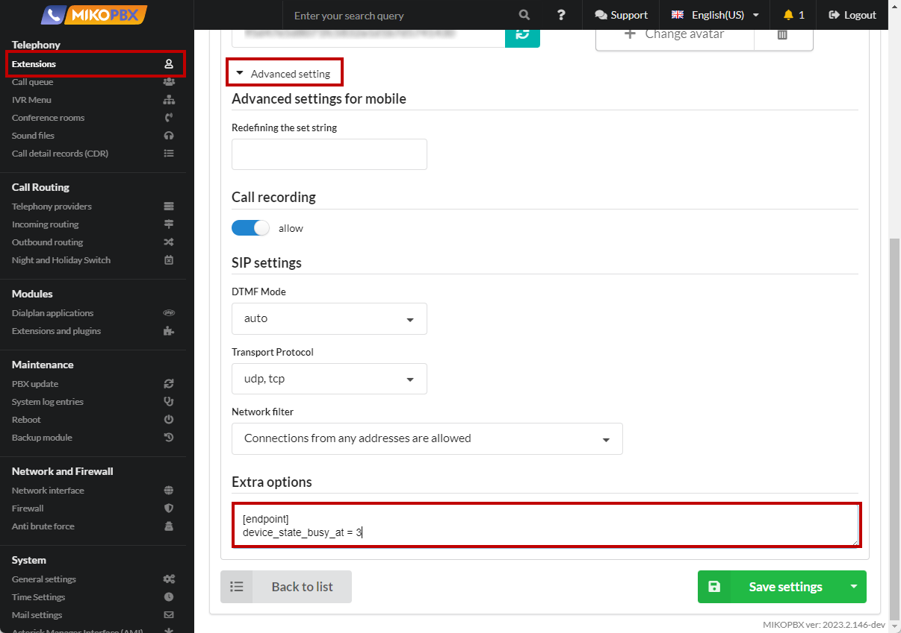

# Notification of Employment, Call Waiting

1. Go to the [System file customization](../../manual/system/custom-files.md) section

<figure><figcaption><p>System file customization menu</p></figcaption></figure>

2. Proceed to editing the "**modules.conf**" file

<figure><figcaption><p>modules.conf file</p></figcaption></figure>

3. Add the following code to the end of the file:

```php
load => func_extstate.so
```

<figure><figcaption><p>Code for modules.conf </p></figcaption></figure>

4. Go to editing the file "**extensions.conf**"

<figure><figcaption><p>extensions.conf file</p></figcaption></figure>

5. Add the following code to the end of the file:

```php
[internal-users-custom]
exten => _X!,1,Progress()
  same => n,ExecIf($["${EXTENSION_STATE(${EXTEN})@internal-hints}" = "INUSE" || "${EXTENSION_STATE(${EXTEN}@internal-hints)}" = "RINGINUSE"]?Playback(beep))
  same => n,ExecIf($["${EXTENSION_STATE(${EXTEN})@internal-hints}" = "INUSE" || "${EXTENSION_STATE(${EXTEN}@internal-hints)}" = "RINGINUSE"]?Set(TRANSFER_OPTIONS=${TRANSFER_OPTIONS}m))
    same => n,return
```

<figure><figcaption></figcaption></figure>

6. In the extension card, in the "**Advanced Settings**" - "**Extra Options**" field, set the value

```php
[endpoint]
device_state_busy_at = 3
```

<figure><figcaption></figcaption></figure>

If the employee is busy, a **beep** file (a short beep) will be played to the caller, then music will be played instead of beeps until the employee answers the call


**device\_state\_busy\_at** is the number of conversations at which the employee should be considered "busy", in this case the "**Routing Settings**" rules described in the employee card will start working.


If the problem solution does not work correctly, change the code in **extensions.conf** to:

```php
[internal-users-custom]
exten => _X!,1,Progress()
same => n,NoOp(${EXTEN})
same => n,NoOp(${DEVICE_STATE(PJSIP/${EXTEN})})
same => n,ExecIf($["${DEVICE_STATE(PJSIP/${EXTEN})}" = "INUSE" || "${DEVICE_STATE(PJSIP/${EXTEN})}" = "RINGINUSE"]?Background(nomer&zanjat))
same => n,ExecIf($["${DEVICE_STATE(PJSIP/${EXTEN})}" = "INUSE" || "${DEVICE_STATE(PJSIP/${EXTEN})}" = "RINGINUSE"]?Set(TRANSFER_OPTIONS=${TRANSFER_OPTIONS}m(callwaiting)))
same => n,return
```
