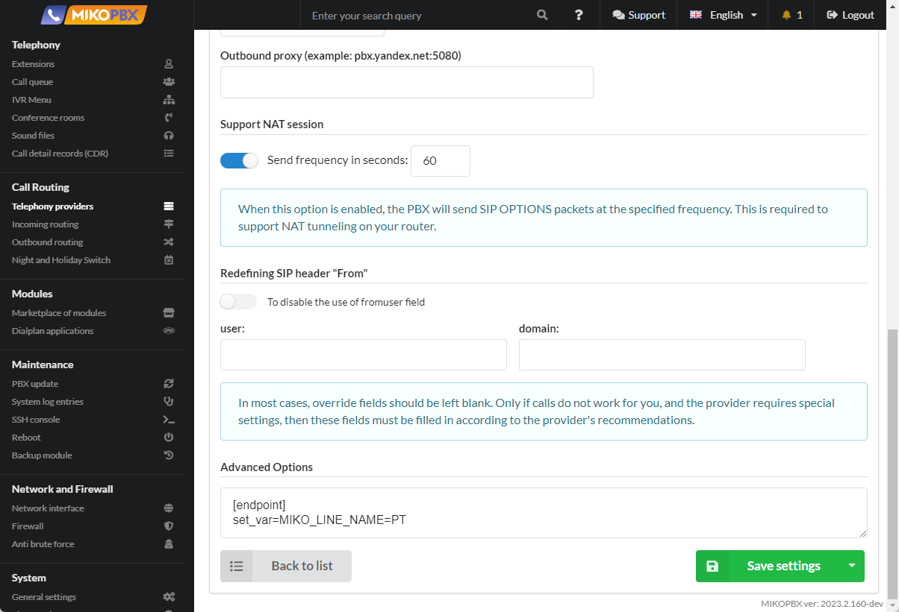
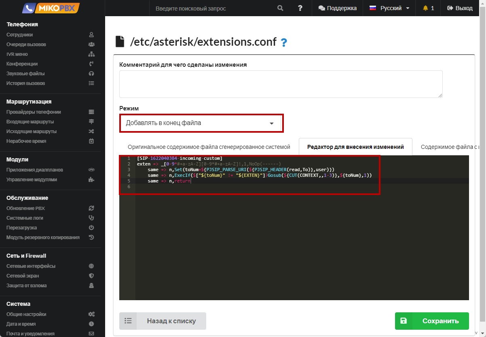

# Output of information about the did number

## Problem statement

MikoPBX can determine the phone number to which the call came from the client. For example, company employees, when receiving an incoming call from a client, need to understand which number the client called. This information should be displayed when a call is received from a client and displayed on the phone. The number the customer called is called the did number. Further in the instructions, we will consider how to display information about the did number on the screen of your phone.

### Display of the DID number during an external incoming call

1. Go to **Call** **Routing** → **Telephony Providers**. Open the provider's account for editing. Copy in the address bar the **ID** of the provider through which subscribers call you to the company. Please note that in our example, a **single** provider is used. If you have configured the connection of **several** providers, then the following steps must be performed **for each provider.**

In our example, the provider ID takes the form: **SIP-1687941868**

<figure><figcaption><p>Provider ID</p></figcaption></figure>

2. Go to **System** -> **System File Customization**

<figure><figcaption><p>System file customization section</p></figcaption></figure>

3. Open the **extensions.conf** configuration file for editing.

<figure><figcaption><p>extensions.conf file</p></figcaption></figure>

4. Set the "Add to end of file" mode. In the black window, add the following code snippet:

```php
[SIP-1687941868-incoming-custom]
exten => _.!,1,NoOp(from_did)
    same => n,ExecIf($[ "${FROM_DID}x" != "x" ]?Set(CALLERID(name)=${FROM_DID}))
    same => n,return
```

<figure><figcaption><p>Code for extensions.conf</p></figcaption></figure>

In the above code snippet, you need to make the correct context name.&#x20;

Format of the created context:

```
[PROVIDER-ID-incoming-custom]
```

* **PROVIDER-ID** is the value that you saved in the first step of this instruction. In our example, this is **SIP-1687941868**.

### Adding the name of the line to the did number

In addition to the did number, you can output the name of the provider / line through which the call passed. To do this, follow these steps:

1. Go to **Call Routing** → **Telephony Providers**. Open the provider's account for editing. In the **Advanced Options** field, specify a variable with the name of the provider.

```php
[endpoint]
set_var=MIKO_LINE_NAME=PT
```

<figure><figcaption><p>Advanced Options</p></figcaption></figure>

2. Go to **System** -> **System file customization**

<figure><figcaption><p>System file customization section</p></figcaption></figure>

3. Open the **extensions.conf** configuration file for editing.

<figure><figcaption><p>extensions.conf </p></figcaption></figure>

4. Set the "**Add to end of file**" mode. In the black window, add the following code snippet:

```php
[SIP-1687941868-incoming-custom]
exten => _.!,1,NoOp(from_did)
    same => n,ExecIf($[ "${FROM_DID}x" != "x"  && "${MIKO_LINE_NAME}x" != "x" ]?Set(CALLERID(name)=${MIKO_LINE_NAME} ${FROM_DID}))
    same => n,return	
```

<figure><figcaption><p>Code for extensions.conf </p></figcaption></figure>

In the above code snippet, you need to make the correct context name.&#x20;

Format of the created context:

```
[PROVIDER-ID-incoming-custom]
```

* **PROVIDER-ID** is the value that you saved in the first step of this instruction. In our example, this is **SIP-1687941868**.
