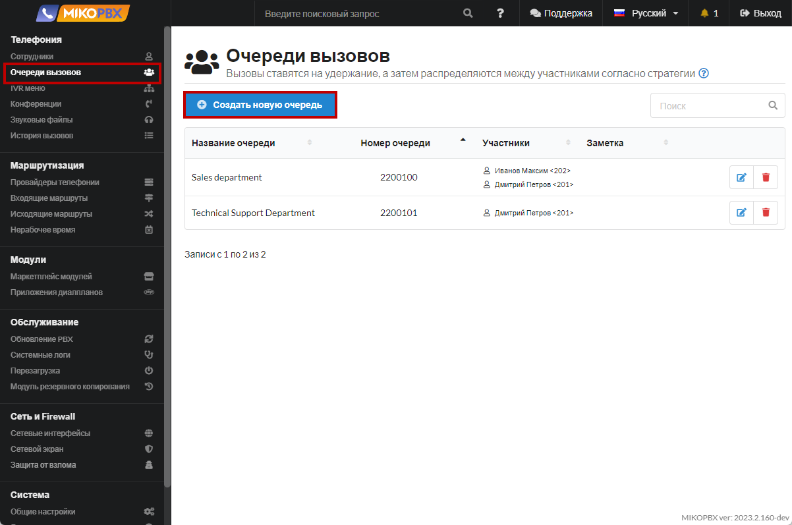
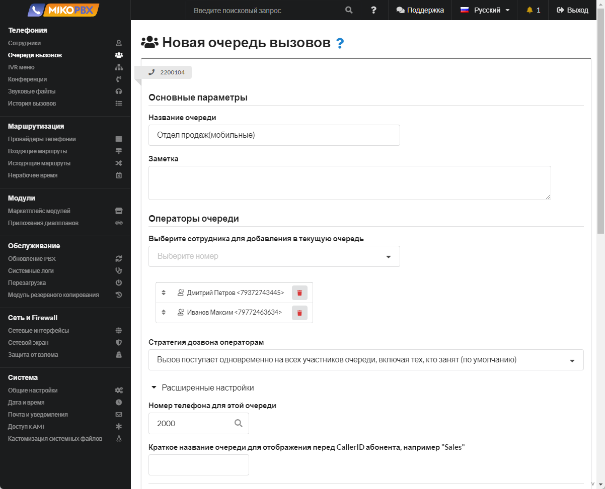
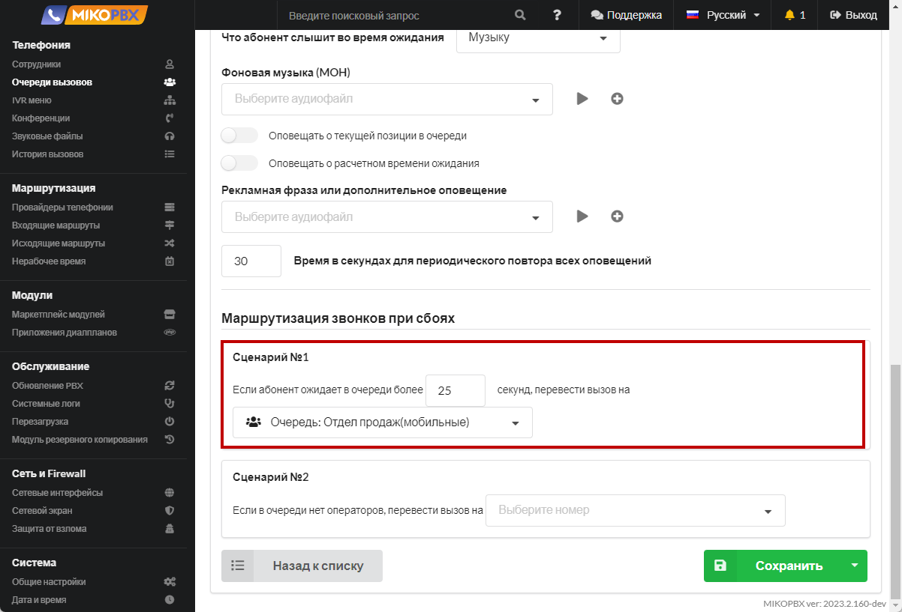
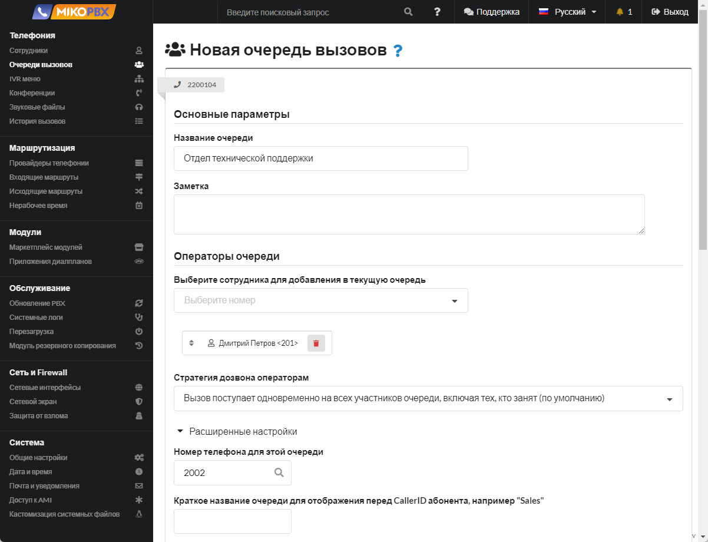
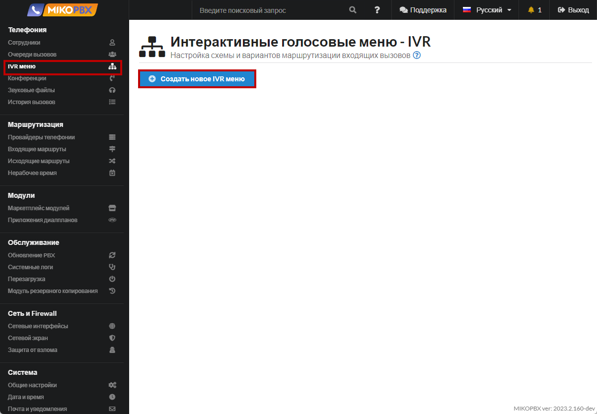
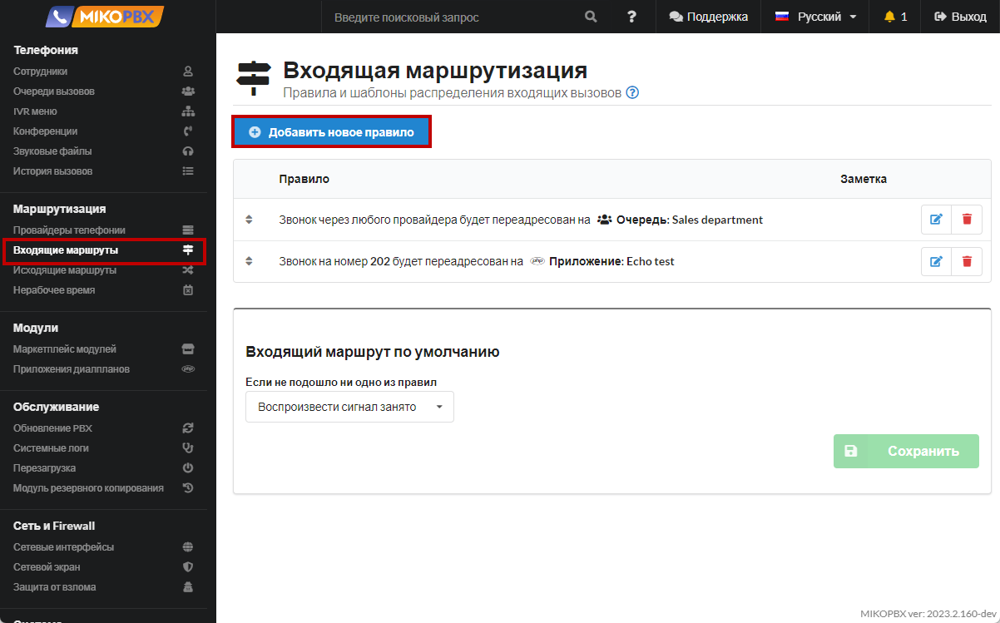
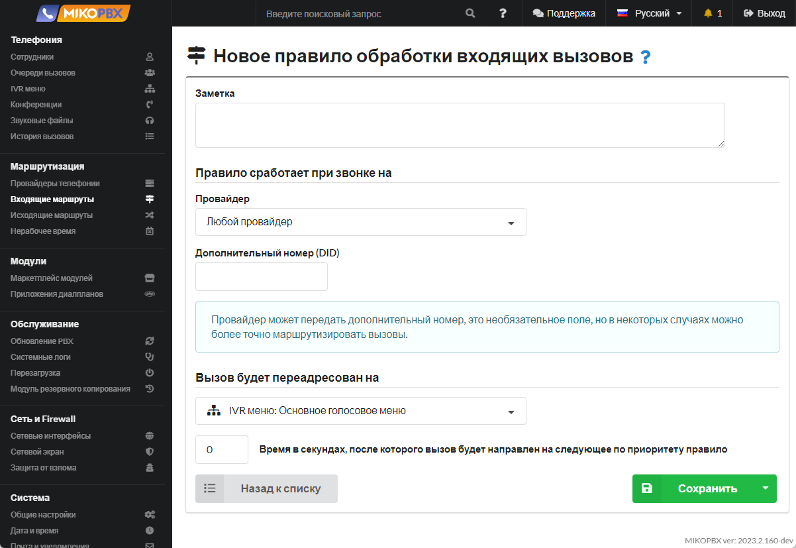

# Пример реализации типового маршрута входящих вызовов

## Постановка задачи 

Клиент звонит в компанию, звучит приветственное сообщение (голосовое приветствие).

Во время проигрывания голосового приветствия клиент может набрать любой внутренний номер, например, добавочный номер сотрудника или добавочный номер отдела.

После проигрывания голосового приветствия клиент может ввести с телефона цифры:

* **1** - вызов в этом случае направится в отдел продаж. **Отдел продаж** - это очередь вызовов, состоящая из двух агентов очереди (двух сотрудников). При звонке в отдел продаж вызов должен поступать на телефоны сотрудников одновременно. Если в течение 25 секунд никто из сотрудников не ответил на звонок клиента, то вызов должен направиться на мобильные номера сотрудников.
* **2** - вызов направится в отдел технической поддержки. **Отдел технической поддержки** - это очередь вызовов, состоящая из трех агентов очереди (трех сотрудников). Вызов должен поступать на любого свободного сотрудника (агента очереди). Если клиент ожидает ответ на свой звонок более 30 секунд, то вызов должен быть переведен на секретаря.

Если клиент ничего не ввел / некорректно набрал номер, то происходит повторное голосовое оповещение и клиент может снова ввести номер. Как только все попытки ввода корректного номера для клиента завершатся, то происходит переадресация вызова на секретаря.

## Решение 

### Очереди вызовов 


Инструкции по очередям вызовов доступны по [ссылке](../../manual/telefoniya/call-queues.md).


Для нашего примера необходимо создать три очереди вызова:

1. Отдел продаж (мобильные номера сотрудников)
2. Отдел продаж (внутренние номера сотрудников)
3. Отдел технической поддержки


Предварительно необходимо создать внутренние учетные записи для сотрудников по [инструкции](../../manual/telefoniya/extensions.md) с указанием их мобильных номеров.


1. Перейдите в раздел **Телефония** → **Очереди вызовов**. Нажмите на кнопку «**Создать новую очередь**».

<figure><figcaption>
Создание новой очереди 
</figcaption></figure>

2. Создаем очередь вызовов для отдела продаж (для **мобильных** номеров сотрудников).

<figure><figcaption>
Очередь для отдела продаж(мобильные)
</figcaption></figure>

3. Создаем очередь вызовов для отдела продаж (для **внутренних** номеров сотрудников).

<figure><figcaption>
Очередь для отдела продаж
</figcaption></figure>

4. Указываем, что если в течение 25 секунд никто из сотрудников не ответил на звонок клиента, то вызов должен направиться на мобильные номера сотрудников.

<figure><figcaption>
Сценарий в случае сбоя
</figcaption></figure>

5. Создаем очередь вызовов для отдела технической поддержки.

<figure><figcaption>
Очередь для отдела технической поддержки
</figcaption></figure>

### IVR-меню 


Инструкции по IVR-меню доступны по [ссылке](../../manual/telefoniya/ivr-menu.md).


1. &#x20;Перейдите в раздел **Телефония** → **IVR меню**. Нажмите на кнопку «**Создать новое IVR меню**».

<figure><figcaption>
Создание нового IVR меню 
</figcaption></figure>

2. Указываем настройки IVR согласно нашему описанию.

<figure><figcaption>
IVR Menu
</figcaption></figure>

### Входящий маршрут 


Инструкции по входящим маршрутам доступны по [ссылке](../../manual/routing/incoming-routes.md).


1. На последнем шаге создаем входящий маршрут вызова для нашего провайдера. В разделе **Маршрутизация** → **Входящие маршруты** добавляем новое правило.

<figure><figcaption>
Раздел "Входящие маршруты"
</figcaption></figure>

2. Заполните данные согласно шаблону:

<figure><figcaption>
Новое правило обработки входящих вызовов
</figcaption></figure>
