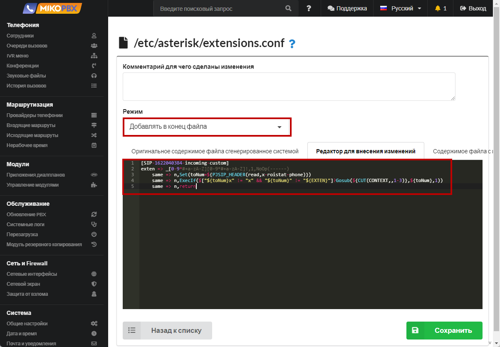

# Маршрутизация по DID номеру

### Введение <a href="#vvedenie" id="vvedenie"></a>

При настройке входящей маршрутизации часто возникает ситуация, когда провайдер предоставляет учетную одну запись SIP для нескольких купленных номеров телефонов.

К примеру у МИКО есть номера телефонов:

* \+7(495)229-30-42
* \+7(499)638-25-84

В интерфейсе MikoPBX создана только одна учетная запись «[Провайдер телефонии](../../manual/routing/providers.md)». Каждый номер телефона необходимо направить на свой маршрут, к примеру на различные IVR.

Тут к приходит на помощь [DID номер](https://ru.wikipedia.org/wiki/DID), который провайдер может передавать при входящих звонках. Зная DID номер, можно для провайдера описать несколько входящие маршрутов, с различными DID, что позволит решить описанную выше задачу.

### Как это работает <a href="#kak_ehto_rabotaet" id="kak_ehto_rabotaet"></a>

Для анализа звонков я обычно использую «[приложение Sngrep](https://wiki.mikopbx.ru/faq:sngrep)». Вот пример запроса от провайдера при входящем:

```
INVITE sip:84996382584@93.188.XX.XX SIP/2.0
Via: SIP/2.0/UDP 81.88.86.65:5060;branch=z9hG4bK1cf7.16247c44.0;cid=2
Max-Forwards: 67
Contact: <sip:81.88.86.65>
To: <sip:84996382584@93.188.XX.XX>
From: "79260577653"<sip:79260577653@mangosip.ru>;tag=5e1a5a28
Call-ID: JUm-E_ISk4DPaL8Npv2Hlw..
CSeq: 1 INVITE
Allow: INVITE, ACK, CANCEL, OPTIONS, BYE, UPDATE, UPDATE, INFO, REFER, MESSAGE
Content-Type: application/sdp
Supported: replaces
User-Agent: Softswitch3
Content-Length: 351
```

При получении такого пакета, MikoPBX проанализирует первую строку с ключевым словом «**INVITE**», значение «**84996382584**» и будет являться **DID** номером.

### Возможные проблемы <a href="#vozmozhnye_problemy" id="vozmozhnye_problemy"></a>

#### DID в заголовке To <a href="#did_v_zagolovke_to" id="did_v_zagolovke_to"></a>

На практике, не всегда все так просто. К примеру я встречал провайдера, который присылает следующий INVITE:

```
INVITE sip:mikoteam@93.188.XX.XX SIP/2.0
Via: SIP/2.0/UDP 81.88.86.65:5060;branch=z9hG4bK1cf7.16247c44.0;cid=2
Max-Forwards: 67
Contact: <sip:81.88.86.65>
To: <sip:84996382584@93.188.XX.XX>
From: "79260577653"<sip:79260577653@mangosip.ru>;tag=5e1a5a28
Call-ID: JUm-E_ISk4DPaL8Npv2Hlw..
CSeq: 1 INVITE
Allow: INVITE, ACK, CANCEL, OPTIONS, BYE, UPDATE, UPDATE, INFO, REFER, MESSAGE
Content-Type: application/sdp
Supported: replaces
User-Agent: Softswitch3
Content-Length: 351
```

В этом случае в строке «INVITE» описывается логин учетной записи, в вот DID уже описывается в заголовке «To». Для корректной настройки достаточно в разделе [Кастомизация системных файлов](../../manual/system/custom-files.md) добавить в конец файла «extensions.conf» следующие строки:

```php
[SIP-1622040384-incoming-custom]
exten => _[0-9*#+a-zA-Z][0-9*#+a-zA-Z]!,1,NoOp(------)
	same => n,Set(toNum=${PJSIP_PARSE_URI(${PJSIP_HEADER(read,To)},user)})
	same => n,ExecIf($["${toNum}" != "${EXTEN}"]?Gosub(${CUT(CONTEXT,,1-3)},${toNum},1))
	same => n,return
```

1. функция «**PJSIP\_HEADER**» считывает значение заголовка «**To**»
2. функция «**PJSIP\_PARSE\_URI**» получает из значения заголовка поле «**user**», которое соответствует значению DID
3. Gosub перемещает канал в начало, для повторной инициализации маршрута
4. **SIP-1622040384** - это ID учетной записи провайдера MikoPBX, можно подсмотреть в адресной строке браузера при редактировании учетной записи

<figure><figcaption><p>Код для решения проблемы</p></figcaption></figure>

#### DID произвольном заголовке <a href="#did_proizvolnom_zagolovke" id="did_proizvolnom_zagolovke"></a>

Такое встречается при использовании сервиса **roistat**. Сервис при входящем может прислать следующий запрос:

```
INVITE sip:mikoteam@93.188.XX.XX SIP/2.0
Via: SIP/2.0/UDP 81.88.86.65:5060;branch=z9hG4bK1cf7.16247c44.0;cid=2
Max-Forwards: 67
Contact: <sip:81.88.86.65>
To: <sip:mikoteam@93.188.XX.XX>
From: "79260577653"<sip:79260577653@mangosip.ru>;tag=5e1a5a28
Call-ID: JUm-E_ISk4DPaL8Npv2Hlw..
CSeq: 1 INVITE
Allow: INVITE, ACK, CANCEL, OPTIONS, BYE, UPDATE, UPDATE, INFO, REFER, MESSAGE
Content-Type: application/sdp
Supported: replaces
User-Agent: Softswitch3
x-roistat-phone: 84996382584
Content-Length: 351
```

Корректного DID нет ни в **INVITE**, ни в поле **To**, но при этом появился новый заголовок «x-roistat-phone».

Для корректной настройки достаточно в разделе [Кастомизация системных файлов](https://wiki.mikopbx.ru/custom-files) добавить в конец файла «extensions.conf» следующие строки:

```php
[SIP-1622040384-incoming-custom]
exten => _[0-9*#+a-zA-Z][0-9*#+a-zA-Z]!,1,NoOp(------)
	same => n,Set(toNum=${PJSIP_HEADER(read,x-roistat-phone)})
	same => n,ExecIf($["${toNum}x" != "x" && "${toNum}" != "${EXTEN}"]?Gosub(${CUT(CONTEXT,,1-3)},${toNum},1))
	same => n,return
```

1. функция «**PJSIP\_HEADER**» считывает значение заголовка «**x-roistat-phone**»
2. Gosub перемещает канал в начало, для повторной инициализации маршрута

<figure><figcaption></figcaption></figure>

#### Манго офис <a href="#mango_ofis" id="mango_ofis"></a>

Получение номера, на который позвонил клиент из поля «Diversion»:

```php
[SIP-1622040384-incoming-custom]
exten => _[0-9*#+a-zA-Z][0-9*#+a-zA-Z]!,1,NoOp(------)
	same => n,Set(tmpDiversion=${PJSIP_HEADER(read,Diversion)})
	same => n,ExecIf($["x${tmpDiversion}" != "x"]?Set(toNum=${CUT(CUT(tmpDiversion,>,1),:,2)}))
	same => n,ExecIf($["${toNum}x" != "x" && "${toNum}" != "${EXTEN}"]?Gosub(${CUT(CONTEXT,,1-3)},${toNum},1))
	same => n,return
```

#### Novafon (zadarma) <a href="#novafon_zadarma" id="novafon_zadarma"></a>

Получение номера, на который позвонил клиент из заголовка «CALLED\_DID»:

```php
[SIP-1622040384-incoming-custom]
exten => _[0-9*#+a-zA-Z][0-9*#+a-zA-Z]!,1,NoOp(------)
	same => n,Set(toNum=${PJSIP_HEADER(read,CALLED_DID)})
	same => n,ExecIf($["${toNum}x" != "x" && "${toNum}" != "${EXTEN}"]?Gosub(${CUT(CONTEXT,,1-3)},${toNum},1))
	same => n,return
```
