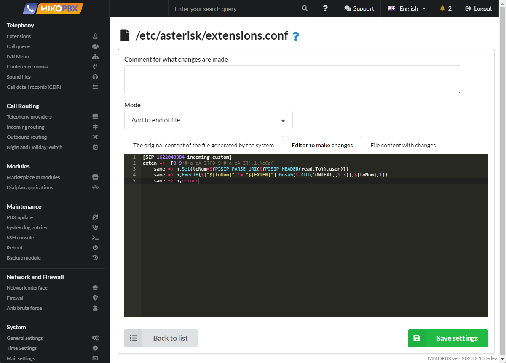

# Routing by DID Number

### Introduction

When configuring inbound routing, a common scenario arises when a provider offers a single SIP account for multiple purchased phone numbers.

For example, at MIKO, there are phone numbers:

* \+7(495)229-30-42
* \+7(499)638-25-84

In the MikoPBX interface, only one "Telephony Provider" account is created. Each phone number needs to be directed to its own route, such as different IVRs.

This is where the [DID number](https://en.wikipedia.org/wiki/Direct\_inward\_dialing) comes to the rescue, which the provider can transmit during inbound calls. Knowing the DID number, you can define multiple inbound routes for the provider, each with a different DID, which solves the described problem.

### How It Works

For call analysis, I usually use the "[Sngrep application](https://wiki.mikopbx.ru/faq:sngrep)". Here's an example request from the provider for an incoming call:

```
INVITE sip:84996382584@93.188.XX.XX SIP/2.0
Via: SIP/2.0/UDP 81.88.86.65:5060;branch=z9hG4bK1cf7.16247c44.0;cid=2
Max-Forwards: 67
Contact: <sip:81.88.86.65>
To: <sip:84996382584@93.188.XX.XX>
From: "79260577653"<sip:79260577653@mangosip.ru>;tag=5e1a5a28
Call-ID: JUm-E_ISk4DPaL8Npv2Hlw..
CSeq: 1 INVITE
Allow: INVITE, ACK, CANCEL, OPTIONS, BYE, UPDATE, UPDATE, INFO, REFER, MESSAGE
Content-Type: application/sdp
Supported: replaces
User-Agent: Softswitch3
Content-Length: 351
```

When receiving such a packet, MikoPBX analyzes the first line with the keyword "**INVITE**," extracts the value "**84996382584**," and considers it as the **DID** number.

### Possible Issues

#### DID in the To Header

In practice, it's not always so straightforward. For example, I've encountered a provider that sends the following INVITE:

```
INVITE sip:mikoteam@93.188.XX.XX SIP/2.0
Via: SIP/2.0/UDP 81.88.86.65:5060;branch=z9hG4bK1cf7.16247c44.0;cid=2
Max-Forwards: 67
Contact: <sip:81.88.86.65>
To: <sip:84996382584@93.188.XX.XX>
From: "79260577653"<sip:79260577653@mangosip.ru>;tag=5e1a5a28
Call-ID: JUm-E_ISk4DPaL8Npv2Hlw..
CSeq: 1 INVITE
Allow: INVITE, ACK, CANCEL, OPTIONS, BYE, UPDATE, UPDATE, INFO, REFER, MESSAGE
Content-Type: application/sdp
Supported: replaces
User-Agent: Softswitch3
Content-Length: 351
```

In this case, the account login is described in the "INVITE" line, while the DID is described in the "To" header. To set it up correctly, you just need to add the following lines to the [Customize System Files](../../manual/system/custom-files.md) section at the end of the "extensions.conf" file:

```php
[SIP-1622040384-incoming-custom]
exten => _[0-9*#+a-zA-Z][0-9*#+a-zA-Z]!,1,NoOp(------)
same => n,Set(toNum=${PJSIP_PARSE_URI(${PJSIP_HEADER(read,To)},user)})
same => n,ExecIf($["${toNum}" != "${EXTEN}"]?Gosub(${CUT(CONTEXT,,1-3)},${toNum},1))
same => n,return
```

1. The "PJSIP\_HEADER" function reads the value of the "To" header.
2. The "PJSIP\_PARSE\_URI" function retrieves the "user" field from the header, which corresponds to the DID value.
3. Gosub moves the channel to the beginning for reinitializing the route.
4. **SIP-1622040384** is the ID of the MikoPBX provider account, which can be found in the browser's address bar when editing the account.

<figure><figcaption></figcaption></figure>

#### DID in Arbitrary Header

This occurs when using the **roistat** service. The service may send the following request for incoming calls:

```
INVITE sip:mikoteam@93.188.XX.XX SIP/2.0
Via: SIP/2.0/UDP 81.88.86.65:5060;branch=z9hG4bK1cf7.16247c44.0;cid=2
Max-Forwards: 67
Contact: <sip:81.88.86.65>
To: <sip:mikoteam@93.188.XX.XX>
From: "79260577653"<sip:79260577653@mangosip.ru>;tag=5e1a5a28
Call-ID: JUm-E_ISk4DPaL8Npv2Hlw..
CSeq: 1 INVITE
Allow: INVITE, ACK, CANCEL, OPTIONS, BYE, UPDATE, UPDATE, INFO, REFER, MESSAGE
Content-Type: application/sdp
Supported: replaces
User-Agent: Softswitch3
x-roistat-phone: 84996382584
Content-Length: 351
```

In this case, there is no correct DID in either the **INVITE** or the **To** field, but a new header "**x-roistat-phone**" has appeared.

To set it up correctly, you just need to add the following lines to the [Customize System Files](../../manual/system/custom-files.md) section at the end of the "extensions.conf" file:

```php
[SIP-1622040384-incoming-custom]
exten => _[0-9*#+a-zA-Z][0-9*#+a-zA-Z]!,1,NoOp(------)
same => n,Set(toNum=${PJSIP_HEADER(read,x-roistat-phone)})
same => n,ExecIf($["${toNum}x" != "x" && "${toNum}" != "${EXTEN}"]?Gosub(${CUT(CONTEXT,,1-3)},${toNum},1))
same => n,return
```

1. The "**PJSIP\_HEADER**" function reads the value of the "x-roistat-phone" header.
2. Gosub moves the channel to the beginning for reinitializing the route.

<figure><figcaption></figcaption></figure>

**Mango Office**

Obtaining the number that the customer called from the "Diversion" field:

```php
[SIP-1622040384-incoming-custom]
exten => _[0-9*#+a-zA-Z][0-9*#+a-zA-Z]!,1,NoOp(------)
same => n,Set(tmpDiversion=${PJSIP_HEADER(read,Diversion)})
same => n,ExecIf($["x${tmpDiversion}" != "x"]?Set(toNum=${CUT(CUT(tmpDiversion,>,1),:,2)}))
same => n,ExecIf($["${toNum}x" != "x" && "${toNum}" != "${EXTEN}"]?Gosub(${CUT(CONTEXT,,1-3)},${toNum},1))
same => n,return
```

**Novafon (Zadarma)**

Obtaining the number that the customer called from the "CALLED\_DID" header:

```php
[SIP-1622040384-incoming-custom]
exten => _[0-9*#+a-zA-Z][0-9*#+a-zA-Z]!,1,NoOp(------)
same => n,Set(toNum=${PJSIP_HEADER(read,CALLED_DID)})
same => n,ExecIf($["${toNum}x" != "x" && "${toNum}" != "${EXTEN}"]?Gosub(${CUT(CONTEXT,,1-3)},${toNum},1))
same => n,return
```
