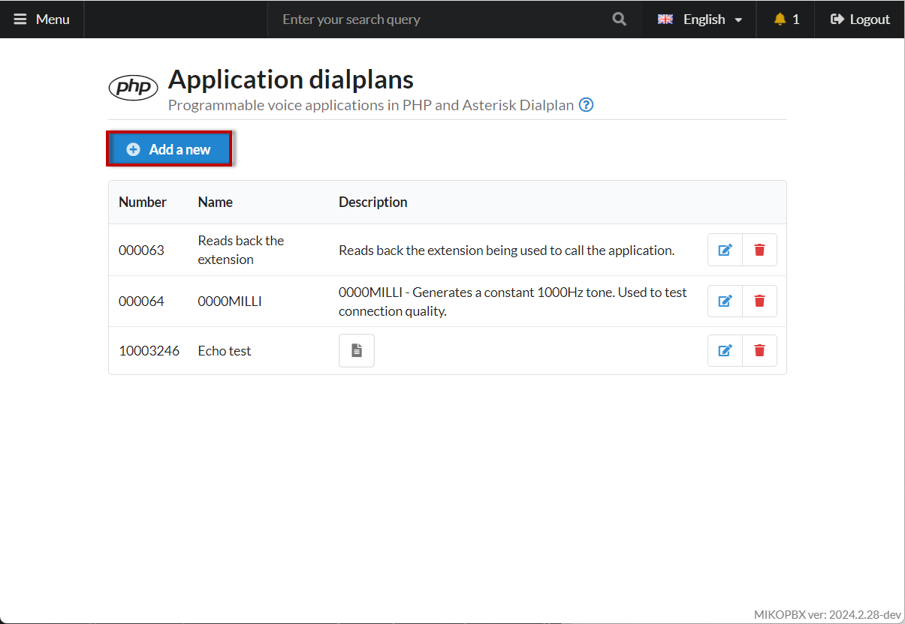
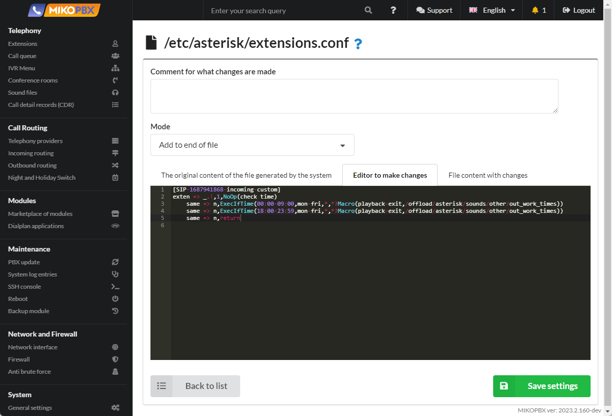

# Setting individual non-working hours for a provider account

## Formulation of the problem

In MikoPBX, in the **Call Routing** → **Night and Holiday section**, rules for routing calls outside working hours are configured. These rules apply to all calls, regardless of which company number the client called. It is necessary to set individual non-working hours for the Zadarma provider. Working hours for this provider: from 9.00 to 18.00 Moscow time.

## Solution

### Method 1

1. Go to **Modules** → **Dialplan Applications**. Create a new application (Asterisk dialplan) following the [instructions](../../manual/modules/dialplan-applications.md). Application parameters take the form:

<figure><figcaption><p>Parameters of the created dialplan</p></figcaption></figure>

2. The program code of the created application:

<figure><figcaption><p>The program code of the application being created</p></figcaption></figure>

The **ExecIfTime** command executes the specified Asterisk application if the current time matches the specified time specification. If we receive a call from 9:00 to 18:00 on any weekday (Monday to Friday), we redirect the call ([Goto ](https://www.voip-info.org/asterisk-cmd-goto/)command) to 2003. **2003** is the IVR menu number.

<figure><figcaption><p>Settings in the IVR menu</p></figcaption></figure>

Otherwise, the call will be routed to the employee with extension 201.

3. Set up inbound routing rules for the created provider. Go to the **Routing** → **Incoming routing** section. We direct all incoming calls to the created application

<figure><figcaption><p>Incoming route settings</p></figcaption></figure>

### Method 2

1. Find and copy the provider ID. To do this, go to the configuration of the required provider. In our example, this is **SIP-1687941868**

<figure><figcaption><p>Provider ID</p></figcaption></figure>

2. Go to **System** -> **System file customization**

<figure><figcaption><p>System file customization section</p></figcaption></figure>

3. Open the configuration file **extensions.conf** for editing.

<figure><figcaption><p>Configuration file "extensions.conf"</p></figcaption></figure>

4. Set the "**Add to end of file**" mode. In the black window, add the following code snippet:

```php
[SIP-1687941868-incoming-custom]
exten => _.!,1,NoOp(check time)
    same => n,ExecIfTime(00:00-09:00,mon-fri,*,*?Macro(playback-exit,/offload/asterisk/sounds/other/out_work_times))
    same => n,ExecIfTime(18:00-23:59,mon-fri,*,*?Macro(playback-exit,/offload/asterisk/sounds/other/out_work_times))
    same => n,return
```

<figure><figcaption><p>Code for extensions.conf</p></figcaption></figure>

In the above code snippet, you need to make the correct context name.&#x20;

Format of the created context:

```
[PROVIDER-ID-incoming-custom]
```

* **PROVIDER-ID** is the value that you saved in the second step of this instruction. In our example, this is **SIP-1687941868.**

Working hours are from 9.00 to 18.00, therefore it is necessary to set two intervals for non-working hours: 00:00-09:00 and 18:00-23:59.

### ExecIfTime command

Let's analyze the **ExecIfTime** command in more detail. This command executes the specified Asterisk application if the current time matches the specified time specification. In our case, the command plays a sound file located in the **/offload/asterisk/sounds/other/out\_work\_times** directory in MikoPBX.

Command syntax:

```php
ExecIfTime(times,weekdays,mdays,months?appname[(appargs)])
```

* **times** - Time ranges in 24-hour format
* **weekdays -** Days of the week (mon, tue, wed, thu, fri, sat, sun)
* **mdays** - Days of the month (1-31)
* **months** - Months (Jan, Feb, Mar, apr, etc.)
* **appname\[(appargs)]** - Asterisk command specifying the call parameters

In our example, the time range, the range of days of the week are indicated. Instead of specifying days months and months, \* are entered. This symbol means "for all other cases".

```php
ExecIfTime(00:00-08:00,mon-fri,*,*?Macro(playback-exit,/offload/asterisk/sounds/other/out_work_times))
```
