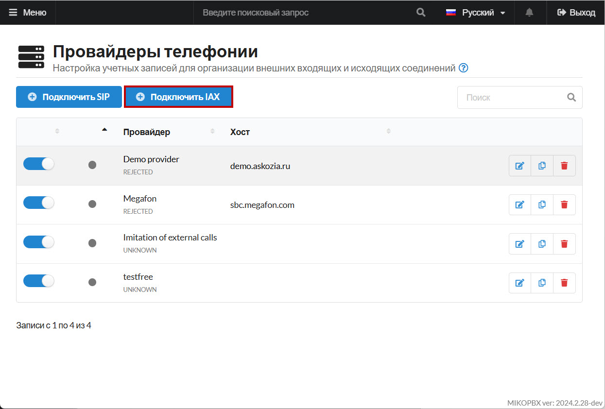
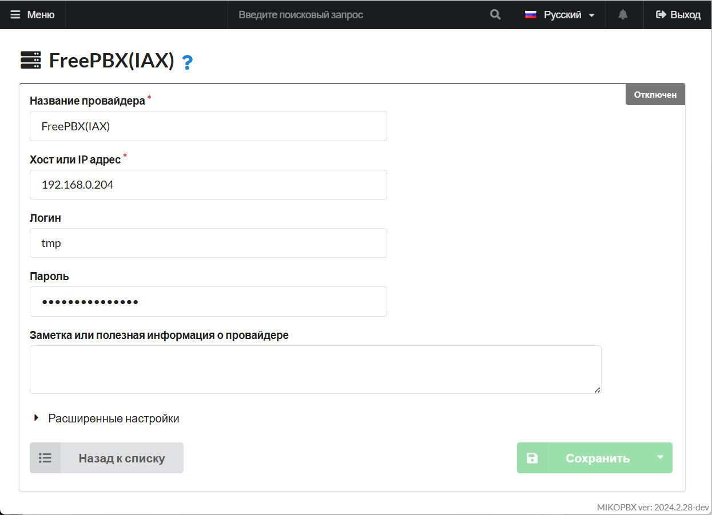
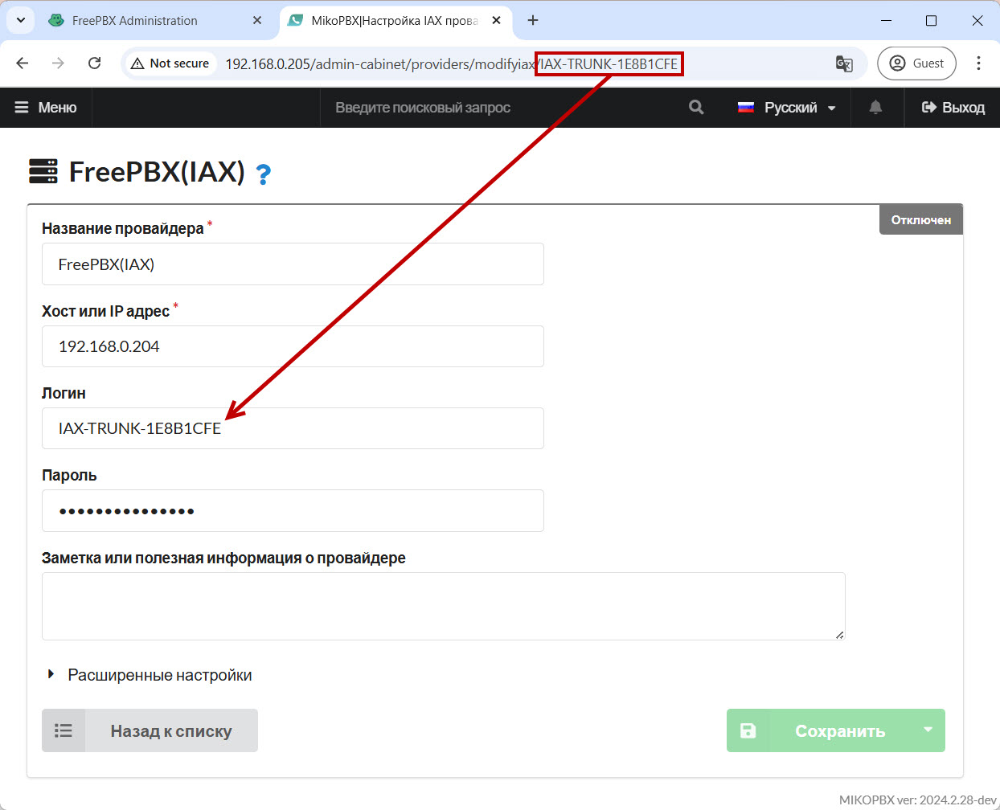
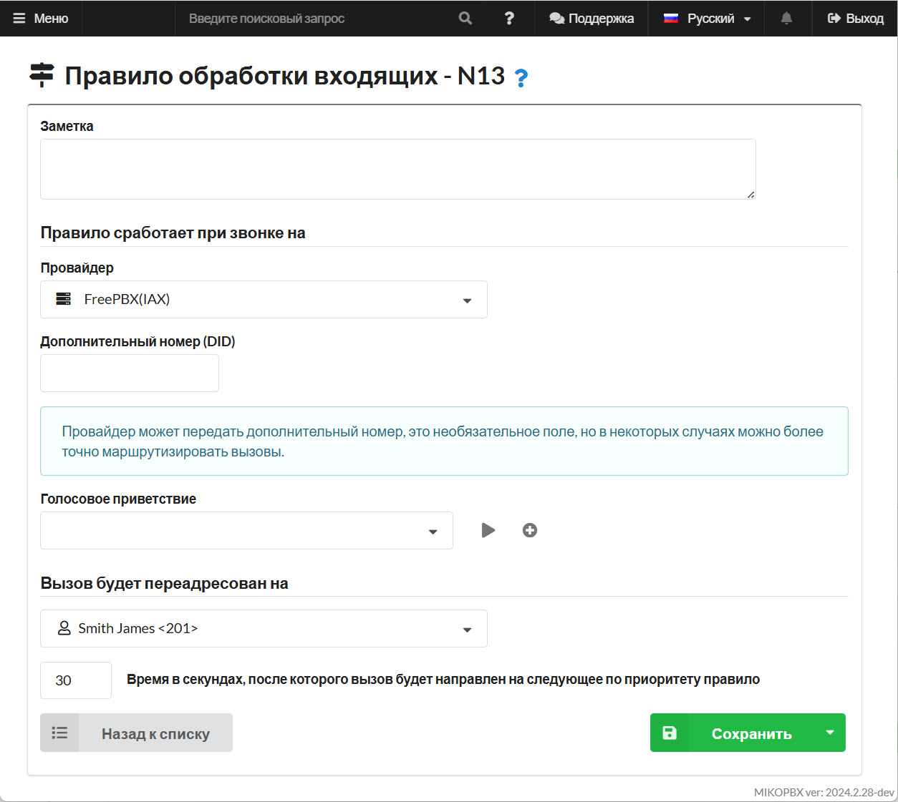
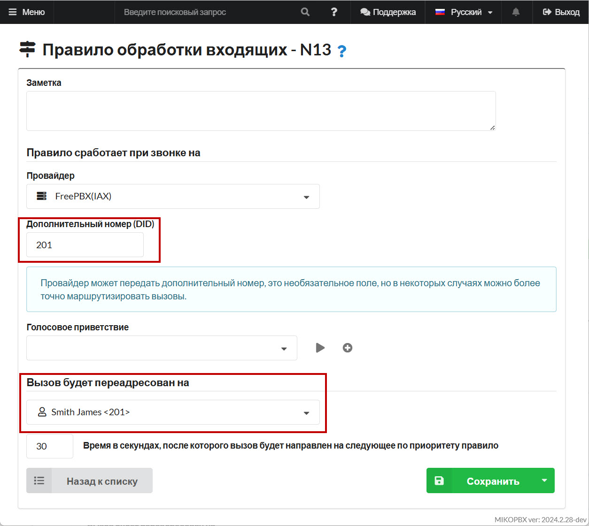
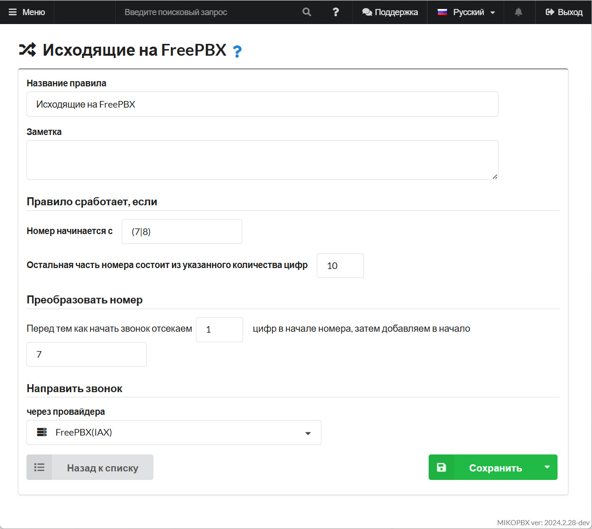

# Объединение MikoPBX и FreePBX (IAX)

## Настройка MikoPBX

1. Перейдите в раздел "**Маршрутизация**" -> "**Провайдеры телефонии**":

<figure><figcaption><p>Раздел "Провайдеры телефонии"</p></figcaption></figure>

2. Создайте нового IAX провайдера:

<figure><figcaption><p>Новый IAX провайдер</p></figcaption></figure>

3. Заполните параметры:

* **"Название провайдера**" - произвольное.
* "**Хост или IP адрес"** - IP адрес FreePBX.
* **"Логин**" - "tmp".
* "**Пароль**" - произвольный, сложный пароль.

Сохраните параметры.

<figure><figcaption><p>Параметры для IAX провайдера</p></figcaption></figure>

4. После сохранения параметров, в адресной строке появится идентификатор провайдера. Скопируйте его в раздел "**Логин**":

<figure><figcaption><p>Логин</p></figcaption></figure>

## Настройки FreePBX

1. Перейдите в раздел «**Connectivity**» - «**Trunks**» и добавьте новый trunk **IAX2**

<figure><figcaption><p>Новый IAX2 Trunk</p></figcaption></figure>

2. Перейдите на вкладку "**General**". Укажите в качестве «**Trunk Name**» логин, используемый в MIKOPBX (из адресной строки браузера «**IAX-TRUNK-1E8B1CFE**»)

<figure><figcaption><p>Поле "Trunk Name"</p></figcaption></figure>

3. Перейдите на вкладку «**Dialed Number Manipulation Rules**» задайте шаблон для исходящих:

<figure><figcaption><p>Шаблон для исходящих</p></figcaption></figure>

4. Перейдите на вкладку **iax2 Settings.** Заполните поле **Trunk Name** логин, используемый в MIKOPBX (из адресной строки браузера «**IAX-TRUNK-1E8B1CFE**»)

<figure><figcaption><p>Поле "Trunk Name"</p></figcaption></figure>

Заполните параметр "**PEER Details**":

```
type=friend
auth=plaintext
language=ru-ru
qualify=2000
transfer=mediaonly
disallow=all
;username=mikopbx
host=dynamic
trunk=yes
secret=123
allow=alaw&ulaw
```

<figure><figcaption><p>Параметр "PEER Details"</p></figcaption></figure>

5. Во вкладке «**Incoming**» заполните поле «**Register String**» в формате "**LOGIN:PASSWORD@IP\_FREE\_PBX**":

<figure><figcaption><p>Параметр "Register String"</p></figcaption></figure>

## Описание маршрутизации

### MikoPBX

1. Опишите входящий маршрут ([см. руководство "Входящие маршруты"](../../manual/routing/incoming-routing.md)). В данном случае, все вызовы будут направлены на внутренний номер 201:

<figure><figcaption><p>Входящая маршрутизация MikoPBX</p></figcaption></figure>

При необходимости опишите отдельно на каждый DID свой номер назначения в отдельном маршруте:

<figure><figcaption><p>Входящая маршрутизация MikoPBX на каждый DID-номер</p></figcaption></figure>

2. Опишите исходящую маршрутизацию ([см. руководство "Исходящие маршруты"](../../manual/routing/outbound-routing.md)):

<figure><figcaption><p>Исходящая маршрутизация MikoPBX</p></figcaption></figure>

### FreePBX

1. Перейдите в раздел «**Connectivity**» - «**Inbound Routes**», опишите входящий маршрут:

<figure><figcaption><p>Входящая маршрутизация FreePBX</p></figcaption></figure>

2. Перейдите в раздел «**Connectivity**» - «**Outbound Routes**», опишите исходящий маршрут:

<figure><figcaption><p>Исходящая маршрутизация FreePBX</p></figcaption></figure>
