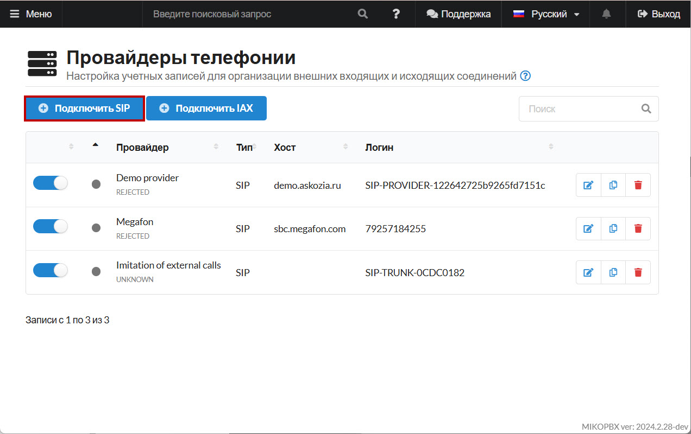
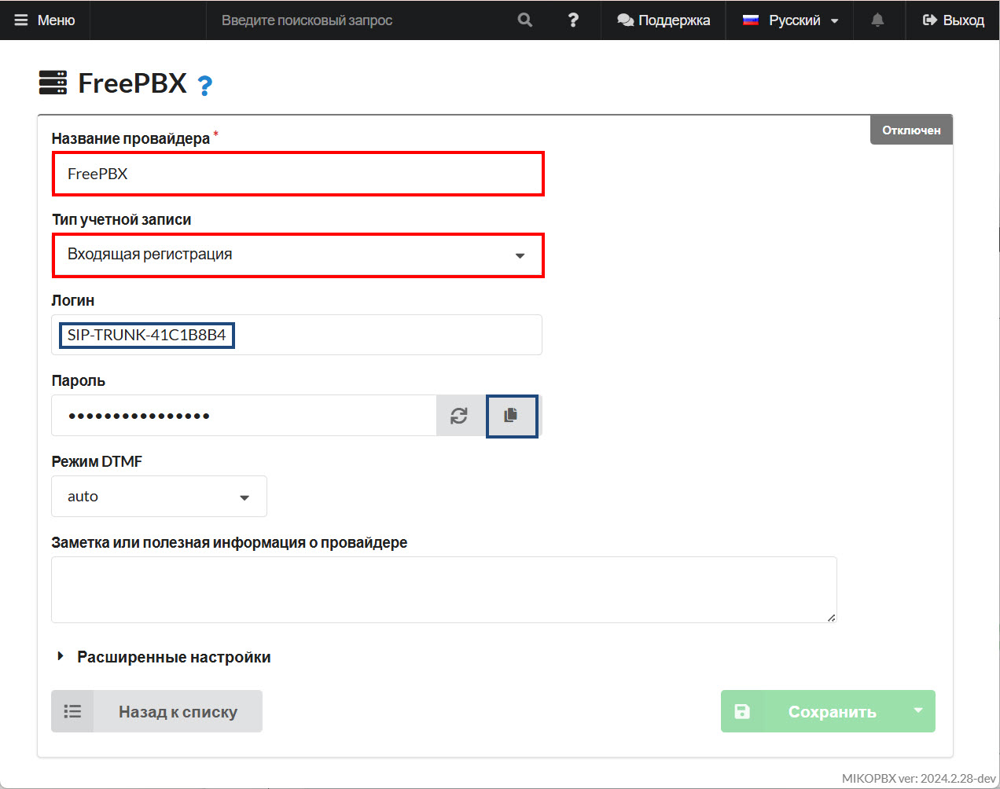
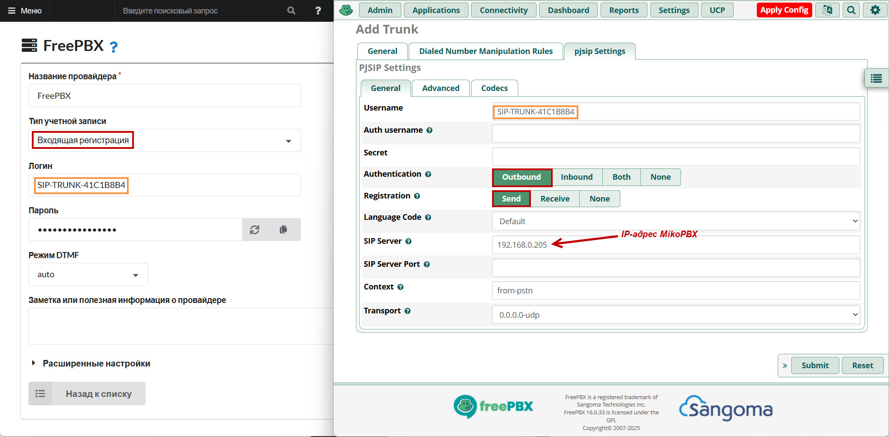
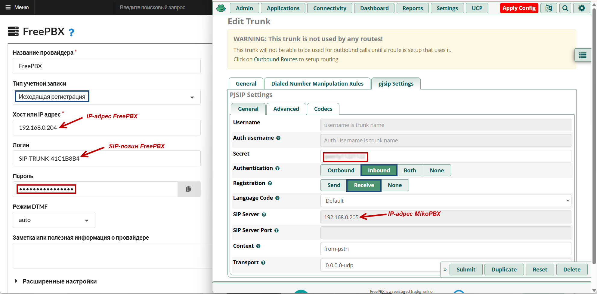
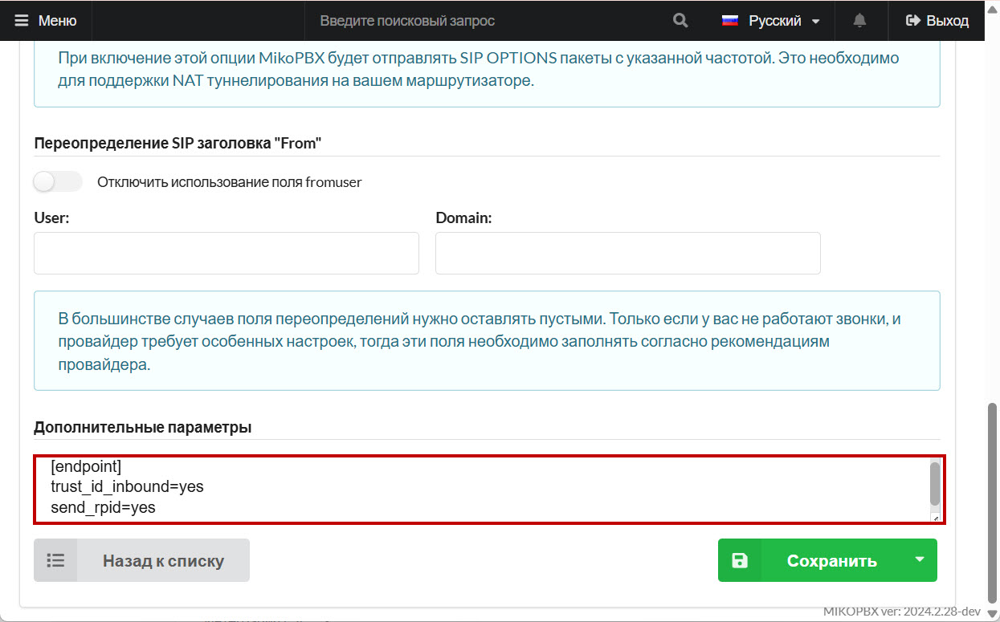
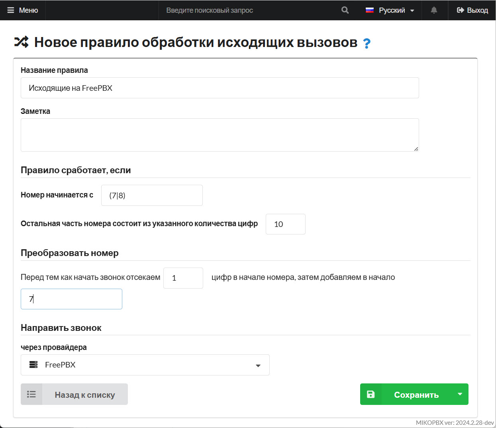
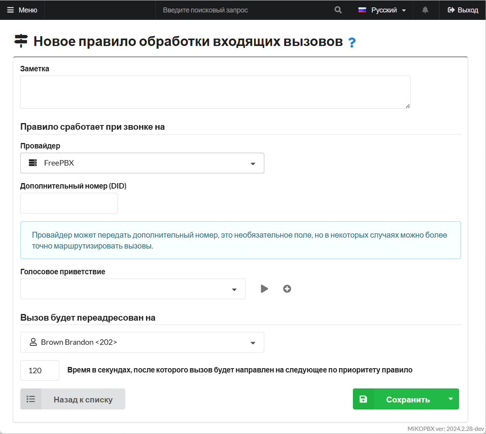
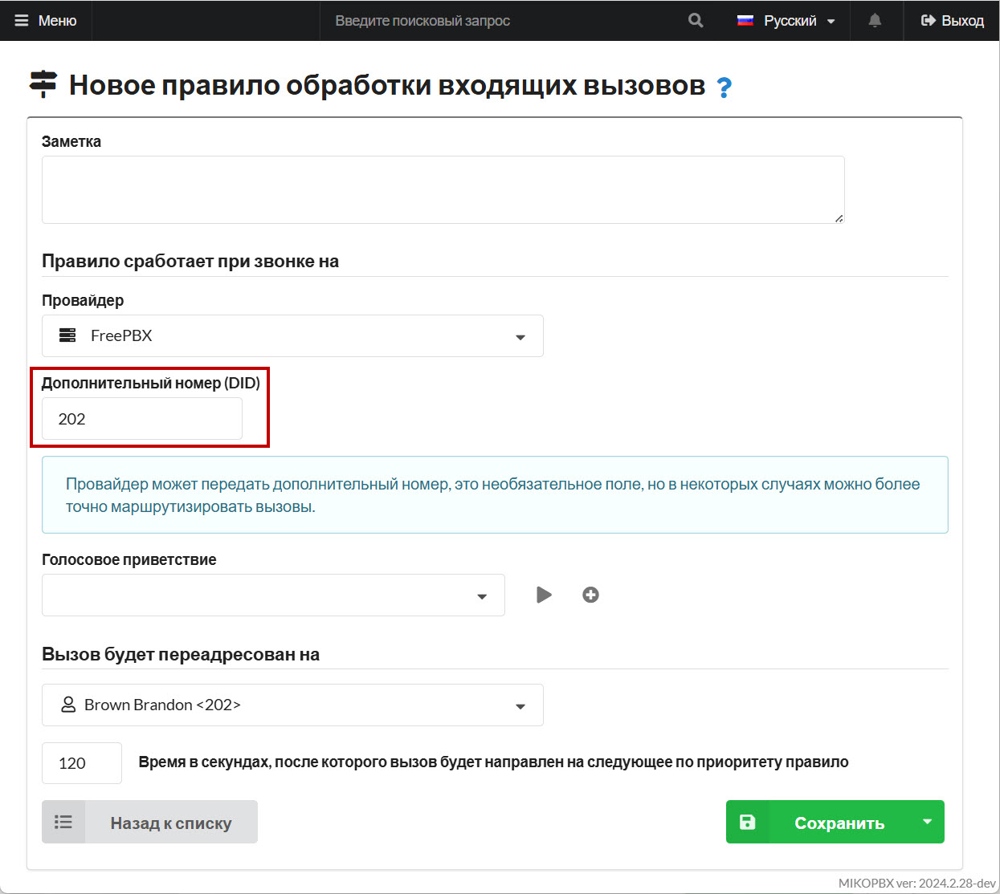

# Объединение MikoPBX и FreePBX (PJSIP)

## Создание провайдера MikoPBX

1. В MikoPBX перейдите во вкладку "**Маршрутизация**" -> "**Провайдеры телефонии**":

<figure><figcaption><p>Раздел "<strong>Провайдеры телефонии</strong>"</p></figcaption></figure>

2. Создайте нового SIP-провайдера. Для этого нажмите "**Подключить SIP**":

<figure><figcaption><p>Элемент "<strong>Подключить SIP</strong>"</p></figcaption></figure>

3. Заполните следующие параметры:

* "**Название провайдера**" - произвольное
* "**Тип учетной записи**" - Входящая регистрация

Скопируйте **логин** и **пароль**, они понадобятся позже.

<figure><figcaption><p>Параметры провайдера MikoPBX</p></figcaption></figure>

## Создание транка FreePBX

1. В интерфейсе FreePBX перейдите в раздел "**Connectivity**" -> "**Trunks**":

<figure><figcaption><p>Раздел "Trunks" FreePBX</p></figcaption></figure>

2. Добавьте новый транк, типа "**chan\_pjsip**".

<figure><figcaption><p>Новый транк в FreePBX</p></figcaption></figure>

3. Вставьте логин провайдера из MikoPBX в поле "**Trunk Name**":

<figure><figcaption><p>"Trunk Name" FreePBX</p></figcaption></figure>

4. Перейдите во вкладку "**pjsip Settings**" -> "**Advanced**":

* В поле «**From User**» вставьте значение «**Логин провайдера MikoPBX**»
* Установите «**Trust RPID/PAI**» в значение "**yes"**
* Установите «**Send RPID/PAI**» в значение «**Send Remote-Party-ID header**»

<figure><figcaption><p>Параметры транка FreePBX</p></figcaption></figure>

5. Опишите шаблоны номеров на вкладке «**Dialed Number Manipulation Rules**»:

<figure><figcaption><p>Настройка шаблонов номеров FreePBX</p></figcaption></figure>

Сохраните изменения.

## Варианты регистрации

Далее Вам необходимо выбрать один из двух вариантов регистрации:

#### Регистрация FreePBX на MikoPBX

<figure><figcaption><p>Вариант регистрации FreePBX на MikoPBX</p></figcaption></figure>

#### Регистрация MikoPBX на FreePBX

<figure><figcaption><p>Вариант регистрации MikoPBX на FreePBX</p></figcaption></figure>

Устанавите пароль (**сложный**, произвольный). Он должен быть одинаковый как на MikoPBX, так на FreePBX.

В «расширенных настройках» MikoPBX, в «Дополнительных параметрах» укажите следующие опции:

```
[endpoint]
trust_id_inbound=yes
send_rpid=yes
```

Сохраните и примените изменения.

<figure><figcaption><p>Дополнительные параметры провайдера в MikoPBX</p></figcaption></figure>

## Настройка маршрутизации

1. Опишите исходящий маршрут ([Статья "Исходящая маршрутизация"](../../manual/routing/outbound-routing.md)) в MikoPBX:

<figure><figcaption><p>Настройка исходящей маршрутизации на MikoPBX</p></figcaption></figure>

2. Опишите входящий маршрут ([Статья "Входящая маршрутизация"](../../manual/routing/incoming-routing.md)) в MikoPBX:

<figure><figcaption><p>Настройка входящей маршрутизации на MikoPBX</p></figcaption></figure>

При необходимости опишите отдельно на каждый DID свой номер назначения в отдельном маршруте (Если пользователь FreePBX наберет номер **202**, то будет направлен на номер **202)**:

<figure><figcaption><p>Описание номера назначения для индивидуального DID-номера</p></figcaption></figure>

3. Перейдите в раздел «**Connectivity**» - «**Inbound Routes**», опишите входящий маршрут в FreePBX:

<figure><figcaption><p>Настройка входящей маршрутизации на FreePBX</p></figcaption></figure>

4. Перейдите в раздел «**Connectivity**» - «**Outbound Routes**», опишите исходящий маршрут:

<figure><figcaption><p>Настройка исходящей маршрутизации на FreePBX</p></figcaption></figure>

## Статусы абонентов <a href="#statusy_abonentov" id="statusy_abonentov"></a>

В некоторых случаях, абонентам одной АТС потребуется знать статусы абонентов другой станции.

К примеру при использовании BLF на телефонных аппаратах «Панель телефонии для 1С» Для настройки статусов потребуется:

### MikoPBX <a href="#mikopbx" id="mikopbx"></a>

1. Добавьте **на первой АТС** через раздел [Кастомизация системных файлов](../../manual/system/custom-files.md) в конец файла "**extensions.conf"** следующий текст:

```php
[internal-hints]
exten => 301,hint,PJSIP/301
exten => 303,hint,PJSIP/303
exten => 302,hint,PJSIP/302
```

Описываются все внутренние номера, что описаны на FreePBX

2. Для **каждой АТС** добавьте через раздел [Кастомизация системных файлов](../../manual/system/custom-files.md) в конец файла "**pjsip.conf":**

```php
[SIP-TRUNK-41C1B8B4-devicestate]
type=outbound-publish
server_uri=sip:SIP-TRUNK-41C1B8B4@172.16.156.216:5060
event=asterisk-devicestate
 
[SIP-TRUNK-41C1B8B4]
type=asterisk-publication
devicestate_publish=SIP-TRUNK-41C1B8B4-devicestate
device_state=yes

[SIP-TRUNK-41C1B8B4]
type=inbound-publication
event_asterisk-devicestate=SIP-TRUNK-41C1B8B4
```


Замените теги "**SIP-TRUNK-41C1B8B4"** на **ID провайдера MikoPBX**, "**172.16.156.216"** на **адрес FreePBX** на свои значения


### FreePBX <a href="#freepbx" id="freepbx"></a>

1. Используйте модуль «**Config Edit**» для редактирования файлов
2. Добавьте к файлу «**extensions\_custom.conf**»

Тут следует описать все внутренние номера MikoPBX:

```
[mikopbx-hints]
exten => 201,hint,PJSIP/201
exten => 202,hint,PJSIP/202
```

3. Добавьте к файлу «**pjsip\_custom.conf**»

```php
[SIP-TRUNK-41C1B8B4-devicestate]
type=outbound-publish
server_uri=sip:SIP-TRUNK-41C1B8B4@172.16.156.223:5060
event=asterisk-devicestate
outbound_auth=SIP-TRUNK-41C1B8B4
 
[SIP-TRUNK-41C1B8B4]
type=asterisk-publication
devicestate_publish=SIP-TRUNK-41C1B8B4-devicestate
device_state=yes
device_state_filter=^PJSIP/

[SIP-TRUNK-41C1B8B4]
type=inbound-publication
event_asterisk-devicestate=SIP-TRUNK-41C1B8B4
```


Замените теги "**SIP-TRUNK-41C1B8B4"** на **ID провайдера MikoPBX**, "**172.16.156.216"** на **адрес FreePBX** на свои значения



Опция **outbound\_auth=SIP-TRUNK-41C1B8B4** актуальна только для случая, когда FreePBX регистрируется на MikoPBX. Передачу статусов удалось настроить только для этого случая.

