# MikoPBX and FreePBX (PJSIP)

## Creating a Provider on MikoPBX

1. In MikoPBX, go to **"Routing"** → **"Telephony Providers"**:

<figure><figcaption><p>"Telephony Providers" section</p></figcaption></figure>

2. Add a new SIP provider by clicking **"Connect SIP"**:

<figure>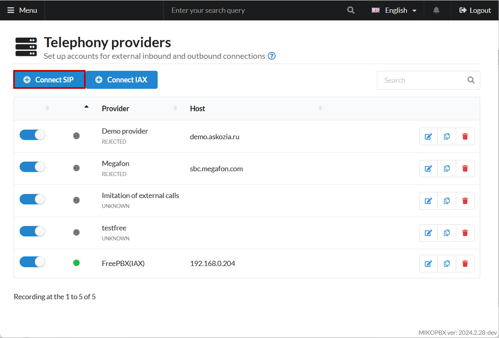<figcaption><p>"Connect SIP" button</p></figcaption></figure>

3. Fill in the following parameters:

* **Provider Name** – any name
* **Account Type** – Incoming Registration

Copy the "**Username"** and "**Password"**; you will need them later.

<figure><figcaption><p>Provider parameters (MikoPBX)</p></figcaption></figure>

## Creating a Trunk on FreePBX

1. In the FreePBX interface, go to **"Connectivity"** → **"Trunks"**:

<figure>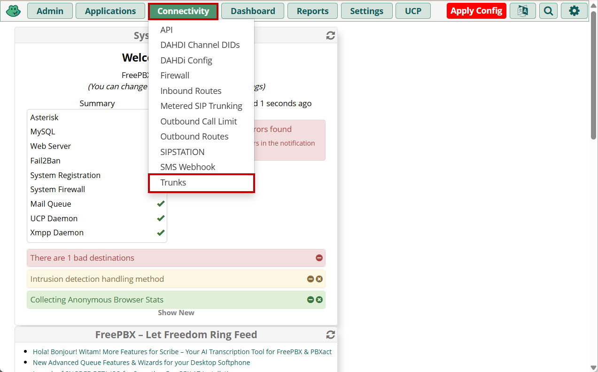<figcaption><p>"Trunks" section</p></figcaption></figure>

2. Add a new trunk of type **"chan\_pjsip"**.

<figure>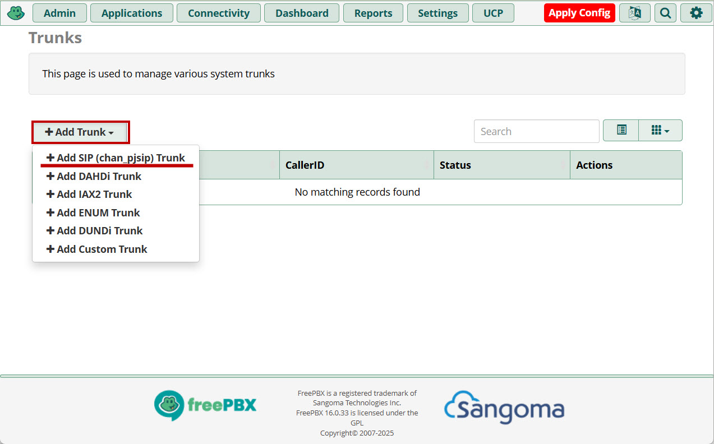<figcaption><p>Adding a new trunk</p></figcaption></figure>

3. Insert the MikoPBX provider’s login into the **"Trunk Name"** field:

<figure>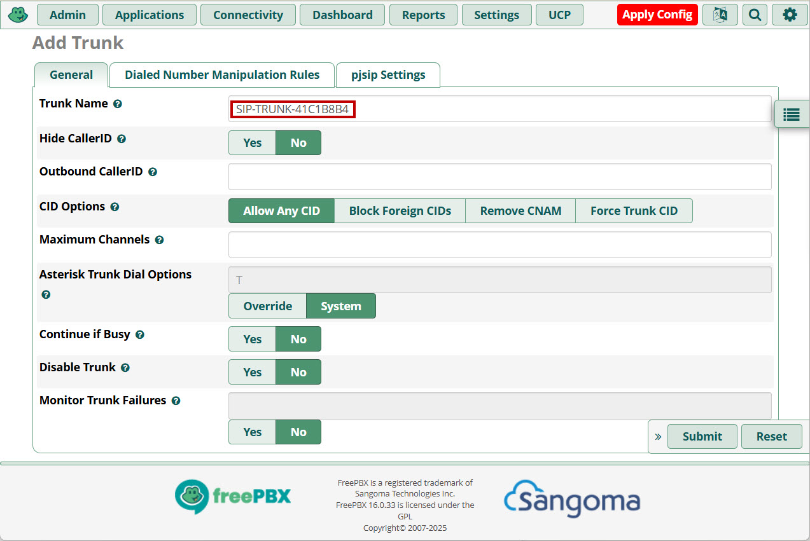<figcaption><p>"Trunk Name<strong>"</strong> field</p></figcaption></figure>

4. Go to **"pjsip Settings"** → **"Advanced"**:

* **From User** – your MikoPBX provider login
* **Trust RPID/PAI** – "yes"
* **Send RPID/PAI** – "Send Remote-Party-ID header"

<figure>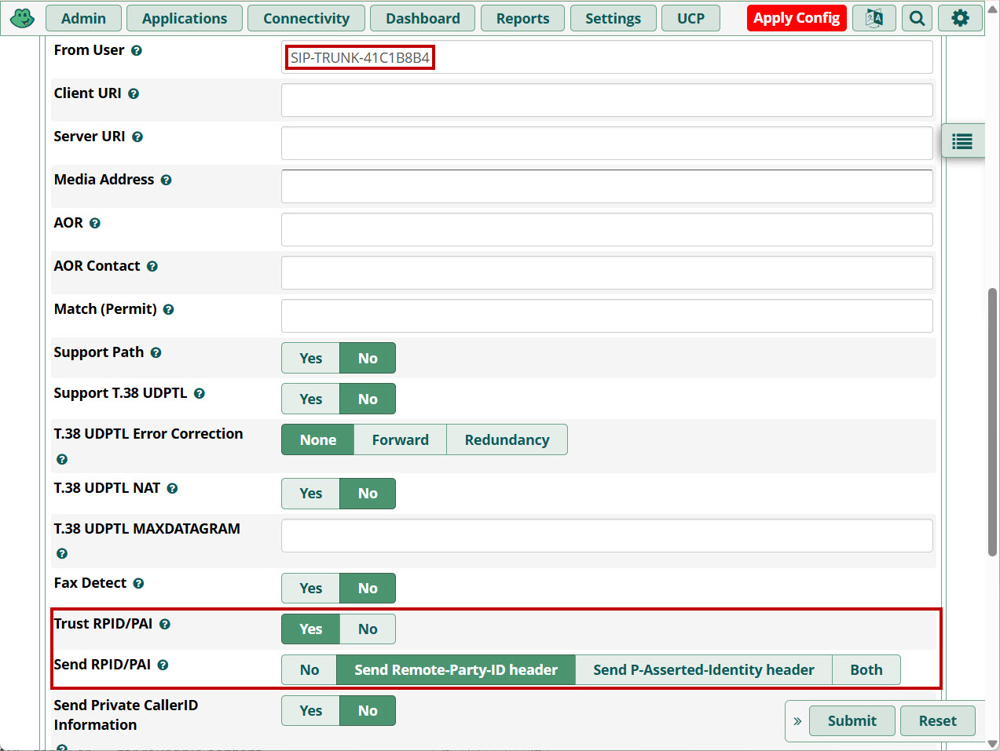<figcaption><p>Advanced parameters of the trunk</p></figcaption></figure>

5. On the **"Dialed Number Manipulation Rules"** tab, define your dial patterns

Save the changes.

<figure>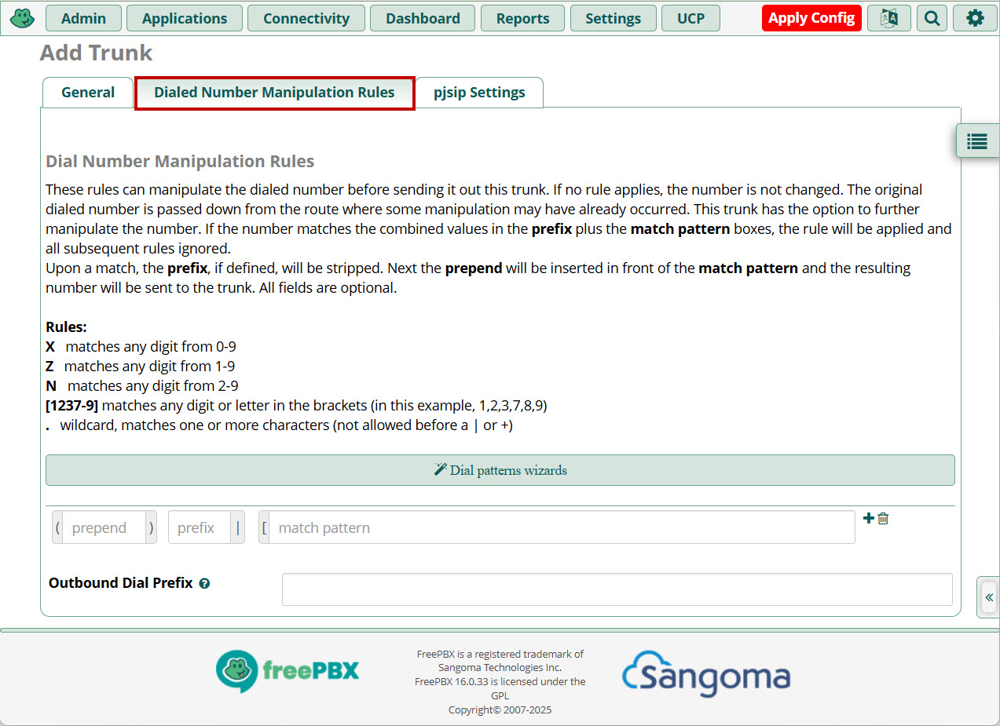<figcaption><p>Dialed Number Manipulation Rules</p></figcaption></figure>

## Registration Variants

Next, choose **one** of the two registration methods:

### **FreePBX Registers on MikoPBX**

<figure>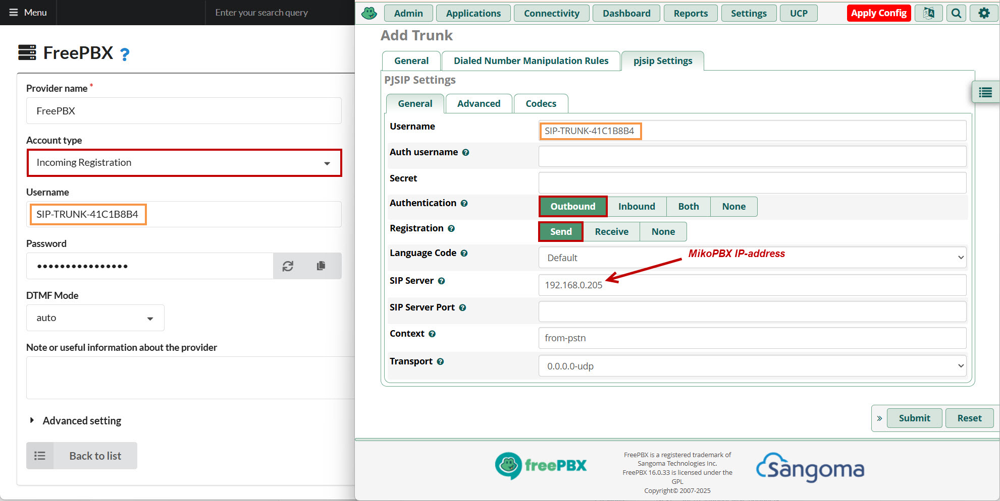<figcaption><p>Registration Sample 1</p></figcaption></figure>

### **MikoPBX Registers on FreePBX**

Set a password (**complex**, arbitrary). It must be the same on both MikoPBX and FreePBX.

<figure>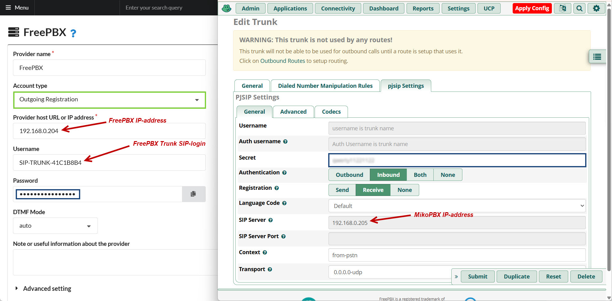<figcaption><p>Registration Sample 2</p></figcaption></figure>

In the MikoPBX “advanced settings” of your provider, under **"Additional Parameters,"** include:

```
[endpoint]
trust_id_inbound=yes
send_rpid=yes
```

Save and apply the changes.

<figure>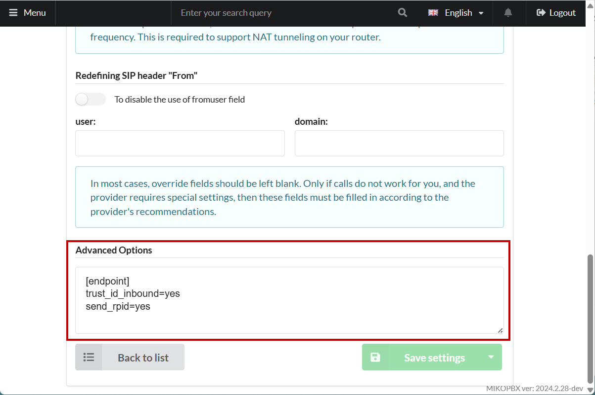<figcaption><p>Advanced Options of provider</p></figcaption></figure>

## Routing Configuration

1. Define an outbound route ([“Outbound Routing” article](../../manual/routing/outbound-routing.md)) in MikoPBX:

<figure>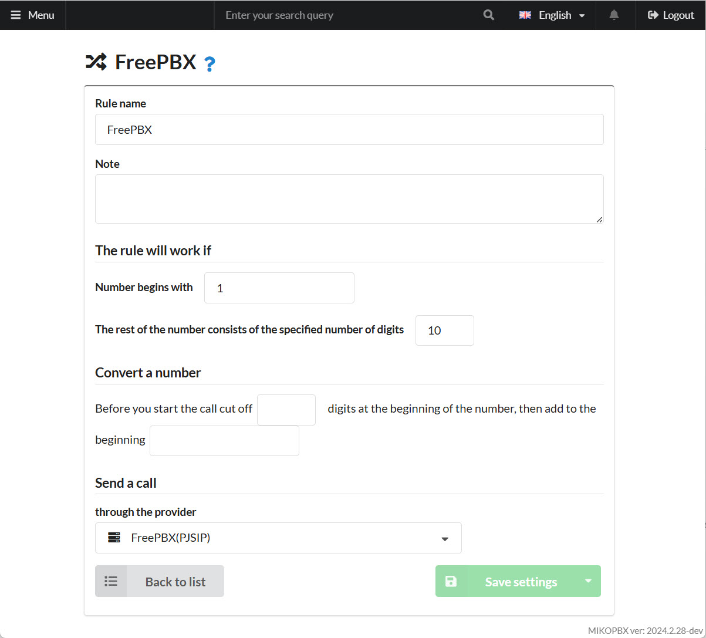<figcaption><p>Outgoing routing template MikoPBX</p></figcaption></figure>

2. Define an inbound route ([“Incoming Routing” article](../../manual/routing/incoming-routing.md)) in MikoPBX:

<figure><figcaption><p>Inbound routing template MikoPBX</p></figcaption></figure>

If necessary, define a separate route for each DID to direct calls to the correct destination (e.g., if a FreePBX user dials **202**, route it to extension **202** on MikoPBX):

<figure><figcaption><p>Inbound routing template (Individual DID configuring)</p></figcaption></figure>

3. Go to **"Connectivity"** → **"Inbound Routes"** in FreePBX and define an inbound route:

<figure>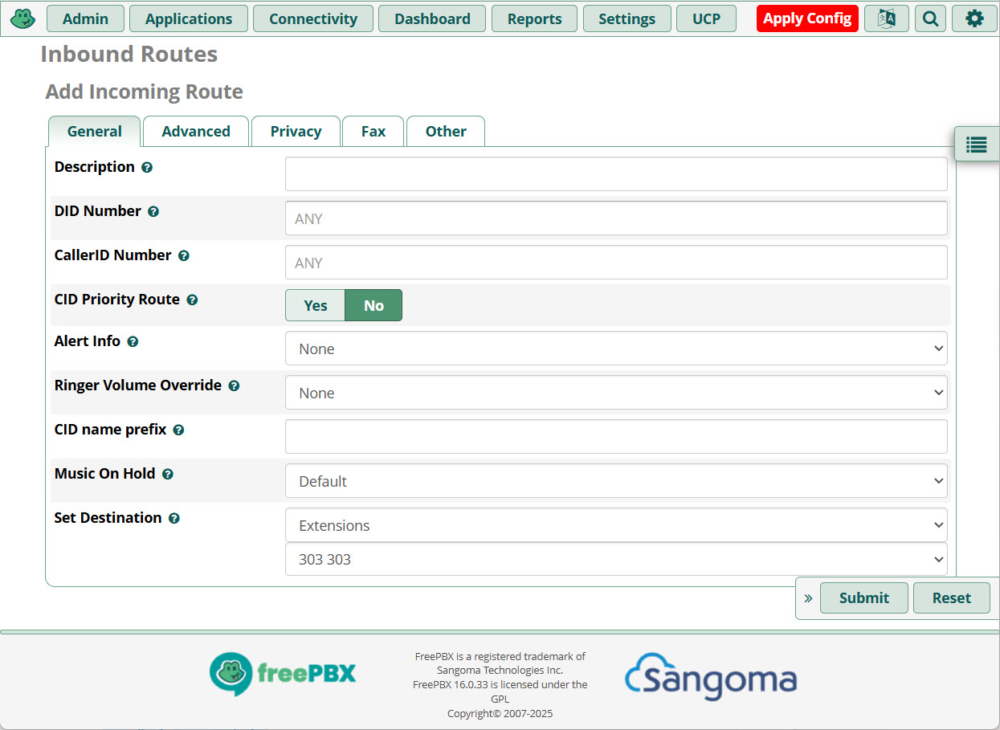<figcaption><p>Inbound routing template FreePBX</p></figcaption></figure>

4. Go to **"Connectivity"** → **"Outbound Routes"** in FreePBX and define an outbound route:

<figure>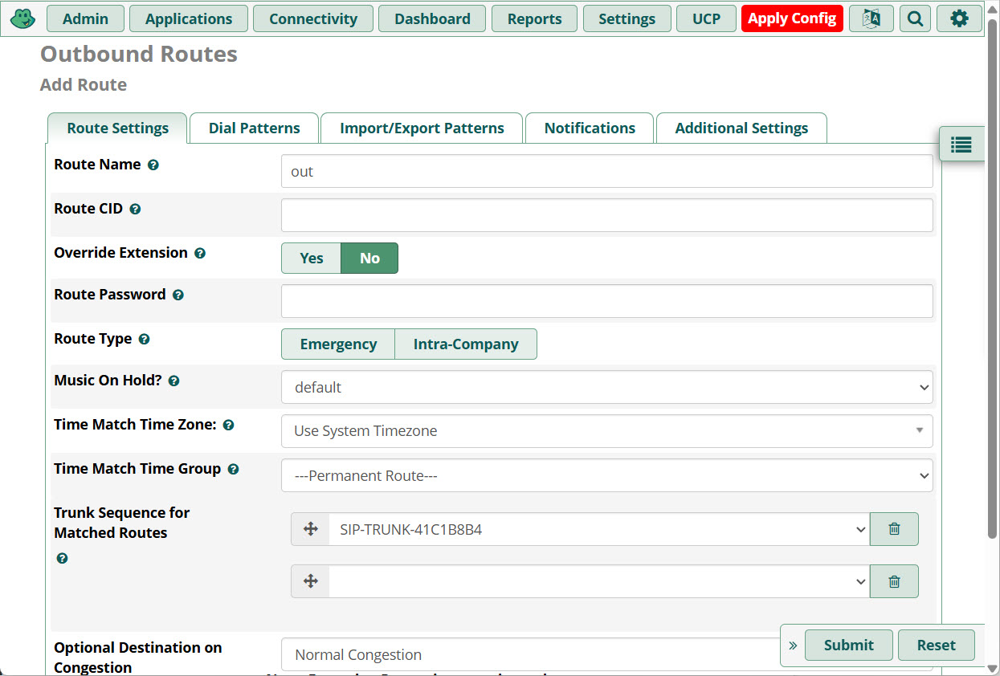<figcaption><p>Outbound routing template FreePBX</p></figcaption></figure>

## Subscriber Statuses

Sometimes users on one PBX need to see the statuses of users on the other PBX, for example when using BLF. To configure statuses:

### MikoPBX

1. In the "[System File Customization](../../manual/system/custom-files.md)" section, add the following text to the end of **"extensions.conf"** on the first PBX:

```php
[internal-hints]
exten => 301,hint,PJSIP/301
exten => 303,hint,PJSIP/303
exten => 302,hint,PJSIP/302
```

List all internal extensions configured on FreePBX.

2. For **each PBX**, in the "System file customization" section, add the following text to the end of **"pjsip.conf"**:

```php
[SIP-TRUNK-41C1B8B4-devicestate]
type=outbound-publish
server_uri=sip:SIP-TRUNK-41C1B8B4@172.16.156.216:5060
event=asterisk-devicestate

[SIP-TRUNK-41C1B8B4]
type=asterisk-publication
devicestate_publish=SIP-TRUNK-41C1B8B4-devicestate
device_state=yes

[SIP-TRUNK-41C1B8B4]
type=inbound-publication
event_asterisk-devicestate=SIP-TRUNK-41C1B8B4
```


Replace **"SIP-TRUNK-41C1B8B4"** with your MikoPBX provider ID and **"172.16.156.216"** with the FreePBX address as appropriate.


### FreePBX

1. Use the **"Config Edit"** module to edit files.
2. In **"extensions\_custom.conf,"** add all of MikoPBX’s internal extensions:

```php
[mikopbx-hints]
exten => 201,hint,PJSIP/201
exten => 202,hint,PJSIP/202
```

3. In **"pjsip\_custom.conf,"** add:

```php
[SIP-TRUNK-41C1B8B4-devicestate]
type=outbound-publish
server_uri=sip:SIP-TRUNK-41C1B8B4@172.16.156.223:5060
event=asterisk-devicestate
outbound_auth=SIP-TRUNK-41C1B8B4

[SIP-TRUNK-41C1B8B4]
type=asterisk-publication
devicestate_publish=SIP-TRUNK-41C1B8B4-devicestate
device_state=yes
device_state_filter=^PJSIP/

[SIP-TRUNK-41C1B8B4]
type=inbound-publication
event_asterisk-devicestate=SIP-TRUNK-41C1B8B4
```


Replace **"SIP-TRUNK-41C1B8B4"** with your MikoPBX provider ID and **"172.16.156.216"** with the FreePBX address, as needed.



The **outbound\_auth=SIP-TRUNK-41C1B8B4** option applies only if FreePBX registers on MikoPBX. Status sharing was tested only under this registration scenario.

