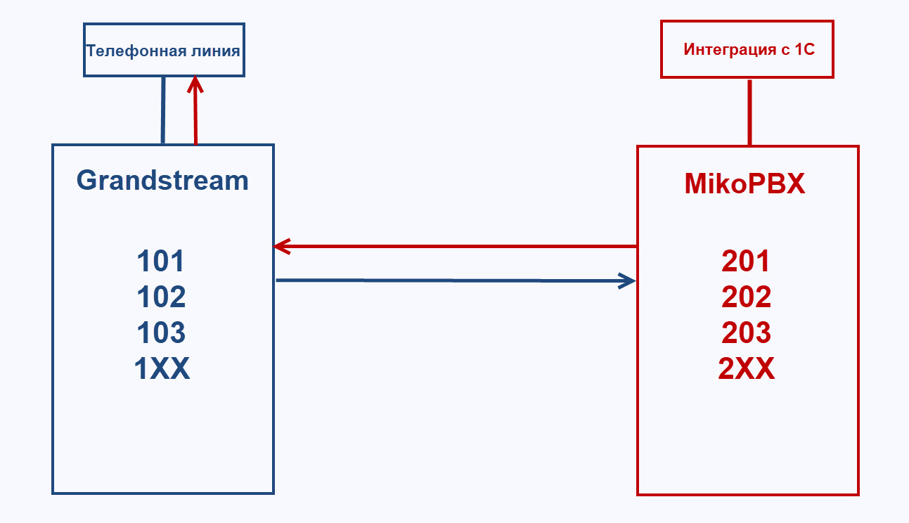
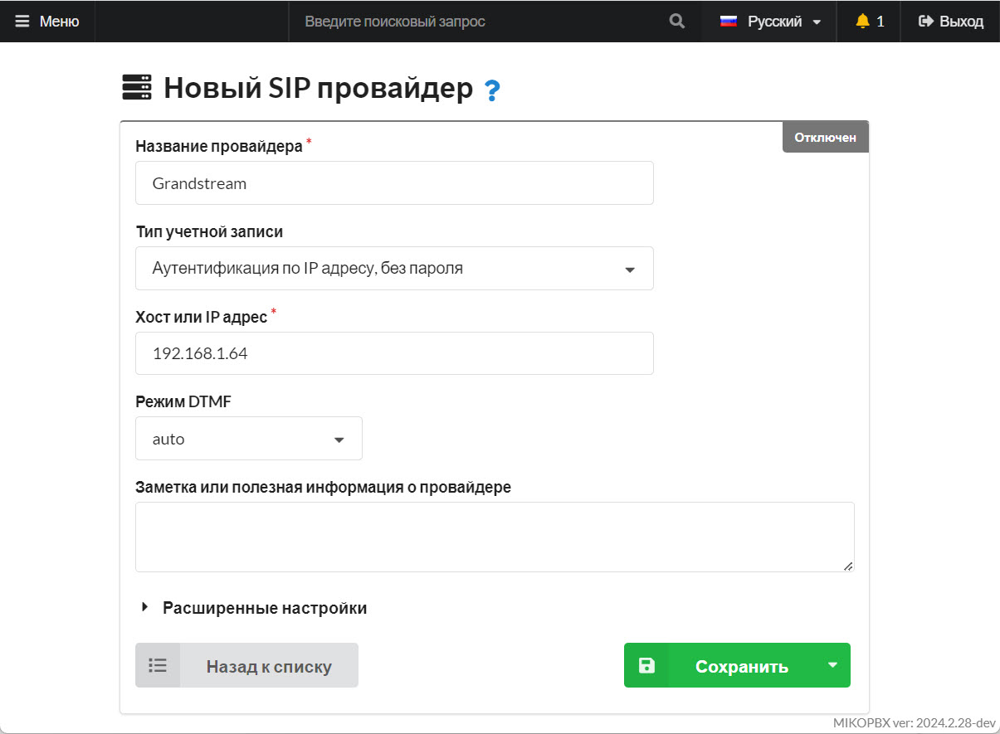
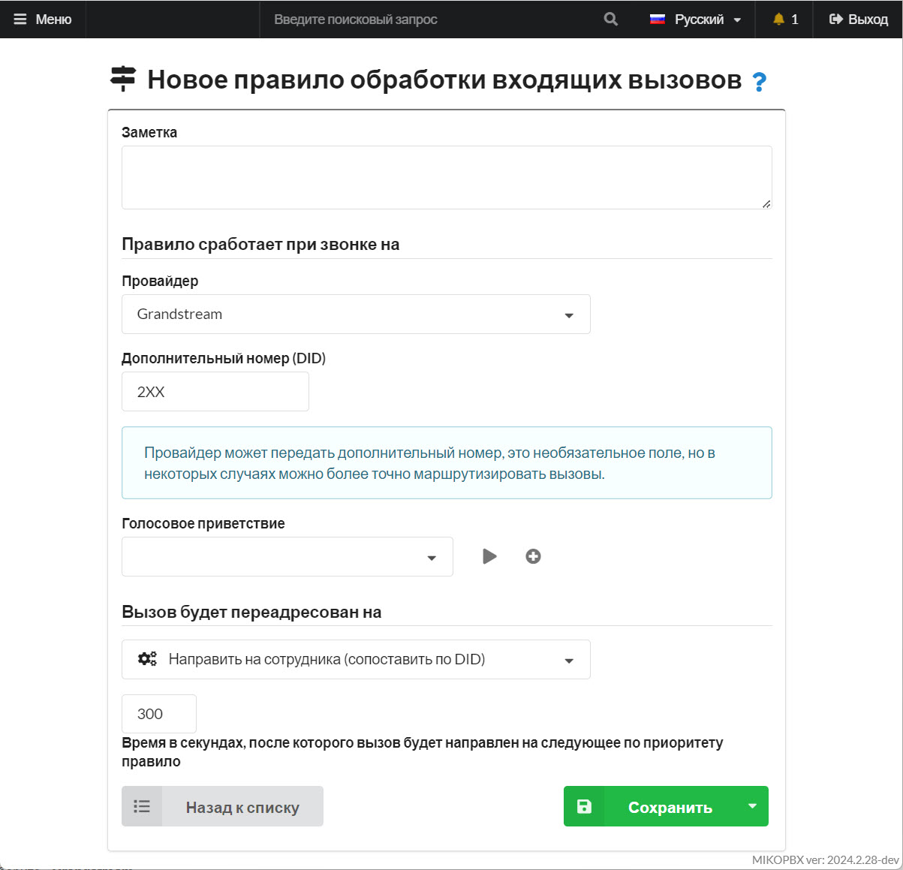
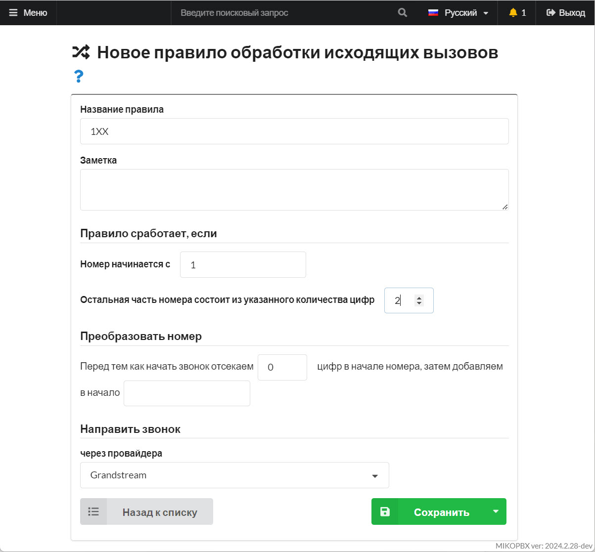
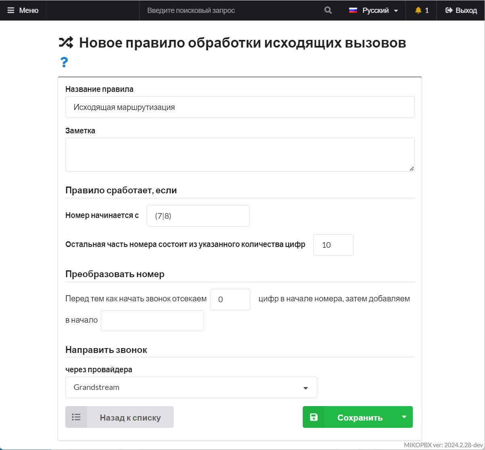
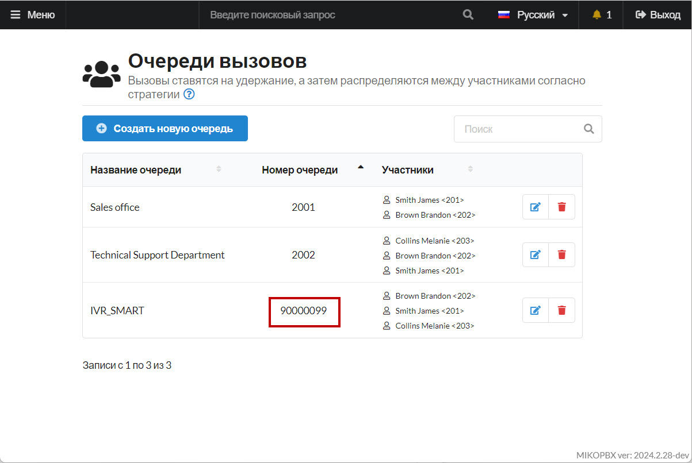
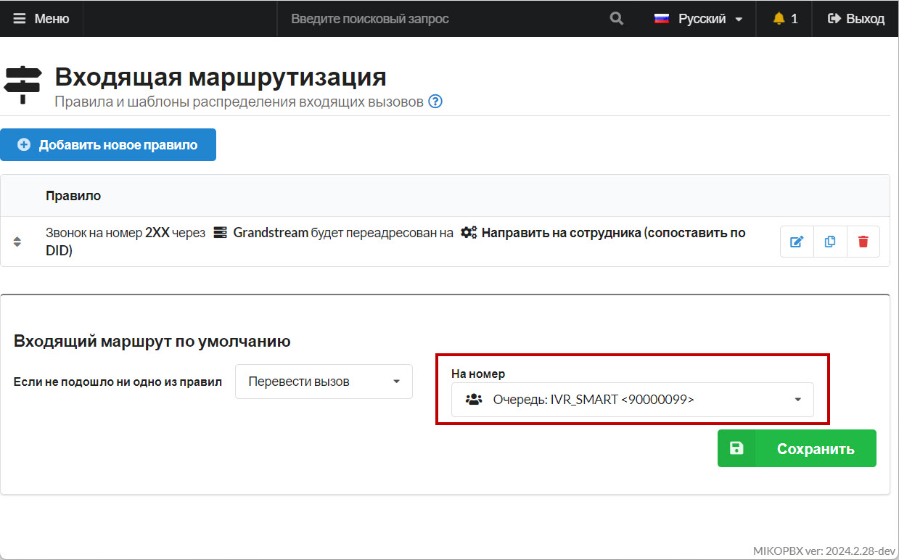

# Объединение MIKOPBX и Grandstream UCM6202

Существует задача: в компании два отдела, один (Администрация) должен работать в рамках АТС Grandstream, другой (Отдел продаж) должен работать с MikoPBX и иметь возможность интеграции с 1C. В рамках данной статьи опишем пример объединения станций, следуя следующим правилам:

* **Администрация**- имеет внутренний номерной план **1XX.**
* **Отдел продаж** - имеет внутренний номерной план **3XX.**
* К **Grandstream** подключена внешняя линия для звонков в город.
* **MikoPBX** должна использовать внешнюю линию Grandstream для звонков в город.
* Абоненты **1XX** должны иметь возможность позвонить абонентам **3XX.**
* Абоненты **3XX** должны иметь возможность позвонить абонентам **1XX.**

<figure><figcaption><p>Схема поставленной задачи</p></figcaption></figure>

## Настройка Grandstream UCM6202 <a href="#grandstream_ucm6202" id="grandstream_ucm6202"></a>

### Создание Trunk <a href="#trunk" id="trunk"></a>

1. Перейдите в раздел «**Extensions / Trunk**» -«**VoIP Trunk**», нажмите «**Add SIP Trunk**». Заполните все необходимые данные:

* «**Provider name**» - укажите произвольное имя провайдера, к примеру **MikoPBX**
* «**Host Name**» - укажите IP-адрес Вашей MikoPBX
* «**Transport**» - укажем **UDP**
* Установите флаг «**Keep Original CID**»

Нажмите кнопку «**Save**».

<figure><figcaption><p>Параметры создаваемого транка</p></figcaption></figure>

У Вас должен получится подобный список транков:

<figure><figcaption><p>Список транков</p></figcaption></figure>

### Настройка исходящих звонков на 2XX <a href="#isxodjaschie_na_2xx" id="isxodjaschie_na_2xx"></a>

Добавим правило, которое позволит абонентам Grandstream (1**XX**) звонить на внутренние номера MikoPBX **2XX.** Для этого:

Перейдите в раздел «**Extensions / Trunk**» - «**Outbound Routes**». Добавьте новый маршрут, укажите для него следующие параметры:

* Установите «**Trunk**» в значение «**SIP Trunks – MikoPBX**»
* «**Calling Rule Name**» в значение «**MikoPBX**» (произвольное, понятное вам значение)
* «**Pattern**» в значение:

```
_2XX
_90000099
```


**90000099** - это номер очереди, которую мы позже определим на MikoPBX


* «**Privilege Level**» - в данном случае можно установить **internal**, на MikoPBX нет выхода на город / межгород

<figure><figcaption><p>Параметры исходящего маршрута</p></figcaption></figure>

### Настройка входящих звонков на 1XX <a href="#vxodjaschie_na_1xx" id="vxodjaschie_na_1xx"></a>

Добавим правило, которое позволит абонентам MikoPBX (**2XX**) звонить на внутренние номера Grandstream (**1XX).** Для этого:

Перейдите в раздел «**Extensions / Trunk**» - «**Inbound Routes**». Добавьте новый маршрут, укажите для него следующие параметры:

* Выберите trunk «**SIP Trunks – MikoPBX**»
* Добавьте маршрут с **Pattern** = **\_1XX**
* Установите «**Allowed DID Destination**» в значение «**Extension**»
* Установите «**Default detination**» в значение «**By DID**»
* Установите «**Privilage Level**» в значение «**internal**»

### Настройка исходящих на \[78]XX <a href="#isxodjaschie_na_78_xx" id="isxodjaschie_na_78_xx"></a>

Добавим правило, которое позволит абонентам MikoPBX (**2XX**) звонить на внешние номера РФ

Перейдите в раздел «**Extensions / Trunk**» - «**Inbound Routes**». Добавьте новое правило входящей маршрутизации. Укажите следующие параметры:

* Выберите trunk «**SIP Trunks – MikoPBX**»
* Добавьте маршрут с **Pattern** = **\_\[78]XXXXXXXXXX**
* Установите флаг «**Dial trunk**»
* Установите «**Allowed DID Destination**» в значение «**Extension**»
* Установите «**Default detination**» в значение «**By DID**»
* Установите «**Privilage Level**» в значение «**National**»

<figure><figcaption><p>Параметры правила входящей маршрутизации</p></figcaption></figure>

Итоговый список входящих маршрутов «**SIP Trunks – MikoPBX**»:

<figure><figcaption><p>Список маршрутов</p></figcaption></figure>

### Параметры Extensions <a href="#extensions" id="extensions"></a>

Для того, чтобы на стороне MikoPBX корректно отображался CID в карточке **Extension,** следует прописать **CallerID Number**:

Перейдите в раздел «**Extensions / Trunk**» - «**Extension**». Заполните параметры на примере скриншота ниже.

<figure><figcaption><p>Пример параметров extension</p></figcaption></figure>

### IVR <a href="#ivr" id="ivr"></a>

Добавим возможность в IVR звонить на номера MikoPBX (**\_2XX**). Для этого перейдите в раздел «**Call Features**» - «**IVR**», создадим / откроем на редактирование IVR:

<figure><figcaption><p>Раздел IVR</p></figcaption></figure>

Выполните следующие действия:

* Установите «**Dial Other Extensions**» в значение **Yes**
* Установите «**Dial Trunk**» в значение **Yes**
* На вкладке «**Key Pressing Events**» настройте переадресацию на **External number**:


**90000099** - это номер очереди, которую мы позже определим на MikoPBX


<figure><figcaption><p>Параметры IVR маршрута</p></figcaption></figure>

## Настройка MikoPBX

### Создание провайдера <a href="#provajder" id="provajder"></a>

Перейдите в раздел «**Маршрутизация**» - «**Провайдеры телефонии**». Добавьте нового провайдера, со следующими параметрами:

* «**Название провайдера**» - произвольное, понятное имя, к примеру **Grandstream**
* «**Тип учетной записи**» - Аутентификация по IP адресу, без пароля
* «**Хост или IP адрес**» - адрес АТС **Grandstream**

Сохраните изменения.

<figure><figcaption><p>Параметры SIP-провайдера</p></figcaption></figure>

### Входящая маршрутизация <a href="#vxodjaschaja_marshrutizacija" id="vxodjaschaja_marshrutizacija"></a>

Добавим правило, которое позволит абонентам Grandstream (1**XX**) звонить на внутренние номера MikoPBX **2XX**

1. Перейдите в раздел «**Маршрутизация**» - «**Входящие маршруты**»
2. Создайте новое правило со следующими параметрами:

* **Провайдер**» - выберите «**Grandstream**»
* «**DID**» - укажите шаблон «**2XX**»
* «**Телефонный номер**» - «**Направить на сотрудника (сопоставить по DID)**»
* «**Время в секундах…**» укажите значение **300**

Сохраните изменения.

<figure><figcaption><p>Параметры правила обработки входящих</p></figcaption></figure>

### Исходящие на 1XX <a href="#isxodjaschie_na_1xx" id="isxodjaschie_na_1xx"></a>

Добавим правило, которое позволит абонентам MikoPBX (**2XX**) звонить на внутренние номера Grandstream (**1XX)**

1. Перейдите в раздел «**Маршрутизация**» - «**Исходящие маршруты**»
2. Создайте новое правило, со следующими параметрами:

* Номер начинается с **«1».**
* Остальная часть номера состоит из **«2».**
* Направить звонок через провайдера «Grandstream».

<figure><figcaption><p>Параметры правила обработки входящих</p></figcaption></figure>

### Исходящие на Городские <a href="#isxodjaschie_na_gorodskie" id="isxodjaschie_na_gorodskie"></a>

1. Перейдите в раздел «**Маршрутизация**» - «**Исходящие маршруты**»
2. Создайте новое правило, со следующими параметрами:

* Номер начинается с **(7|8).**
* Остальная часть номера состоит из **10.**
* Направить звонок через провайдера «**Grandstream**».

<figure><figcaption><p>Параметры правила обработки исходящих</p></figcaption></figure>

### Входящие на группу <a href="#vxodjaschie_na_gruppu" id="vxodjaschie_na_gruppu"></a>

1. Перейдите в раздел «**Телефония**» - «**Очереди вызовов**».
2. Добавьте очередь с внутренним номером **90000099.**

<figure><figcaption><p>Создание очереди вызовов</p></figcaption></figure>

3. Направьте маршрут по умолчанию на очередь.&#x20;

<figure><figcaption><p>Маршрут по умолчанию на очередь</p></figcaption></figure>

На этом настройка завершена!
