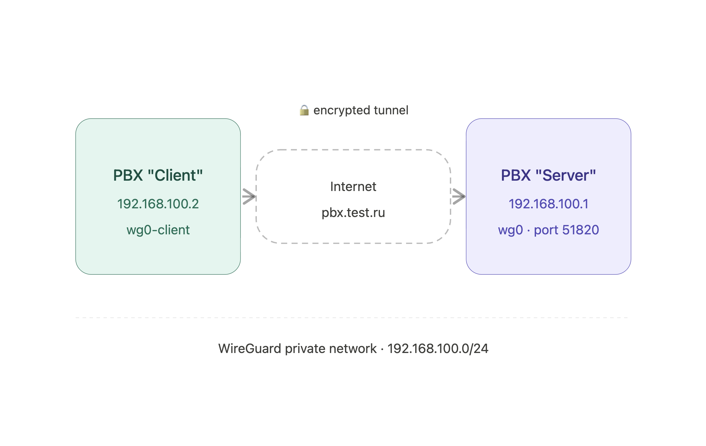

# WireGuard - VPN


WireGuard configuration is available on MikoPBX version **2024.2.301-dev** and newer builds.


WireGuard allows you to connect two MikoPBX systems into a single private network over the internet. This is useful when offices are in different locations and you need to set up direct SIP communication or configuration synchronization between them.


This page describes the manual command-line setup. For most scenarios the **VPN** module brings up the same WireGuard tunnel right from the web interface — no SSH or cron required, and it also supports WireGuard with obfuscation, OpenVPN and Tailscale.



[module-vpn.md](../../modules/miko/module-vpn.md)


<figure><figcaption><p>Conenction diagram</p></figcaption></figure>

### Setting Up the Connection

1. Connect to the PBX via SSH. Download the WireGuard configuration script to both the server and the client:

```bash
cd /storage/usbdisk1/mikopbx/custom_modules
curl -o wg-configure.sh https://files.miko.ru/s/Rs9VKpzeXmmJcTC/download
```

2. On the "**Client"** PBX, run:

```bash
sh /storage/usbdisk1/mikopbx/custom_modules/wg-configure.sh get-pubkey
```

3. Copy the public key, which looks like: `"bnJTY0HZwO6OzDrnmHKxQ"`
4. On the "**Server"** PBX, assign an IP address to the key using the following command:

```bash
sh /storage/usbdisk1/mikopbx/custom_modules/wg-configure.sh add-peer bnJTY0HZwO6OzDrnmHKxQ
```

The output will look similar to this:

```bash
Create keys
Peer saved: IP=192.168.100.2 -> /storage/usbdisk1/mikopbx/custom_modules/wg/peers/192.168.100.2
```

5. Start the server:

```bash
sh /storage/usbdisk1/mikopbx/custom_modules/wg-configure.sh up-wg
```

Add a call to this script in cron via "[System files customization](../../manual/system/custom-files.md)":


```bash
*/1 * * * * /bin/sh /storage/usbdisk1/mikopbx/custom_modules/wg-configure.sh up-wg > /dev/null 2>&1
```



Adding this to cron is required for automatic tunnel recovery — after a PBX reboot or connection drop, WireGuard does not come back up on its own. The script runs every minute and re-establishes the connection when needed.


6. Next, on the "**Server"** PBX, run:

```bash
sh /storage/usbdisk1/mikopbx/custom_modules/wg-configure.sh get-pubkey
```

Copy the public key, which looks like: `"C82txdP8wh8pBztQ4Usyxw="`

7. On the "**Client"** PBX, connect to the server using the following command:

```bash
sh /storage/usbdisk1/mikopbx/custom_modules/wg-configure.sh up-wg-client \
   192.168.100.2 \
   C82txdP8wh8pBztQ4Usyxw= \
   pbx.test.ru
```

Replace:

* `192.168.100.2` — with your client address assigned on the server by the `add-peer` command
* `"C82txdP8wh8pBztQ4Usyxw="` — with your server's public key
* `"pbx.test.ru"` — with the public address of the server; the port is always `51820`

Similarly to the "**Server"** PBX, add this command to cron via "[System files Customization](../../manual/system/custom-files.md)":


```bash
*/1 * * * * /bin/sh /storage/usbdisk1/mikopbx/custom_modules/wg-configure.sh up-wg-client 192.168.100.2 C82txdP8wh8pBztQ4Usyxw= pbx.test.ru > /dev/null 2>&1
```


This ensures the connection is re-established automatically after a PBX reboot or connection drop.

### Verification

Run the following command on both the "**Client"** and "**Server"** PBX:

```bash
wg show
```

Expected output on the "**Client"** PBX:

```bash
interface: wg0-client
  public key: OCGp7zjfB1jQNLWOk1xIBk=
  private key: (hidden)
  listening port: 57731

peer: oIvFopfaQNhCDv1CAIM/F8=
  endpoint: *.*.*.*:51820
  allowed ips: 192.168.100.0/24
  latest handshake: 4 seconds ago
  transfer: 92 B received, 180 B sent
  persistent keepalive: every 25 seconds
```

Expected output on the "**Server"** PBX:

```bash
interface: wg0
  public key: oIvFopfaQNhCDv1CAIM/F8=
  private key: (hidden)
  listening port: 51820

peer: OCGp7zjfB1jQNLWOk1xIBk=
  endpoint: 158.160.179.211:57731
  allowed ips: 192.168.100.2/32
  latest handshake: 1 minute, 3 seconds ago
  transfer: 244 B received, 92 B sent
```

#### Firewall Configuration

On the "**Server"** PBX, open the file **/etc/firewall\_additional** for editing via "[System files customization](../../manual/system/custom-files.md)" and allow connections to the WireGuard port:


```
iptables -I INPUT 2 -s 0.0.0.0/0 -p udp -m multiport --dports 51820 -j ACCEPT
```


* `"0.0.0.0/0"` — replace with a specific subnet or address for better security.

In the "**Firewall"** section, define the subnet `192.168.100.0/24` as local.
