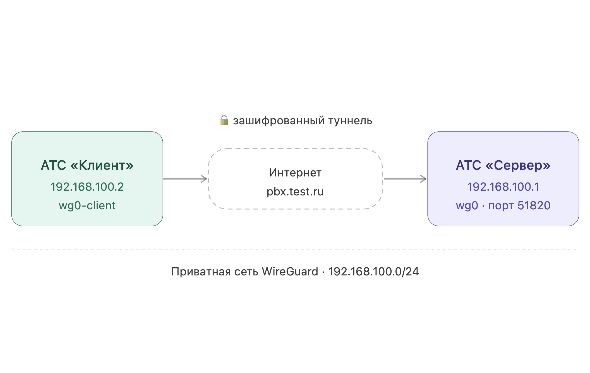

# WireGuard - VPN


Настроить WireGuard  возможно на АТС версии **2024.2.301-dev** и более новых сборках.&#x20;


WireGuard позволяет объединить две АТС MikoPBX в единую приватную сеть через интернет. Это удобно, когда офисы находятся в разных локациях и нужно настроить между ними прямую SIP-связь или синхронизацию настроек.


На этой странице описана ручная настройка через командную строку. В большинстве случаев тот же туннель WireGuard проще поднять из веб-интерфейса с помощью модуля **VPN** — без SSH и cron, к тому же модуль поддерживает WireGuard с обфускацией, OpenVPN и Tailscale.



[module-vpn.md](../../modules/miko/module-vpn.md)


<figure><figcaption><p>Диаграмма подключения</p></figcaption></figure>

### Настройка подключения

1. Подключитесь к АТС по [SSH](../troubleshooting/connecting-to-a-pbx-using-ssh/). Скачайте скрипт настройки wg на сервер и на клиент:

```bash
cd /storage/usbdisk1/mikopbx/custom_modules
curl -o wg-configure.sh https://files.miko.ru/s/Rs9VKpzeXmmJcTC/download
```

2. На АТС "Клиент" выполните:

```bash
sh /storage/usbdisk1/mikopbx/custom_modules/wg-configure.sh get-pubkey
```

3. Скопируйте публичный ключ вида: "`bnJTY0HZwO6OzDrnmHKxQ`"
4. На АТС "Сервер" выполните назначение IP адрес для ключа с помощью следующей команды:

```bash
sh /storage/usbdisk1/mikopbx/custom_modules/wg-configure.sh add-peer bnJTY0HZwO6OzDrnmHKxQ
```

В качестве результата Вы увидите подобный контекст:

```bash
Create keys
Peer saved: IP=192.168.100.2 -> /storage/usbdisk1/mikopbx/custom_modules/wg/peers/192.168.100.2
```

5. Запустите сервер:

```bash
sh /storage/usbdisk1/mikopbx/custom_modules/wg-configure.sh up-wg
```

Добавьте вызов этого скрипта в cron через "[**Кастомизация системных файлов**](../../manual/system/custom-files.md)":


```bash
*/1 * * * * /bin/sh /storage/usbdisk1/mikopbx/custom_modules/wg-configure.sh up-wg > /dev/null 2>&1
```



Добавление в cron необходимо для автоматического восстановления туннеля — после перезагрузки АТС или при обрыве соединения WireGuard не поднимается самостоятельно. Скрипт запускается каждую минуту и при необходимости переподнимает соединение.


6. Далее На АТС "Сервер" выполните:

```bash
sh /storage/usbdisk1/mikopbx/custom_modules/wg-configure.sh get-pubkey
```

Скопируйте публичный ключ вида: "`C82txdP8wh8pBztQ4Usyxw=`"

7. На клиенте подключитесь к серверу, используя следующую команду:

```bash
sh /storage/usbdisk1/mikopbx/custom_modules/wg-configure.sh up-wg-client \
   192.168.100.2 \
   C82txdP8wh8pBztQ4Usyxw= \
   pbx.test.ru
```

Замените:

* `192.168.100.2` - на Ваш адрес клиента, назначенный на сервере командой `add-peer`
* "`C82txdP8wh8pBztQ4Usyxw=`" - на Ваш публичный ключ сервера.
* "`pbx.test.ru`" - на публичный адрес сервера, порт всегда "`51820`".

По аналогии с АТС "Сервер", добавьте выполнение этой команды в cron через "[**Кастомизация системных файлов**](../../manual/system/custom-files.md)":


```bash
*/1 * * * * /bin/sh /storage/usbdisk1/mikopbx/custom_modules/wg-configure.sh up-wg-client 192.168.100.2 C82txdP8wh8pBztQ4Usyxw= pbx.test.ru > /dev/null 2>&1
```


В этом случае подключение будет подниматься автоматически при перезагрузке станции или обрыве соединения. &#x20;

### Проверка

Выполните на АТС "Клиент" и на АТС "Сервер" следующую команду:

```bash
wg show
```

Пример вывода, который Вы должны получить на АТС "Клиент":

```bash
interface: wg0-client
  public key: OCGp7zjfB1jQNLWOk1xIBk=
  private key: (hidden)
  listening port: 57731

peer: oIvFopfaQNhCDv1CAIM/F8=
  endpoint: *.*.*.*:51820
  allowed ips: 192.168.100.0/24
  latest handshake: 4 seconds ago
  transfer: 92 B received, 180 B sent
  persistent keepalive: every 25 seconds
```

Пример вывода, который Вы должны получить на АТС "Сервер":

```bash
interface: wg0
  public key: oIvFopfaQNhCDv1CAIM/F8=
  private key: (hidden)
  listening port: 51820

peer: OCGp7zjfB1jQNLWOk1xIBk=
  endpoint: 158.160.179.211:57731
  allowed ips: 192.168.100.2/32
  latest handshake: 1 minute, 3 seconds ago
  transfer: 244 B received, 92 B sent
```

### Настройка сетевого экран

На АТС "Сервер", через раздел "[Кастомизация системных файлов](../../manual/system/custom-files.md)", откройте для редактирования файл "**/etc/firewall\_additional"** и разрешите подключение к порту Wireguard:



* "`0.0.0.0/0`" -  замените на конкретную подсеть / адрес, для большей безопасности.&#x20;

В разделе "[Сетевой экран](../../manual/connectivity/firewall.md)" опишите подсеть `192.168.100.0/24` как локальную.&#x20;
