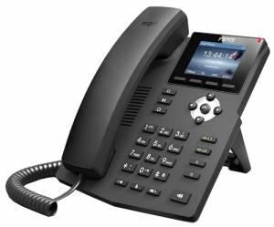
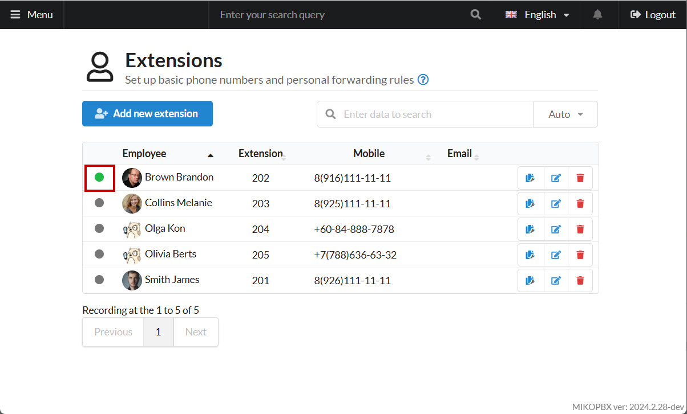

# Fanvil X3SP

IP-телефон Fanvil X3SP сочетает современный дизайн, HD-качество звука и интуитивно понятный интерфейс, обеспечивая легкость в настройке и установке.&#x20;

<figure><figcaption>
Телефон Fanvil X3SP
</figcaption></figure>


Убедитесь, что в разделе "**Система**" -> "**Общие настройки**" -> "**Аудио/Видео кодеки**", кодек **G.711 A-law** включен.


## Настройки внутри раздела "Сотрудники"

1. Перейдите в web-интерфейс MikoPBX. В раздел **«Телефония» -> «Сотрудники»:**

<figure><figcaption>
Раздел "Сотрудники"
</figcaption></figure>

2. Напротив учетной записи сотрудника, которого Вы будете подключать к телефону, скопируйте пароль для SIP:

<figure><figcaption>
Копирования пароля для SIP
</figcaption></figure>

## Настройка телефона 

1. Подключите телефон к сети ethernet, используя порт с надписью "**internet".**


Если в вашей сети настроен DHCP сервер, то телефон получит IP адрес автоматически.


2. Нажмите на клавишу "OK" на, чтобы узнать IP-адрес телефона, по которому к нему будет произодиться подключение из браузера. Далее адрес будет отображен на экране телефона.
3. Перейдите по ссылке <mark style="color:blue;">http://ip\_адрес\_телефона</mark> в вашем браузере.


Стандартные данные для первой авторизации:

* Username: admin
* Login: admin


<figure><figcaption>
Форма авторизации
</figcaption></figure>

4. Перейдите в раздел "**Аккаунт**".

<figure><figcaption>
Раздел "Аккаунт"
</figcaption></figure>

5. Заполните следующие параметры:

* «**Имя пользователя**» - внутренний номер сотрудника.
* «**Имя регистрации**» - внутренний номер сотрудника.
* «**Пароль**» - пароль для SIP из карточки сотрудника в MikoPBX.
* «**Адрес SIP-сервера**» - адрес MikoPBX.

Перейдите в расширенные настройки и заполните следующие параметры:

* Укажите «**Caller ID Header**» в значение «**PAI-RPID-FROM**».
* «**Приоритет гарнитуры**» установите в значение «**Вкл.**».
* Включите «**Интерком**».

Сохраните настройки нажав кнопку «**Применить**». Статус телефона отобразиться как «**Зарегистрированно**».

<figure><figcaption>
Параметры SIP аккаунта
</figcaption></figure>

После успешного подключения телефона, в интерфейсе MikoPBX индикатор состояния подключения загорится зелёным:

<figure><figcaption>
Индикатор успешного подключения в интерфейсе MikoPBX
</figcaption></figure>
