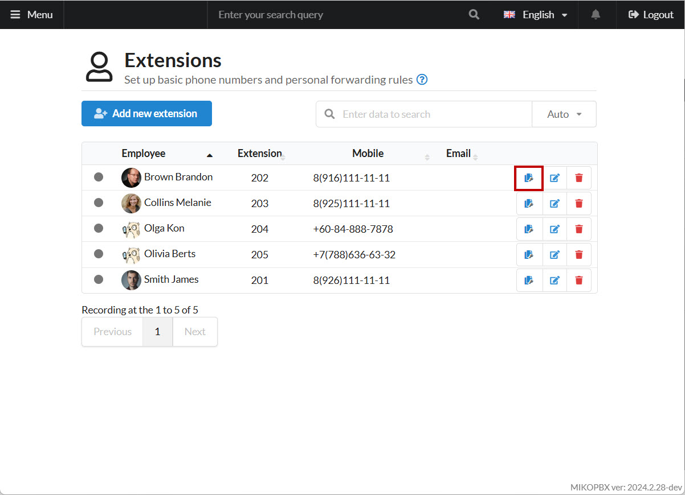
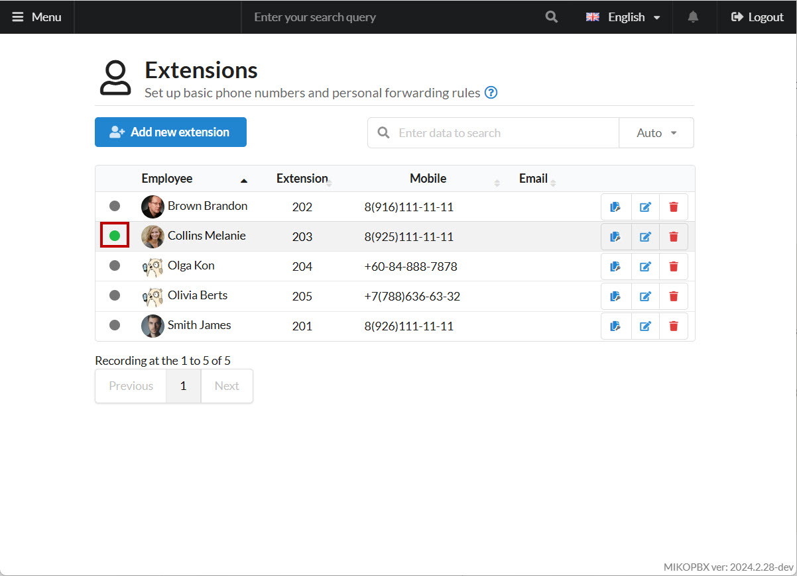

# Snom D120

**Snom D120** is an entry-level desk phone by **Snom**. This guide explains how to connect and configure the Snom D120 with MikoPBX.


Verify that **G.711 A-law** is enabled under **System** → **General Settings** → **Audio/Video Codecs** in MikoPBX.


## MikoPBX Extensions Settings

1. Open the MikoPBX web interface and go to **Telephony** → **Extensions**:

<figure><figcaption>
"Extensions" section
</figcaption></figure>

2. Next to the employee account you wish to connect, copy the SIP password:

<figure><figcaption>
Copying password for SIP
</figcaption></figure>

## Configuring the Snom D120

Connect the D120 to your local network using the LAN port.

<figure><figcaption>
Scheme of Snom D120
</figcaption></figure>


If DHCP is enabled in your network, the phone will automatically receive an IP address. The IP address will be shown on the phone’s screen at startup.


1. Enter the phone’s IP address into your browser as **http://phone\_ip\_address** and log into its web interface.
2. To configure the SIP account, go to **Setup** → **Identity 1**:

<figure><figcaption>
"Identity 1" section
</figcaption></figure>

* **Identity active** – set to “on”
* **Displayname** – any name (preferably in Latin characters)
* **Account** – the extension number of the MikoPBX employee
* **Password** – the SIP password you copied previously
* **Registrar** – your MikoPBX address

Click **Apply**, then **Re-Register**.

To verify, go to **Status** → **System Information**. If registration is successful, the phone will show something like:

<figure><figcaption>
Succesfull connection
</figcaption></figure>

In the MikoPBX web interface the status indicator will turn green:

<figure><figcaption>
Status Indicator in MikoPBX interface
</figcaption></figure>

## Additional Settings

1. We recommend enabling **PnP Config** to use the [**Automatic Phone Setup**](../../modules/miko/module-autoprovision.md) module features.

<figure><figcaption>
Configuring "PnP Config"
</figcaption></figure>

2. In some cases, if DHCP is used, **option 132** might be set for auto-provisioning terminals. You may need to disable this option for proper phone operation:

<figure><figcaption>
Option 132
</figcaption></figure>
