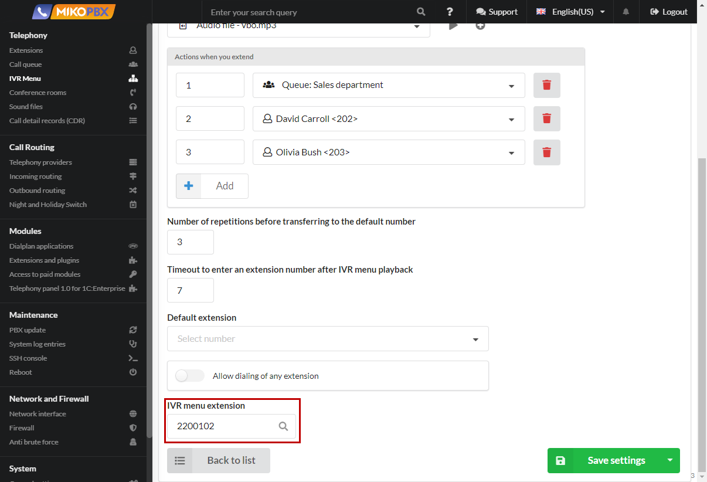
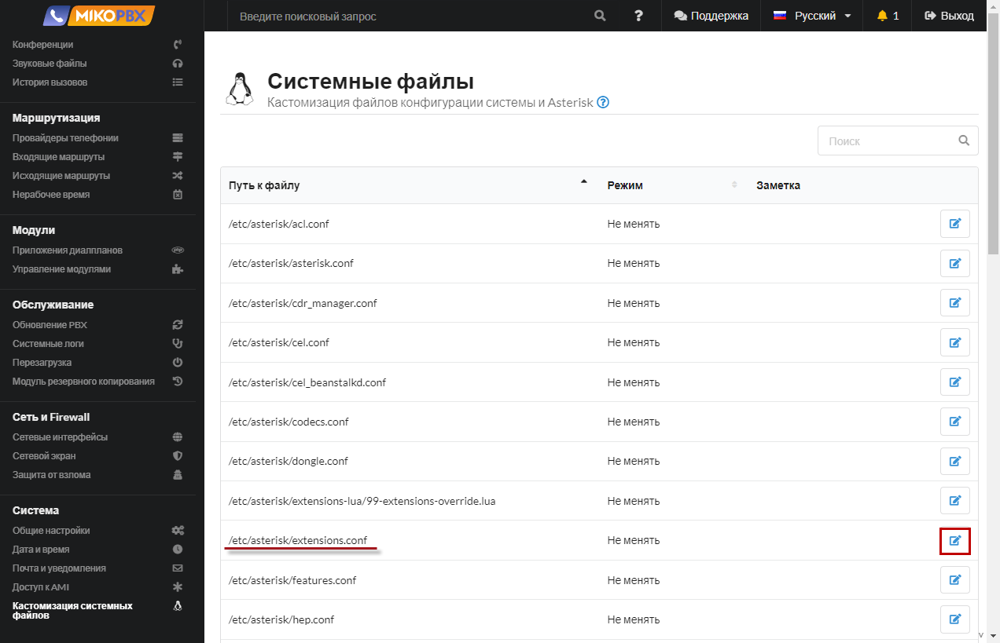

# Исходящий с набором внутреннего номера

Допустим есть некий номер **8-495-000-00-00**, позвонив на который и набрав добавочный можно попасть на конкретного сотрудника. Это бывает крайне удобно, особенно если добавочный номер длиннее 3х символов. Далее опишем пример реализации задачи.

1. Для решения задачи следует описать дополнительные контексты через меню [Кастомизация системных файлов](../../manual/system/custom-files.md).

<figure><figcaption><p>меню <a href="../../manual/system/custom-files.md">Кастомизация системных файлов</a>.</p></figcaption></figure>

2. Править будем файл **extensions.conf**.

<figure><figcaption><p>Правка файла "<strong>extensions.conf"</strong></p></figcaption></figure>

3.  Добавьте в конец файла следующий текст:

    ```php
    [z-outgoing]
    exten => _X!,1,Ringing()
      same => n,Gosub(${ISTRANSFER}dial,${EXTEN},1)
      same => n,Dial(PJSIP/${EXTEN}@${ZPROVIDERID},600,${DOPTIONS}TKU(z-dial-answer)b(dial_create_chan,s,1))
      same => n,ExecIf($["${ISTRANSFER}x" != "x"]?Gosub(${ISTRANSFER}dial_hangup,${EXTEN},1))
      same => n,Set(pt1c_UNIQUEID=${EMPTY_VALUE})
      same => n,ExecIf($["${BLINDTRANSFER}x" != "x"]?AGI(check_redirect.php,${BLINDTRANSFER}))
      same => n,Hangup()

    [z-dial-answer]
    exten => s,1,NoOp(Answered send DTMF...)
      same => n,Gosub(dial_answer,${EXTEN},1)
      same => n,SendDTMF(${ZDTMF})
      same => n,return
    ```

<figure><figcaption><p>Добавление кода в конец файла файл "<strong>extensions.conf"</strong></p></figcaption></figure>

4. Далее необходимо описать [Приложения диалпланов](../../manual/modules/dialplan-applications.md)

<figure><figcaption><p>Создание нового <a href="../../manual/modules/dialplan-applications.md">Приложения диалпланов</a></p></figcaption></figure>

5. Выберите «**Тип кода**» - «**Диалплан Asterisk**»

<figure><figcaption><p>Указание типа кода Диалплана</p></figcaption></figure>

6. Допустим «донабрать» нужно номер **3542331**, установим это значение в «**Номер для вызова приложения**»

<figure><figcaption><p>Указание номера "донабора" для вызова приложения </p></figcaption></figure>

7. Перейдите во вкладку "Программный код" Вставьте шаблон:

```php
1,Set(_ZDTMF=${EXTEN})
n,Set(_ZDST=84950000000)
n,Set(_ZPROVIDERID=SIP-1601534775)
n,Goto(z-outgoing,${ZDST},1)
```

<figure><figcaption><p>Вставка шаблона во вкладку "Программный код" </p></figcaption></figure>

* Если в поле «**Номер для вызова приложения**» указать шаблон **9XXXX**, то станет возможно «донабрать» любые пятизначные номера, начинающиеся с цифры «**9**»
* В приложении переменной «**ZDST**» присвойте номер, на который следует совершить вызов
* В переменной «**ZDTMF**» следует указать номер для дополнительного набора
* В переменной «**ZPROVIDERID**» укажите идентификатор провайдера, через которого следует совершить исходящий вызов. ID можно подсмотреть в адресной строке браузера при редактировании провайдера
