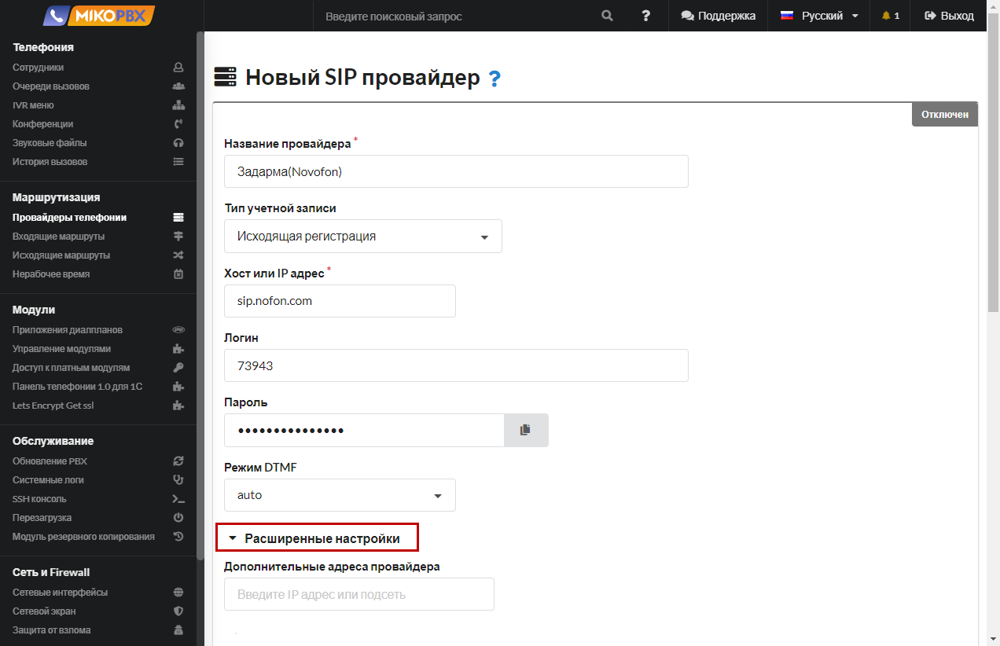
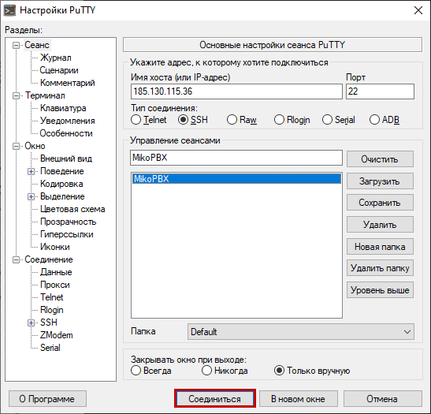
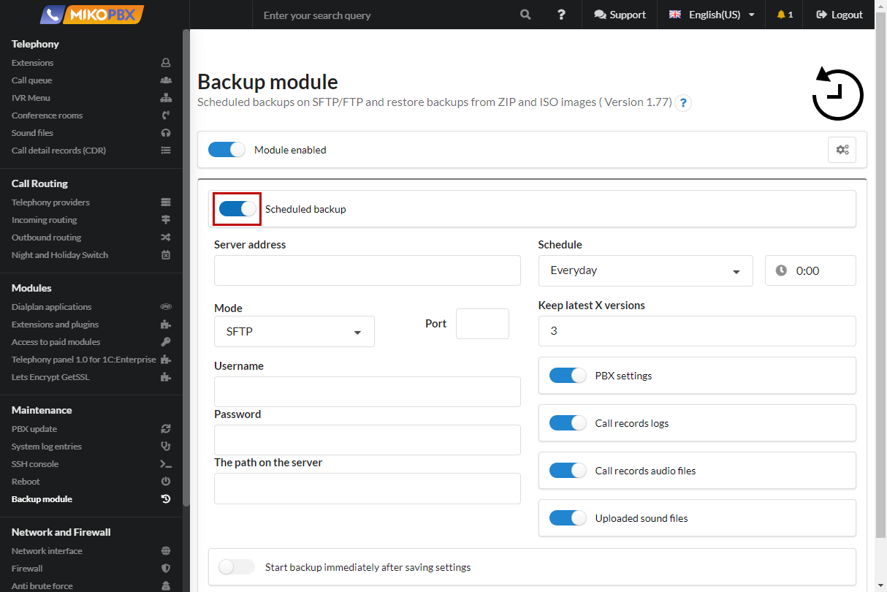
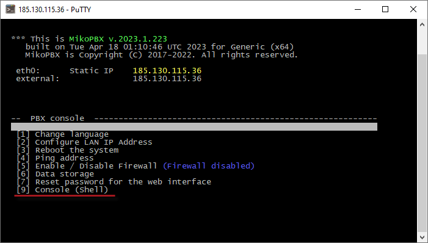

# Конференция с постоянным внешним абонентом

* Допустим на АТС настроена конференц-комната с номером «**354233**».
* При звонке сотрудника(ов) в конференцию необходимо всегда подключать внешнего абонента.
* При отключении сотрудников от конференции внешнего абонента необходимо отключатьъ

Это может потребоваться для организации связи с внешней (относительно MIKOPBX) конференцией. Позволит сэкономить на исходящих звонках (будет занята только одна линия).

1. В разделе «**Телефония**» - «**Конференция**» создаем новую конференцию

<figure><figcaption></figcaption></figure>

2. Укажем название комнаты «**Z-CONF-354233**»

<figure><figcaption></figcaption></figure>

3. Укажем внутренний номер «**354233**»

<figure><figcaption></figcaption></figure>

4. Опишем «**Приложение Dialplan**» (см. [Приложения диалпланов](../../manual/modules/dialplan-applications.md))

<figure><figcaption></figcaption></figure>

5. Название «**Z-Worker-CONF**»

<figure><figcaption></figcaption></figure>

6. Номер для вызова «**2200103**» (может быть произвольным)

<figure><figcaption></figcaption></figure>

7. Укажите тип кода «**PHP-AGI скрипт**»

<figure><figcaption></figcaption></figure>

8. Код

<figure><figcaption></figcaption></figure>

```php
<?php

require_once 'Globals.php';

use MikoPBX\Core\System\Util;
use \MikoPBX\Core\Asterisk\AGI;
use \MikoPBX\Core\Asterisk\AsteriskManager;

function checkStartConf(){
    $Z_DTMF         = '354233';
    $Z_PROVIDER_ID  = 'SIP-1601534775';
    $Z_DST          = '84957776675';

    $am = new AsteriskManager();
    $am->connect();

    $confEmpty = true;
    $confChannelFound = false;
    $data = $am->meetMeCollectInfo($Z_DTMF);
    foreach ($data as $channelData){
        $value = $am->GetVar($channelData['Channel'], 'ZDTMF', null, false);
        if(!empty($value)){
            // Это канал конференции.
            $confChannelFound = true;
        }else{
            // Есть канал конечного пользователя.
            $confEmpty = false;
        }
    }

    if($confChannelFound === false && $confEmpty === false){
        // Необходимо соединить с внешней конференцией.
        $am->Originate(
            'Local/'.$Z_DTMF.'@z-meetme',
            $Z_DST,
            'z-outgoing',
            '1',
            null,
            null,
            null,
            null,
            "__ZDTMF={$Z_DTMF},__ZPROVIDERID={$Z_PROVIDER_ID},__ZDST={$Z_DST}}",
            '0');

    }elseif ($confChannelFound === true && $confEmpty === true){
        $asteriskCmd = Util::which('asterisk');
        Util::mwExec("{$asteriskCmd} -rx 'meetme kick {$Z_DTMF} all'");
    }
}

$action = $argv[1]??'';
if($action === 'start'){
    $pid = Util::getPidOfProcess(basename($argv[0])." start$", getmypid());
    var_dump($pid);
    if(!empty($pid)){
        $killCmd = Util::which('kill');
        Util::mwExec("{$killCmd} {$pid}");
    }
    while (true){
        checkStartConf();
        sleep(3);
    }
}else{
    $agi = new AGI();
    $agi->answer();
    checkStartConf();
    $agi->hangup();
}
```

9. Правим файл «**/var/spool/cron/crontabs/root**» через меню [Кастомизация системных файлов](../../manual/system/custom-files.md)

<figure><figcaption></figcaption></figure>

10. &#x20;Добавляем задачу в конец файла:

<figure><figcaption></figcaption></figure>

```php
*/1 * * * * /usr/bin/php -f /var/lib/asterisk/agi-bin/DIALPLAN-APP-EC12CFAE6783FE82FD34F16E40C7386B.php start > /dev/null 2> /dev/null
```

11. В данном примере «**DIALPLAN-APP-EC12CFAE6783FE82FD34F16E40C7386B**» - Это идентификатор созданного ранее приложения. ID можно подсмотреть в адресной строке браузера при редактировании приложения.
12. Опишем дополнительные контексты через меню [Кастомизация системных файлов](../../manual/system/custom-files.md). Править будем файл **extensions.conf**.&#x20;

<figure><figcaption></figcaption></figure>

13. Добавьте в конец файла следущий код:

```php
[z-outgoing]
exten => _X!,1,Ringing()
  same => n,Gosub(${ISTRANSFER}dial,${EXTEN},1)
  same => n,Dial(PJSIP/${EXTEN}@${ZPROVIDERID},600,${DOPTIONS}TKU(z-dial-answer)b(dial_create_chan,s,1))
  same => n,ExecIf($["${ISTRANSFER}x" != "x"]?Gosub(${ISTRANSFER}dial_hangup,${EXTEN},1))
  same => n,Set(pt1c_UNIQUEID=${EMPTY_VALUE})
  same => n,ExecIf($["${BLINDTRANSFER}x" != "x"]?AGI(check_redirect.php,${BLINDTRANSFER}))
  same => n,Hangup()

[z-dial-answer]
exten => s,1,NoOp(Answered send DTMF...)
  same => n,Gosub(dial_answer,${EXTEN},1)
  same => n,SendDTMF(${ZDTMF})
  same => n,return
	
[z-meetme]
exten => _X!,1,Answer()
  same => n,Meetme(${EXTEN},qdMTr)
  same => n,Hangup()
```

<figure><figcaption></figcaption></figure>


При звонке в конференцию по номеру **354233** автоматически будет подключаться внешний абонент с номером **84957776675**. Как только абонент ответи, будет произведен набор добавочного номера **354233**. Как только все «внутренние» участники покинули конференцию, внешний абонент будет отключен.



Задача в крон нужна лишь для дополнительной «защиты», по сути это рестарт php скрипта каждую минуту

