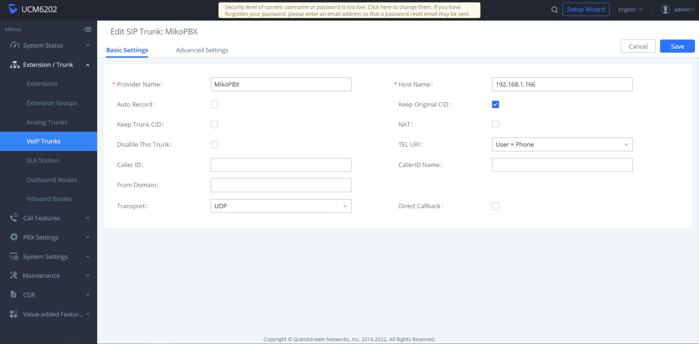

# Как запретить замену "+" на "00"

1. Перейдите в раздел  «**Система**» -> «**Кастомизация системных файлов**»

<figure><figcaption></figcaption></figure>

2. Выберите для редактирования файл «**/etc/asterisk/extensions.conf**»

<figure><figcaption></figcaption></figure>

3. Выберите режим «**Добавлять в конец файла**»

<figure><figcaption></figcaption></figure>

4. Добавьте во второе поле текст

```
[outgoing](+)
exten => _+X!,1,Set(ADDPLUS=+);
    same => n,Goto(${CONTEXT},${EXTEN:1},1);
```

<figure><figcaption></figcaption></figure>

5. Сохраните изменения
